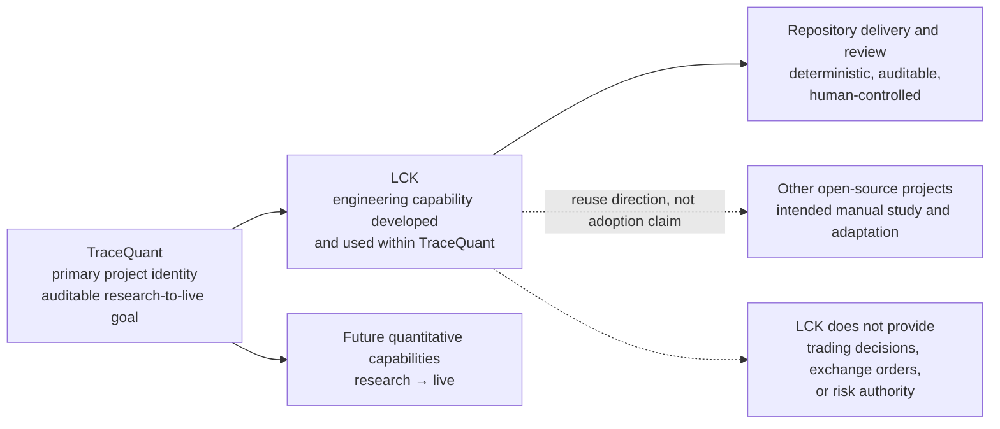
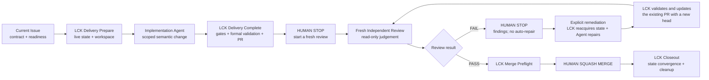

# TraceQuant

TraceQuant is an actively developed open-source project intended to become an
auditable research-to-live quantitative trading system for cryptocurrency
perpetual futures. The current repository is the Research MVP foundation: it
contains a small, validated Python package and the engineering documentation
around it. It does not contain a trading system or an executable strategy yet.

## LCK: an engineering capability within TraceQuant

While building and maintaining TraceQuant, the project is developing the Local
Control Kernel (LCK): an engineering capability for making Codex-centered,
AI-assisted development deterministic, auditable, and human-controlled. LCK
separates semantic Agent work—understanding, designing, implementing, and
reviewing—from deterministic lifecycle control such as resolving current
repository and GitHub state, validating a candidate, and carrying out bounded
delivery effects.

LCK is part of TraceQuant. It is not an independent product, general Agent
platform, trading module, or risk authority, and it does not make the current
repository a trading system. LCK is provider-neutral by design: Codex is a
primary use case, while other supported Agent providers can use the same
lifecycle contract. The capability is intended to offer reusable engineering
value to other open-source projects, but this repository does not claim
drop-in installation, external adoption, or unsupported portability. See the
[public LCK overview](docs/guides/LCK-overview.md) for the lifecycle and
boundaries.

### Why TraceQuant developed LCK

TraceQuant is intended to become a long-lived, auditable quantitative system.
That kind of project needs more than an Agent that can produce a plausible
patch: the current Issue, branch, commit, pull request, validation result, and
recovery action must be resolved deterministically; semantic work must remain
reviewable; and a human must retain authority over the irreversible merge.
LCK was formed while building TraceQuant to provide those boundaries for
Codex-assisted maintenance without turning the workflow controller into a
trading or risk component.



The diagram shows the relationship, not an implementation claim: the future
quantitative system remains TraceQuant's product goal, while LCK governs the
engineering workflow used to build and maintain it.

### Current LCK capability surface

The current capability is a repository workflow contract, not a separately
released product. Its implemented surface includes:

- an Issue-driven lifecycle with readiness, typed leaf contracts, and fresh
  resolution of the current Git and GitHub state;
- an explicit work-item contract, including the Task `Critical Outcome` gate
  where that typed profile requires it, with Documentation, Bug, and Research
  profiles using their own contracts;
- a strict execution boundary: Agents perform semantic work, while LCK owns
  bounded workspace preparation, lifecycle gates, formal validation, commit,
  push, and pull-request effects;
- exact-candidate validation and check observation before the lifecycle reaches
  the human Review boundary;
- a fresh, read-only Independent Review that independently judges the current
  candidate rather than inheriting Delivery's correctness judgment;
- human-controlled merge authority: Review PASS can make a change ready for
  manual Squash Merge, but no Agent, Skill, or LCK operation merges it;
- bounded Audit Receipts that explain lifecycle effects without becoming
  permission tokens or a substitute for current live state; and
- fail-closed recovery with explicit remediation after Review FAIL and a fresh
  Review requirement for every repaired head.

The [Issue workflow](docs/development/issue-workflow.md),
[Independent PR Review](docs/development/pr-review.md), and
[LCK Overview](docs/guides/LCK-overview.md) describe the current contract in
more detail.

### LCK lifecycle at a glance

The human stops are intentional: Delivery does not start Review automatically,
Review FAIL does not start repair automatically, and merge remains a manual
maintainer action.



### LCK releases and manual adoption

LCK is actively developed within TraceQuant. Versioned LCK previews and their
release notes are listed on the [GitHub Releases page](https://github.com/PhoenixSss/tracequant/releases).
The release page is the stable entry point for selecting a specific version;
this README intentionally does not pin a version that would need to change
with every release.

For manual evaluation and repository-specific adaptation, see the [LCK
adoption guide](docs/guides/LCK-adoption.md). LCK is not a standalone product,
one-click installation package, or universal portability promise: adopters
must inspect the selected snapshot, adapt repository-specific contracts and
integrations, and validate the result themselves.

## Current capability and boundary

The currently implemented public package is `tracequant` under `src/`:

- `tracequant.config`: explicit, immutable application settings and a
  representation-safe `SecretValue` helper;
- `tracequant.logging`: explicit JSON console/file logging and recursive
  redaction of known sensitive fields;
- `tracequant.core.time`: timezone-aware UTC validation, conversion, parsing,
  and formatting;
- `tracequant.domain`: the initial immutable `InstrumentId`, `TimeRange`, and
  `OHLCVBar` models with validation and JSON-compatible serialization.
- `tracequant.data`: typed Binance USDⓈ-M public-history request and source
  identity contracts; it performs no network, file, or data-parsing work.

The `apps/`, `packages/`, and `deploy/` directories currently establish future
boundaries through small README files. They are not implemented product
packages. There is currently no exchange client, market-data ingestion,
database, data pipeline, feature or label pipeline, backtester, strategy,
machine-learning model, order or account service, risk engine, live runtime,
or multi-exchange implementation.

“Research MVP” therefore means a reliable foundation for later research work,
not a claim that research, backtesting, Demo, or Live trading is available.

## Development environment

Use a clean checkout with:

- Python `3.13` (`>=3.13,<3.14`), as pinned by `.python-version` and CI;
- uv `0.12.1`, the version used by the repository workflow;
- Git and a supported shell.

uv creates and manages the project environment. No manual virtual-environment
activation is required:

```console
uv sync --locked --dev
uv run --frozen python -c "import tracequant; print(tracequant.__name__)"
```

The first command is the clean-install command. It uses `uv.lock`; do not
replace it with an unlocked install when reproducing CI.

### Environment variables

The committed [`.env.example`](.env.example) lists the current variable
contract. The application does not automatically read `.env`, `.env.*`, or
`.env.example`. Copying `.env.example` is only a reference operation; values
must be exported, supplied by IDE/env-file tooling, or passed explicitly to
`load_settings`.

For a POSIX shell (Linux/macOS/WSL):

```sh
export TRACEQUANT_ENV=development
export TRACEQUANT_LOG_FORMAT=json
uv run --frozen pytest
```

For Windows PowerShell:

```powershell
$env:TRACEQUANT_ENV = "development"
$env:TRACEQUANT_LOG_FORMAT = "json"
uv run --frozen pytest
```

PowerShell uses `$env:NAME = "value"`, while POSIX shells use `export
NAME=value`. `uv run` works without activating `.venv` on either platform.
When setting `TRACEQUANT_LOG_DIR`, use the host platform's path syntax, such as
`logs/app` on POSIX or `logs\app` on Windows. Keep repository text files UTF-8
with LF line endings; check a change with `git diff --check`.

### Canonical quality commands

These are the one set of local commands corresponding to the current CI
workflow (`.github/workflows/ci.yml`):

| Purpose | Command |
| --- | --- |
| Install locked development dependencies | `uv sync --locked --dev` |
| Tests | `uv run --frozen pytest` |
| Ruff lint | `uv run --frozen ruff check .` |
| Ruff format check | `uv run --frozen ruff format --check .` |
| Strict type check | `uv run --frozen mypy src tests` |

CI also runs `uv lock --check` after syncing dependencies. It runs the same
pytest, Ruff, and mypy commands shown above for pull requests targeting `main`
and pushes to `main`. Do not introduce a second command set in another guide.

## Repository layout

```text
src/tracequant/                 implemented bootstrap package
  config.py                     explicit settings loading
  logging.py                    structured JSON logging
  core/time.py                  UTC utilities
  domain/models.py              initial domain models
  data/public_history.py        Binance public-history contracts
tests/                          package and workflow tests
  fixtures/domain.py            deterministic domain factories, test-only
apps/                           future research/runtime/console boundaries
packages/                       future contracts/domain/adapters boundaries
deploy/                         future environment-specific deployment assets
docs/                           architecture, development, research, workflow docs
.env.example                    documented environment-variable names
pyproject.toml                  package and tool configuration
uv.lock                         locked dependency resolution
```

The `tests/tools/` subtree tests the repository workflow tooling. It is not a
runtime dependency of `tracequant`. The intended boundaries and dependency
direction are described in [Repository structure](docs/architecture/repository-structure.md).

## Python package quick start

The current `tracequant` package is a small, validated bootstrap foundation,
not a complete quantitative trading system. Configuration, structured logging,
UTC utilities, initial domain models, and test fixtures are covered in the
[Python package getting started guide](docs/guides/getting-started.md).

## Security and known limitations

- Live trading is disabled because no trading runtime exists. Do not add real
  exchange credentials or API keys to the repository, examples, issues, or
  logs. Local `.env` files, keys, logs, databases, and research data are
  ignored by Git, but ignoring a file is not a substitute for secret hygiene.
- The current configuration only covers environment name, log level, log
  format, and an optional log directory. It has no exchange credentials,
  account, database, trading-mode, or automatic log-setup fields.
- File logging is an explicit logging setup action. An empty or unset
  `TRACEQUANT_LOG_DIR` disables it; a non-empty path is created by
  `configure_logging`, not by importing a module. The current logger writes
  JSON only and appends to one file named `tracequant.jsonl`.
- UTC utilities reject naive datetimes, but callers still own the boundary
  validation for external data. Domain serialization is explicit and
  JSON-compatible; it is not a versioned external storage contract. OHLCV
  numeric fields require finite Python `float` values, while zero and negative
  prices are currently allowed at this initial boundary.
- The shared fixtures cover only the initial domain models. They do not model
  exchange responses, missing or duplicated market data, fills, accounts, or
  production state.
- The current repository does not provide database storage, raw/canonical data
  layers, factors, labels, backtesting, model training, execution, risk
  decisions, monitoring, or multi-exchange adapters. Those are future Issues,
  not available capabilities.
- Documentation and Agent workflow controls have separate responsibilities.
  LCK and the Validation Runner describe repository lifecycle mechanics; they
  do not add business or trading functionality. See the [WSL2 Codex environment
  guide](docs/workflows/wsl2-codex-environment/README.md) only when working in
  that specific environment.

## Typed leaf Issue navigation

TraceQuant has four executable leaf Issue kinds. The `type:*` label selects
exactly one profile in the [LCK leaf profile resolver](tools/agent_workflow/lck_core/issue_profiles.py);
the Issue Forms and [Issue authoring guide](docs/development/issue-authoring.md)
define the semantic contract, while the profile-owned policy modules provide
the type-specific gates.

| Leaf kind | Semantic contract | Profile / gate owner | Branch namespace |
| --- | --- | --- | --- |
| Task | Add or change system behavior; uses the Task-only Critical Outcome contract. | [LCK profiles](tools/agent_workflow/lck_core/issue_profiles.py) / [Critical Outcome](tools/agent_workflow/critical_outcome.py) | `task/` |
| Bug | Restore expected behavior with defect and regression semantics. | [LCK profiles](tools/agent_workflow/lck_core/issue_profiles.py) / [Bug policy](tools/agent_workflow/bug_policy.py) | `bug/` |
| Documentation | Add, correct, or converge documented facts without changing runtime behavior. | [LCK profiles](tools/agent_workflow/lck_core/issue_profiles.py) / [Documentation policy](tools/agent_workflow/documentation_policy.py) | `documentation/` |
| Research | Reduce an unknown with evidence and record a typed decision. Repository-backed v1 artifacts belong under [`docs/research/`](docs/research/). | [LCK profiles](tools/agent_workflow/lck_core/issue_profiles.py) / [Research policy](tools/agent_workflow/research_policy.py) | `research/` |

The type-specific policies answer semantic questions; they do not create four
workflow controllers. One shared [LCK implementation kernel](tools/agent_workflow/lck_core/README.md)
owns the mechanical boundary for every leaf kind: branch and workspace
preparation, formal validation authority, current PR/base/head identity, fresh
Independent Review, maintainer manual Squash Merge, Closeout, remediation and
recovery, and bounded Agent View / Audit Receipt evidence. The [shared Issue
workflow](docs/development/issue-workflow.md) and [Review semantics](docs/development/pr-review.md)
remain the canonical lifecycle references.

`Critical Outcome` is required and verified only for an implementation Task.
Bug, Documentation, and Research profiles neither require nor fabricate or
auto-generate Task Critical Outcome evidence; each uses its own contract and
policy gate.

For Research, workflow completion and the Project `Research Outcome` are
different facts. A completed repository-backed Research workflow records one
typed business result—`IMPLEMENT`, `DO NOT IMPLEMENT`, `NEEDS MORE EVIDENCE`,
or `ARCHITECTURE DECISION`—in the Project field during Closeout; the latter is
not a replacement for the workflow lifecycle state, and the non-implementation
outcomes are still valid research conclusions.

Typed profiles are not retroactive. Historical Issues completed before the
typed profiles existed, including [legacy sample #66](https://github.com/PhoenixSss/tracequant/issues/66),
remain design, migration, or compatibility fixtures; they must not receive
backfilled or replayed typed lifecycle receipts.

## Documentation map

- [LCK overview](docs/guides/LCK-overview.md): public explanation of the LCK
  engineering capability, lifecycle, responsibilities, and reuse boundaries.
- [Technical baseline](docs/architecture/technical-baseline.md): current
  implementation facts and explicitly deferred research/trading architecture.
- [Repository structure](docs/architecture/repository-structure.md): current
  tree, dependency direction, and future boundary rules.
- [Initial public domain models](docs/architecture/domain-models.md): model
  invariants, serialization, and test-factory boundary.
- [Project roadmap](docs/planning/project-roadmap.md): planning and Issue
  navigation, not proof that planned capabilities are implemented.
- [Issue workflow](docs/development/issue-workflow.md): repository lifecycle
  semantics for implementation work.
- [Independent PR Review](docs/development/pr-review.md): fresh Review,
  remediation, and merge-preflight semantics.
- [Agent workflow Skills](docs/workflows/agent-skills.md): current workflow
  controls, separate from the business architecture.
- [LCK v1 Design Charter](docs/workflows/LCK-v1-Design-Charter.md): design
  baseline and responsibility model; it is not evidence of completed product
  capability.
- [WSL2 Codex environment](docs/workflows/wsl2-codex-environment/README.md):
  environment-specific setup and diagnostics.

## License

TraceQuant is distributed under the [Apache License, Version 2.0](LICENSE)
(SPDX identifier: `Apache-2.0`). This license applies to TraceQuant itself;
third-party dependencies retain their respective licenses.
