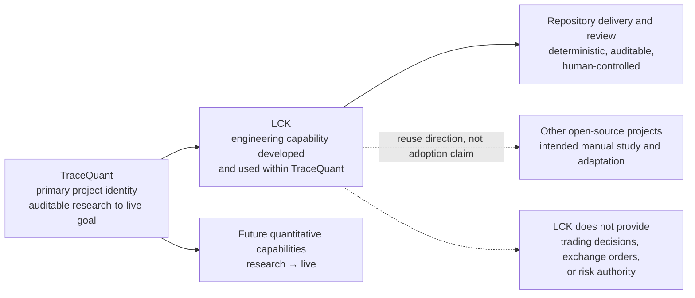
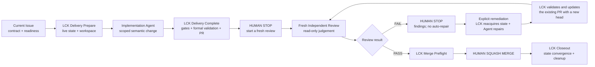

# TraceQuant

TraceQuant v2 is an auditable quantitative research-to-live project for
cryptocurrency perpetual futures. Its product runtime remains a clean,
non-production bootstrap: it pins the approved NautilusTrader runtime,
establishes package ownership, and provides mechanical guards for that boundary.
The repository also includes the approved Local Control Kernel (LCK) engineering
tooling under `tools/lck/`; LCK is not part of the TraceQuant product runtime.

There is no strategy, data ingestion, backtest workflow, exchange connectivity,
order submission, Demo mode, or Live mode in this tree. Live trading is not
approved and cannot be enabled by configuration.

## Bootstrap environment

TraceQuant supports CPython 3.13 and uv 0.12.1. Create the exact development
environment from an official `nautilus-trader==2.0.0rc4` binary wheel:

```bash
uv sync --locked --dev --no-build-package nautilus-trader --no-cache
```

A missing compatible wheel is a hard failure; do not relax the Python target or
allow a source build. Run the repository checks with:

```bash
uv lock --check
uv run --frozen pytest
uv run --frozen ruff check .
uv run --frozen ruff format --check .
uv run --frozen mypy src tools/lck tests
```

## LCK: an engineering capability within TraceQuant

While building and maintaining TraceQuant, the project is developing the Local
Control Kernel (LCK): an engineering capability for making Codex-centered,
AI-assisted development deterministic, auditable, and human-controlled. LCK
separates semantic Agent work—understanding, designing, implementing, and
reviewing—from deterministic lifecycle control such as resolving current
repository and GitHub state, validating a candidate, and carrying out bounded
delivery effects.

LCK is part of TraceQuant's repository engineering system. It is not an
independent product, general Agent platform, trading module, product-runtime
dependency, or risk authority, and it does not make the current repository a
trading system. LCK is provider-neutral by design: Codex is a primary use case,
while other supported Agent providers can use the same lifecycle contract. The
capability is intended to offer reusable engineering value to other open-source
projects, but this repository does not claim drop-in installation, external
adoption, or unsupported portability. See the
[public LCK overview](docs/guides/lck/overview.md) for the lifecycle and
boundaries.

### Why TraceQuant developed LCK

TraceQuant is intended to become a long-lived, auditable quantitative system.
That kind of project needs more than an Agent that can produce a plausible
patch: the current Issue, branch, commit, pull request, validation result, and
recovery action must be resolved deterministically; semantic work must remain
reviewable; and a human must retain authority over the irreversible merge. LCK
was formed while building TraceQuant to provide those boundaries for
Codex-assisted maintenance without turning the workflow controller into a
trading or risk component.



The diagram shows the relationship, not an implementation claim: the future
quantitative system remains TraceQuant's product goal, while LCK governs the
engineering workflow used to build and maintain it.

### Current LCK capability surface

The current capability is a repository workflow contract, not a separately
released product. Its implemented surface includes:

- an Issue-driven lifecycle with readiness, typed leaf contracts, and fresh
  resolution of the current Git and GitHub state;
- an explicit work-item contract, including the Task `Critical Outcome` gate
  where that typed profile requires it, with Documentation, Bug, and Research
  profiles using their own contracts;
- a strict execution boundary: Agents perform semantic work, while LCK owns
  bounded workspace preparation, lifecycle gates, formal validation, commit,
  push, and pull-request effects;
- exact-candidate validation and check observation before the lifecycle reaches
  the human Review boundary;
- a fresh, read-only Independent Review that independently judges the current
  candidate rather than inheriting Delivery's correctness judgment;
- human-controlled merge authority: Review PASS can make a change ready for
  manual Squash Merge, but no Agent, Skill, or LCK operation merges it;
- bounded Audit Receipts that explain lifecycle effects without becoming
  permission tokens or a substitute for current live state; and
- fail-closed recovery with explicit remediation after Review FAIL and a fresh
  Review requirement for every repaired head.

The [Issue lifecycle](docs/workflows/lck/lifecycle.md),
[Independent Review and remediation](docs/workflows/lck/review-and-remediation.md),
and [LCK overview](docs/guides/lck/overview.md) describe the current contract in
more detail. The stable CLI entry is:

```bash
uv run --frozen python -m tools.lck --help
```

Implementation and configuration live only under `tools/lck/`, tests under
`tests/tools/lck/`, workflow specifications under `docs/workflows/lck/`, and
user guidance under `docs/guides/lck/`.

### LCK lifecycle at a glance

The human stops are intentional: Delivery does not start Review automatically,
Review FAIL does not start repair automatically, and merge remains a manual
maintainer action.



### LCK releases and manual adoption

The in-repository LCK restored by Task #333 is derived from the final
pre-removal source commit
`0d9d762238a3e837a864b5350bf16d1b885a73c3` and reorganized for the current v2
ownership boundary. The [restoration manifest](docs/workflows/lck/restoration-manifest.md)
records the old paths, blob identities, new paths, and adaptation decisions.

The [GitHub Releases page](https://github.com/PhoenixSss/tracequant/releases) is
the authority for named portable archives. The corrected historical preview is
the published [`lck-v0.1.0-preview.2`
Release](https://github.com/PhoenixSss/tracequant/releases/tag/lck-v0.1.0-preview.2),
a pre-release fixed to source commit
`850ce58c24646c69379d83d79c13d39b145280b5`. Its release record and named assets
remain authoritative for that immutable preview; they do not float with the
current repository implementation. The historical `preview.1` is superseded
and remains immutable.

For manual evaluation and repository-specific adaptation, see the
[LCK adoption guide](docs/guides/lck/adoption.md). LCK is not a standalone
product, one-click installation package, or universal portability promise:
adopters must inspect the selected snapshot, adapt repository-specific
contracts and integrations, and validate the result themselves.

The initial v2 bootstrap restriction that excluded repository workflow-tooling
roots is superseded for these exact LCK-owned paths. It remains in force for
unapproved tooling trees and for any attempt to place LCK in the product package.

## Ownership and safety

All TraceQuant production Python is under `src/tracequant`. Direct imports of
the external `nautilus_trader` package are confined to
`tracequant.integrations.nautilus`; the package is installed into the generated
environment and is never vendored into this repository.

Persistent raw data, catalogs, caches, runs, evidence, audit data, model
artifacts, and credentials must use explicit external roots. The bootstrap does
not implement those roots or silently fall back to paths inside the checkout.
See the [repository structure](docs/architecture/repository-structure.md),
[runtime decision](docs/architecture/adr-0001-nautilustrader-primary-runtime.md),
and [dependency policy](docs/guides/nautilustrader-import-and-update-policy.md).

## v1 recovery

The final v1 tree remains recoverable from the immutable annotated tag and
GitHub Release
[`tracequant-v1-archive-2026-09-12`](https://github.com/PhoenixSss/tracequant/releases/tag/tracequant-v1-archive-2026-09-12).
Its peeled commit is `27a9fdd877533f933cde4818eba9c186d286c529` and its
tree is `8406076ce81a2476005e3c938abd4c5a088373c2`. The v2 bootstrap is a
normal descendant and does not modify that recovery identity.
