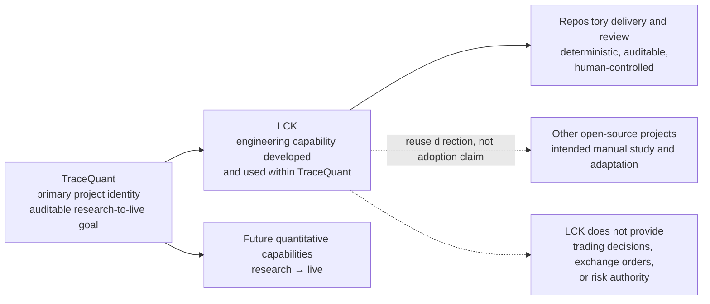
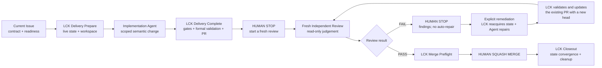

# TraceQuant

TraceQuant v2 is an auditable quantitative research-to-live project for
cryptocurrency perpetual futures. Its product runtime remains a clean,
non-production bootstrap: it pins the approved NautilusTrader runtime,
establishes package ownership, and provides mechanical guards for that boundary.
The repository also includes the approved Local Control Kernel (LCK) engineering
tooling under `tools/lck/`; LCK is not part of the TraceQuant product runtime.

Stages 1 and 2 are complete. Stage 1 implements one selected BTCUSDT 1h
historical Bar path into Nautilus `ParquetDataCatalog` and one Nautilus-native
SMA crossover offline backtest. Stage 2 imports the accepted BTC/ETH
`binance-usdm-btceth-202001-202608-r1` dataset — 15m/1h/4h Bars, 15m mark price,
and funding — into one Nautilus catalog, and serves both the read-only Polars
research views and `BacktestNode` from that same catalog. Stage 3 binds that
accepted input to a finite causal feature/label contract, a traditional momentum
Strategy, deterministic LightGBM artifacts and Strategy, the fixed
expanding-window/accounting-sensitivity matrix, and a finite `rebuild-oos`
entry which emits a compact tracked acceptance record. There is no Demo mode or
Live mode in this tree. The project remains
`OFFLINE_BACKTEST_ONLY` and `LIVE_NOT_APPROVED`; live trading cannot be enabled
by configuration.

## Bootstrap environment

TraceQuant supports CPython 3.13 and uv 0.12.1. Create the exact development
environment from an official `nautilus-trader==2.0.0rc4` binary wheel:

```bash
uv sync --locked --dev --no-build-package nautilus-trader --no-cache
```

A missing compatible wheel is a hard failure; do not relax the Python target or
allow a source build. The pinned LightGBM CPU wheel also requires the platform's
native OpenMP runtime (`libgomp1` on Ubuntu). Run the repository checks with:

```bash
uv lock --check
uv run --frozen pytest
uv run --frozen ruff check .
uv run --frozen ruff format --check .
uv run --frozen mypy src tools/lck tests
```

## Stage 1 offline backtest

`OFFLINE_BACKTEST_ONLY`. `LIVE_NOT_APPROVED`.

Prepare the Task #339 catalog into an absolute external `catalog_root`, then run
the backtest into an absolute external `run_root`:

```bash
uv run --frozen python -m tracequant.integrations.nautilus.stage1_backtest \
  --catalog-root /absolute/catalog-root \
  --run-root /absolute/run-root
```

Run the stage 1 backtest acceptance test:

```bash
uv run --frozen pytest tests/acceptance/test_stage1_backtest.py::test_stage1_native_strategy_completes_offline_backtest
```

## Current stage status

Stages 1 and 2 are implemented and accepted. Stage 3's bounded software
capability is implemented through the trusted-input, feature/label, two-Strategy,
artifact, fixed evaluation, and OOS rebuild paths. A formal rebuild writes the
tracked Stage 3 acceptance record; its research metrics may be negative without
invalidating software acceptance or granting Demo admission.

| Stage | Status | Where it lives |
| --- | --- | --- |
| Stage 1: minimal offline loop | complete | [stage 1 backtest](#stage-1-offline-backtest) above |
| Stage 2: Nautilus-homologous data | complete and accepted | [stage 2 requirements](docs/product/stage-2-data-and-research-requirements.md) |
| Stage 3: strategy and model loop | bounded software capability implemented; formal results remain offline research evidence | [finite OOS rebuild](src/tracequant/integrations/nautilus/stage3_oos.py) and [requirements](docs/product/stage-3-strategy-and-model-requirements.md) |

The accepted stage 2 dataset identity is tracked in
[`docs/product/stage2-btceth-dataset-acceptance.json`](docs/product/stage2-btceth-dataset-acceptance.json).
Its tracked `acceptance_digest`, `dataset_digest`, `source_manifest_digest`,
`market_data_manifest_digest`, instrument snapshot checksum, and
`runtime_identity` are the frozen input identity for every later stage. A
successful ordinary catalog identity check is not by itself proof that a
catalog is that accepted dataset.

The accepted catalog is published as the immutable Stage 2 r1 GitHub Release
artifact bound by
[`config/datasets/binance-usdm-btceth-202001-202608-r1.lock.json`](config/datasets/binance-usdm-btceth-202001-202608-r1.lock.json).
The corresponding recovery, publication, and real-loader smoke evidence is
tracked in
[`docs/product/stage2-btceth-dataset-publication.json`](docs/product/stage2-btceth-dataset-publication.json).
Materialize it only into an explicit external path:

```bash
uv run --frozen python -m tracequant.integrations.nautilus.stage2_artifact materialize \
  --lock config/datasets/binance-usdm-btceth-202001-202608-r1.lock.json \
  --staging-root /absolute/external/stage2-staging \
  --catalog-path /absolute/external/catalog-root/binance-usdm-btceth-202001-202608-r1

uv run --frozen python -m tracequant.integrations.nautilus.stage2_artifact verify \
  --lock config/datasets/binance-usdm-btceth-202001-202608-r1.lock.json \
  --catalog-path /absolute/external/catalog-root/binance-usdm-btceth-202001-202608-r1
```

The materializer verifies archive size/hash before extraction, rejects unsafe
or unknown members, verifies every catalog file and the full Stage 2 identity,
then atomically installs the catalog. It never overwrites or merges a non-empty
target. Operators remain responsible for retaining an independent recoverable
copy outside temporary directories.

Both statuses above stay offline: `OFFLINE_BACKTEST_ONLY` and
`LIVE_NOT_APPROVED`. Reaching the end of stage 3 requires no profit threshold
and grants no Demo admission.

## Stage 3 finite OOS rebuild

The [Stage 3 execution amendment r1](docs/product/stage-3-execution-amendment-r1.md)
defines the approved B1 price conversion, minimum order checks and native
funding rounding bound for both strategies. Its digest is bound into the
run identities and rebuild contract alongside the frozen v0.1 requirements.

Materialize and verify the locked Stage 2 catalog first. `catalog_path` is that
existing, installed, read-only input; `evidence_root` and `run_root` are two
different new, nonexistent external identity partitions. Run `rebuild-oos` from
an identifiable clean commit. The command has no environment or
`latest` fallback. It freezes the clean Git SHA, lock checksum, and rebuild
contract digest before evaluation and rechecks them immediately before
publication; any drift fails without replacing the tracked record.
After the complete rebuild and strict validation succeed, it
atomically replaces the compact tracked record at
`docs/product/stage3-btceth-oos-acceptance.json`; an existing tracked record is
left unchanged if the rebuild fails:

```bash
uv run --frozen python -m tracequant.integrations.nautilus.stage3_oos rebuild-oos \
  --catalog-path <ABSOLUTE_CATALOG_PATH> \
  --evidence-root <ABSOLUTE_NEW_EVIDENCE_PARTITION> \
  --run-root <ABSOLUTE_NEW_RUN_PARTITION> \
  --dataset-id binance-usdm-btceth-202001-202608-r1 \
  --acceptance-digest 5909c878a81f0cdea85a8b8f86efd36d9c9bad5b3f3fb4c0f9960bb0551609cd \
  --dataset-digest e17c6294e0a0e6714e56a44624ade37cff46125c46d8b0ee81ede6093711579c \
  --source-manifest-digest de86d44c73117e17af2bbcb655cf1c8d4290043fa8854636cc0e4e592a1dc790 \
  --market-data-manifest-digest a0d9a36bb65ec7c2ec41f47cdf6ba7d20f57ad28d8d3494a69624c60d6d0a110 \
  --instrument-snapshot-checksum dd7fab59448a3b530ab70871ec57c375f6758e409004f9673d9d0cac7ee630bd \
  --runtime-identity 2.0.0rc4+a0400251110653b6d8ae6a9b5b89c4543fa85a2d
```

The evidence and run targets must not exist, overlap each other or the catalog,
or live in this checkout. Those external partitions remain immutable. A failed
or partial run is never resumed; repair the input and rerun into different empty
partitions. The tracked record contains
only strict identities, digests, window roles, metric summaries, fee provenance,
the command template, and relative external evidence filenames—never models,
catalog data, full reports, local absolute paths, or secrets. Outcomes remain
`OFFLINE_BACKTEST_ONLY` and `LIVE_NOT_APPROVED`; poor returns or a model losing
to momentum do not block software acceptance and never auto-approve Demo.
Two rebuilds in the same recorded OS/architecture, LightGBM binary build, and
locked environment must produce the same stable artifact, decision, scenario,
metric and result digests. The evaluation `result_digest` excludes artifact
manifest digests because those bind creation-time provenance. Full artifact
references remain in the evaluation manifest and are verified against the
external evidence. Consequently, exact evaluation `manifest_digest` and tracked
`acceptance_digest` can differ across creation times; compare the stable result
digests and compact artifact/run/metric records for repeatability. Cross-environment
model checksums are compared only under the recorded compatibility identity and
the approved prediction tolerances (`atol = 1e-9`, `rtol = 1e-6`).

Before publication the command rereads the evaluation manifest, partition
identities, training parameters, fold manifests and model bytes, and every
required run output. It checks report contents and complete run references
against the completed evaluation. Each result identity binds the compact
metrics, scenario, decisions, predictions, artifact and a digest of the full
Nautilus reports, so the tracked record can verify those bindings without
embedding the reports. Missing, changed or conflicting outputs leave the
previous tracked record untouched.

Formal evidence was regenerated twice from clean implementation commit
`75e3de9ec96085b4394f52536009b2763183292c`, using distinct new external partitions
in the same recorded environment. Each rebuild completed four fold artifacts,
eight base runs and eight sensitivity runs, passed strict acceptance validation,
and left the locked catalog unchanged. Both produced evaluation result digest
`53e7929a716e763df8b0442e4f909cf6f6b01009b053f56e2b6c6789735de8d3`.
The complete compact records agree after excluding only `acceptance_digest`
and `evaluation.manifest_digest`, which retain distinct creation-time evidence.
The tracked record is the second rebuild's generated output, with acceptance
digest `bc9449100eb2b79b720f4d65ab11609115fb0b4181472dbd86a3f9e5bc5bbcd8`.

The review-accessible bounded receipt
`docs/product/stage3-btceth-oos-rebuild-receipt.json` records two further
successful formal rebuilds from clean implementation commit `e5c59151bca40725595f7ab3caa2ff8dee4fe7c0`.
It binds the distinct initially empty partitions, pre/post catalog verification,
formal provenance, artifact manifests, complete 4/8/8 matrices, full external
partition inventories, and stable-payload comparison to the tracked acceptance
record. The receipt carries its own canonical SHA-256 and no external absolute
path, model, full report, catalog data, secret, or derived market data. These are
the completed formal rebuild evidence for Review finding E1; their acceptance
remains subject to fresh Independent Review. Software acceptance still grants no
Demo or Live admission.

## LCK: an engineering capability within TraceQuant

While building and maintaining TraceQuant, the project is developing the Local
Control Kernel (LCK): an engineering capability for making Codex-centered,
AI-assisted development deterministic, auditable, and human-controlled. LCK
separates semantic Agent work—understanding, designing, implementing, and
reviewing—from deterministic lifecycle control such as resolving current
repository and GitHub state, validating a candidate, and carrying out bounded
delivery effects.

LCK is part of TraceQuant's repository engineering system. It is not an
independent product, general Agent platform, trading module, product-runtime
dependency, or risk authority, and it does not make the current repository a
trading system. LCK is provider-neutral by design: Codex is a primary use case,
while other supported Agent providers can use the same lifecycle contract. The
capability is intended to offer reusable engineering value to other open-source
projects, but this repository does not claim drop-in installation, external
adoption, or unsupported portability. See the
[public LCK overview](docs/guides/lck/overview.md) for the lifecycle and
boundaries.

### Why TraceQuant developed LCK

TraceQuant is intended to become a long-lived, auditable quantitative system.
That kind of project needs more than an Agent that can produce a plausible
patch: the current Issue, branch, commit, pull request, validation result, and
recovery action must be resolved deterministically; semantic work must remain
reviewable; and a human must retain authority over the irreversible merge. LCK
was formed while building TraceQuant to provide those boundaries for
Codex-assisted maintenance without turning the workflow controller into a
trading or risk component.



The diagram shows the relationship, not an implementation claim: the future
quantitative system remains TraceQuant's product goal, while LCK governs the
engineering workflow used to build and maintain it.

### Current LCK capability surface

The current capability is a repository workflow contract, not a separately
released product. Its implemented surface includes:

- an Issue-driven lifecycle with readiness, typed leaf contracts, and fresh
  resolution of the current Git and GitHub state;
- an explicit work-item contract, including the Task `Critical Outcome` gate
  where that typed profile requires it, with Documentation, Bug, and Research
  profiles using their own contracts;
- a strict execution boundary: Agents perform semantic work, while LCK owns
  bounded workspace preparation, lifecycle gates, formal validation, commit,
  push, and pull-request effects;
- exact-candidate validation and check observation before the lifecycle reaches
  the human Review boundary;
- a fresh, read-only Independent Review that independently judges the current
  candidate rather than inheriting Delivery's correctness judgment;
- human-controlled merge authority: Review PASS can make a change ready for
  manual Squash Merge, but no Agent, Skill, or LCK operation merges it;
- bounded Audit Receipts that explain lifecycle effects without becoming
  permission tokens or a substitute for current live state; and
- fail-closed recovery with explicit remediation after Review FAIL and a fresh
  Review requirement for every repaired head.

The [Issue lifecycle](docs/workflows/lck/lifecycle.md),
[Independent Review and remediation](docs/workflows/lck/review-and-remediation.md),
and [LCK overview](docs/guides/lck/overview.md) describe the current contract in
more detail. The stable CLI entry is:

```bash
uv run --frozen python -m tools.lck --help
```

Implementation and configuration live only under `tools/lck/`, tests under
`tests/tools/lck/`, workflow specifications under `docs/workflows/lck/`, and
user guidance under `docs/guides/lck/`.

### LCK lifecycle at a glance

The human stops are intentional: Delivery does not start Review automatically,
Review FAIL does not start repair automatically, and merge remains a manual
maintainer action.



### LCK releases and manual adoption

The in-repository LCK restored by Task #333 is derived from the final
pre-removal source commit
`0d9d762238a3e837a864b5350bf16d1b885a73c3` and reorganized for the current v2
ownership boundary. The [restoration manifest](docs/workflows/lck/restoration-manifest.md)
records the old paths, blob identities, new paths, and adaptation decisions.

The [GitHub Releases page](https://github.com/PhoenixSss/tracequant/releases) is
the authority for named portable archives. The corrected historical preview is
the published [`lck-v0.1.0-preview.2`
Release](https://github.com/PhoenixSss/tracequant/releases/tag/lck-v0.1.0-preview.2),
a pre-release fixed to source commit
`850ce58c24646c69379d83d79c13d39b145280b5`. Its release record and named assets
remain authoritative for that immutable preview; they do not float with the
current repository implementation. The historical `preview.1` is superseded
and remains immutable.

For manual evaluation and repository-specific adaptation, see the
[LCK adoption guide](docs/guides/lck/adoption.md). LCK is not a standalone
product, one-click installation package, or universal portability promise:
adopters must inspect the selected snapshot, adapt repository-specific
contracts and integrations, and validate the result themselves.

The initial v2 bootstrap restriction that excluded repository workflow-tooling
roots is superseded for these exact LCK-owned paths. It remains in force for
unapproved tooling trees and for any attempt to place LCK in the product package.

## Ownership and safety

All TraceQuant production Python is under `src/tracequant`. Direct imports of
the external `nautilus_trader` package are confined to
`tracequant.integrations.nautilus`; the package is installed into the generated
environment and is never vendored into this repository.

Persistent raw data, catalogs, caches, runs, evidence, audit data, model
artifacts, and credentials must use explicit external roots. Stage 1 catalog
writes require an absolute external `catalog_root` and an identity partition;
they do not fall back to paths inside the checkout.
See the [repository structure](docs/architecture/repository-structure.md),
[runtime decision](docs/architecture/adr-0001-nautilustrader-primary-runtime.md),
and [dependency policy](docs/guides/nautilustrader-import-and-update-policy.md).

## v1 recovery

The final v1 tree remains recoverable from the immutable annotated tag and
GitHub Release
[`tracequant-v1-archive-2026-09-12`](https://github.com/PhoenixSss/tracequant/releases/tag/tracequant-v1-archive-2026-09-12).
Its peeled commit is `27a9fdd877533f933cde4818eba9c186d286c529` and its
tree is `8406076ce81a2476005e3c938abd4c5a088373c2`. The v2 bootstrap is a
normal descendant and does not modify that recovery identity.
