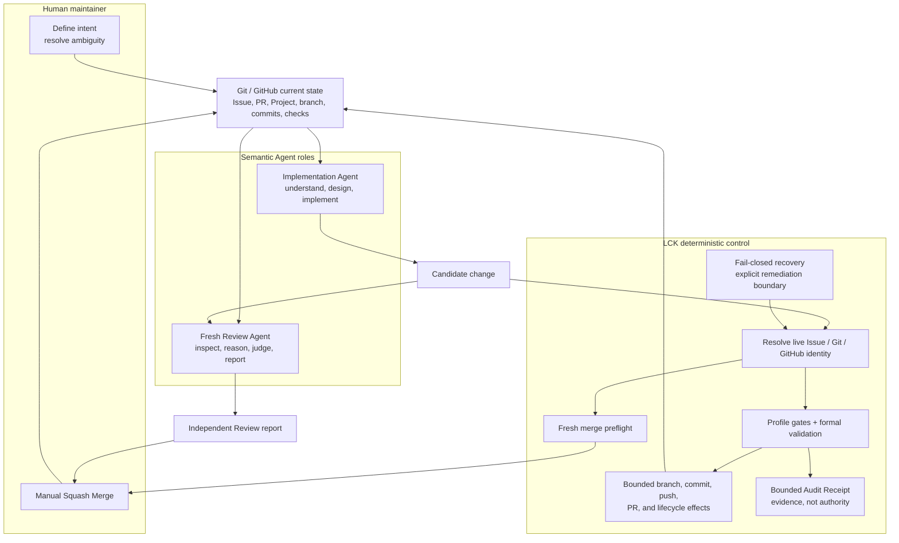
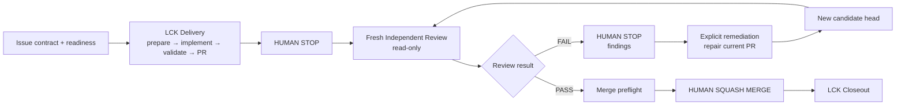

# LCK overview

This page is a public orientation to the Local Control Kernel (LCK) as it is
used within TraceQuant. It distinguishes current workflow behavior from design
intentions. The [LCK v1 Design Charter](../workflows/LCK-v1-Design-Charter.md)
is a design baseline; it is not proof that TraceQuant has completed its
quantitative roadmap or that every future capability described there exists.

## What LCK is

TraceQuant is an actively developed open-source project whose long-term goal is
an auditable research-to-live quantitative trading system for cryptocurrency
perpetual futures. The current repository is a Research MVP foundation. It has
no exchange client, research data pipeline, backtester, strategy, model,
execution service, risk engine, or Live runtime. LCK does not change that
boundary.

LCK was developed within TraceQuant while constructing and maintaining it. It
is an engineering capability for making AI-assisted software delivery deterministic,
auditable, and human-controlled. It addresses a practical problem: an Agent
can reason about a change, but conversational context alone should not decide
which branch, commit, pull request, lifecycle state, or recovery action is
currently safe.

LCK is an on-demand local control layer, not a long-running daemon, standalone
Agent platform, trading module, or risk authority. Its purpose is to control
the deterministic parts of the repository workflow while leaving semantic
judgment with people and Agents.

## Why it was developed inside TraceQuant

TraceQuant is being built as a long-lived, auditable quantitative project.
Maintaining that kind of repository with Agents requires current state to be
resolved from Git and GitHub rather than inferred from conversation: the
active Issue, branch, commit, pull request, validation result, lifecycle state,
and safe recovery action all matter. LCK was developed within TraceQuant to
make those mechanics deterministic while keeping design and implementation
judgment with people and Agents.

This is an engineering capability formed and actively used during TraceQuant's
construction. It is not a claim that TraceQuant already has its future data,
research, backtesting, execution, risk, or Live capabilities.

## Semantic work and deterministic control

The responsibilities are deliberately separated:

| Responsibility | Primary owner |
| --- | --- |
| Define intent, resolve genuine ambiguity, and manually approve the merge | Human maintainer |
| Understand the change, design it, implement it, diagnose it, and explain it | Implementation Agent |
| Independently inspect, reason about, judge, and report on a candidate | Fresh Review Agent |
| Resolve current Git/GitHub identity, evaluate lifecycle gates, run formal validation, commit, push, resolve the PR, and record bounded lifecycle evidence | LCK |
| Store current repository, Issue, PR, branch, commit, and check state | Git and GitHub |

The authority boundary can be summarized as follows:



LCK can control the deterministic path and record what happened, but it does
not decide whether a design is good, replace the fresh Review Agent, or merge
on a maintainer's behalf. Git and GitHub remain the current-state authority;
an Audit Receipt is bounded evidence for explanation and recovery, not a
permission token.

## Current capability surface

The current LCK workflow provides these repository-level capabilities:

- Issue-driven delivery with readiness checks, typed contracts, and a
  profile-specific policy boundary;
- explicit work-item contracts, including a Task `Critical Outcome` verifier
  where required and separate contracts for Documentation, Bug, and Research
  leaves;
- a semantic/deterministic execution boundary between Agents and LCK;
- formal candidate validation and current-check observation at the Delivery
  boundary;
- fresh, read-only Independent Review with a stale-target guard;
- human-only Squash Merge authority after Review and merge preflight;
- bounded Audit Receipts that preserve lifecycle evidence without replacing
  live-state resolution; and
- fail-closed recovery, including explicit remediation after Review FAIL and a
  fresh Review for every repaired head.

Codex is a primary use case, and the workflow is provider-neutral by design.
Codex and other supported providers, including Claude in the current workflow
documentation, can perform the semantic Agent roles under the same LCK
contract. Provider-specific prompts, tools, or sandbox details must not decide
the actionable branch, SHA, PR, push destination, merge state, or recovery
state.

## The controlled lifecycle

The normal path is:

1. **Issue and Delivery.** A maintainer starts from the current Issue
   contract. LCK resolves live readiness facts and prepares the correct
   profile-owned workspace. The Implementation Agent performs the scoped
   semantic work. LCK Delivery Complete runs the applicable gates and formal
   validation, commits the validated tree, synchronizes the branch, resolves
   or creates the open PR, and moves the lifecycle to Review.

2. **Human stop and Independent Review.** Delivery stops at a human boundary.
   A fresh Review invocation independently resolves the current open PR,
   base, head, checks, and applicable contract. The Review Agent works
   read-only and does not inherit the Delivery Agent's correctness judgment.

3. **Review PASS and manual merge.** A passing Review is followed by a fresh
   merge preflight. Only after that preflight is the change ready for the
   maintainer's manual Squash Merge. No Agent, Skill, or LCK operation
   automatically merges a PR.

4. **Review FAIL and explicit remediation.** A failed Review stops with
   findings. It does not automatically start repair. A maintainer must
   explicitly start remediation using the failed Review identity. LCK then
   reacquires live state, the Implementation Agent repairs the scoped defect,
   and LCK validates and updates the existing PR. The repaired head must go
   through a fresh Independent Review; the old Review result cannot authorize
   the new head.

5. **Closeout.** After the maintainer has merged the PR, a separate LCK
   Closeout operation reacquires the merge identity and converges the Issue,
   Project, canonical `main`, and exact leaf-Issue branch lifecycle. Closeout is
   separate from the merge decision and does not turn a planned quantitative
   capability into a completed one.

```text
Issue → Delivery → HUMAN STOP → Independent Review
                                  ├─ FAIL → HUMAN STOP → explicit remediation → fresh Review
                                  └─ PASS → merge preflight → HUMAN SQUASH MERGE → Closeout
```

The same lifecycle in an editable public diagram is:



## Fresh state, recovery, and auditability

Each LCK lifecycle operation resolves a fresh phase-specific snapshot from
current Git and GitHub facts. A previous Agent message, expected SHA, PR
number, validation snapshot, or audit receipt is not authority for a later
operation. LCK checks freshness at operation boundaries and fails closed when
identity is ambiguous, state has diverged, or a required fact cannot be
trusted. It does not guess, force-push, automatically repair a failed Review,
or wait in a background polling loop for the world to change.

LCK records bounded operation results, validation, effect receipts, and other
diagnostic evidence so that a maintainer can understand what happened. That
audit evidence is not a permission token: current live state is resolved again
before a later lifecycle effect. This separation makes recovery from an
interrupted or stale operation an explicit state-resolution problem rather
than a request to trust conversational memory.

## Relationship to TraceQuant and reuse

LCK remains an engineering capability within TraceQuant, whose product identity
and quantitative-system goal remain primary. LCK governs repository delivery
and review mechanics; it does not make trading decisions, submit exchange
orders, or replace a future risk authority. Its provider-neutral control ideas
are intended to have reuse value for other open-source projects that need
auditable, human-controlled Agent-assisted maintenance. That is an intended
reuse direction, not a claim of drop-in installation, external adoption, or
capabilities that this repository does not currently support.

For the normative current workflow, see the [Issue workflow](../development/issue-workflow.md)
and [Independent PR Review](../development/pr-review.md). The [Agent Workflow
Skills registry](../workflows/agent-skills.md) is a navigation document, while
the [technical baseline](../architecture/technical-baseline.md) remains the
authority for TraceQuant's current product capabilities.

For manual study and adaptation by another open-source project, see the
[LCK adoption guide](LCK-adoption.md). It describes reuse value and the
repository-specific work that remains necessary; it is not a standalone
installation path, universal portability claim, or evidence of external
adoption.
