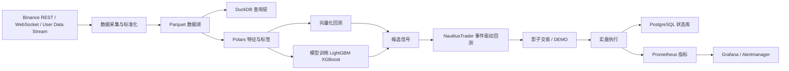

# 面向个人的加密永续合约量化项目技术路线确认报告

## 执行摘要

本项目最稳妥、也最符合个人资源禀赋的技术路线，不是“完全从零造一个交易引擎”，也不是“把现成机器人直接改成实盘系统”，而是**以 NautilusTrader 作为事件驱动回测与实盘执行底座，在其之上自研数据层、因子层、标签层、模型层、信号层、风控层与监控层**。这样做的理由很直接：NautilusTrader 的设计目标本来就是在同一事件驱动架构内覆盖研究、仿真和实盘，并且其 Binance 集成已经支持 DEMO 环境、`post_only`、`reduce_only`、以及期货上的 `GTX` 行为；与此同时，Freqtrade 的 K 线级回测明确假设订单在 candle 条件满足时成交，Hummingbot 则更偏向做市与执行机器人，而不是完整的 ML 研究平台。对你当前的项目边界而言，**最佳组合是“自研 Alpha + 开源执行内核”**。citeturn3search2turn4search5turn17search0turn6search12turn0search2turn13search10

项目边界已经比较清晰：交易所固定为 Binance USDⓈ-M，交易对起步为 BTC/ETH 永续，优先考虑 USDC 永续执行，但程序必须通过 `GET /fapi/v1/commissionRate` 动态读取账户真实费率，不能把“maker 免手续费”写死在代码里；数据层第一阶段只使用公开数据，包括 1m K 线、标记价、指数价、funding、top-of-book、聚合成交与基础账户流，不购买高精度 L3 历史数据；执行侧采用“maker 优先、超时再判断是否 taker”的订单路由；研究侧采用“向量化回测筛选 + 事件驱动回测验真”的双层验证；模型侧以规则基线、LightGBM、XGBoost 为主，后期再上神经网络或 LLM 辅助，而不是一开始就押注复杂时序深度模型。Binance 官方文档已明确提供 USDⓈ-M 的 mark price、funding、index/mark Kline、aggTrades、bookTicker、depth、commissionRate、position mode、margin type、user data stream 与 DEMO 环境；Polars、DuckDB、LightGBM、XGBoost、Optuna、MLflow、PostgreSQL、Prometheus 与 Grafana 也都具备成熟且活跃的官方文档与发布节奏，足以支撑这一技术路线。citeturn3search7turn5search0turn4search0turn4search10turn4search16turn11search2turn11search1turn11search3turn8search8turn8search5turn8search10turn8search7turn10search0turn2search5turn2search14turn3search4turn2search7

这份报告的核心结论可以归纳为三点。第一，**从零开发的部分，应集中在“竞争力真正所在”的模块**：数据标准化、特征工程、标签定义、Walk-forward 验证、模型训练、信号组合、仓位与风控、订单路由策略、对账与监控规则。第二，**不应从零开发的部分**，包括交易所底层适配、事件总线、订单状态机、基础撮合仿真、账户状态恢复、实盘连接与对账机制，这些优先交给 NautilusTrader 这类专门为此而生的底座。第三，项目应拆成若干阶段推进：先做可重复的数据与向量化回测，再做事件驱动回测与影子交易，再进入 DEMO，再进入小资金实盘，最后再讨论多标的、多机部署、双向持仓和购买深度历史数据。这样做能把“研究正确性”和“实盘工程可靠性”分层验证，避免一开始就把全部复杂性揉在一起。citeturn7search14turn4search2turn5search1turn5search2turn7search2turn7search7

以下假设目前仍是**未指定、且应在配置层面预留为参数**：初始资金规模、可接受开发周期、所在司法辖区与合规限制、是否允许使用 VPS/云服务、是否允许未来采购 L2/L3 历史数据、是否允许将 BTC/ETH 之外的品种纳入信息源、以及是否在后期启用双向持仓与多资产保证金。这些不应被写死在架构里，而应以 `.yaml/.toml` 配置、数据库参数表或模型 registry 元数据管理。Binance 的 position mode、margin type、multi-assets mode 都有对应的官方接口，因此这些“未来可能变化的制度变量”完全可以配置化，而不是硬编码。citeturn16search0turn16search2turn12search2

## 项目边界与总体验证原则

本项目适合围绕以下边界展开。交易所锁定 Binance USDⓈ-M；起步信息源至少覆盖 `BTCUSDT`、`ETHUSDT`、`BTCUSDC`、`ETHUSDC` 四个永续合约；起步实际交易建议只开 `BTCUSDC`，待执行质量验证后再加入 `ETHUSDC`；决策频率限定在 15 分钟到 4 小时；基础历史数据以 1 分钟粒度为主；实时数据至少覆盖 bookTicker、聚合成交和 user data stream；第一阶段不购买高精度 L3 历史数据，只维护本地 top-of-book 与轻量 order-flow 特征。这样做与 Binance 公开 API 的能力边界一致，也与你当前“小资金、maker 优先、中低频”的目标一致。citeturn4search0turn4search10turn4search16turn11search2turn5search0

从研究方法看，最重要的不是“策略名字”，而是**验证链条**。向量化回测应当承担“快速筛选”职责，只回答两个问题：这个因子有没有最基本的统计关系，这个信号在粗成本下是否可能覆盖费用。事件驱动回测则承担“实盘可行性”职责，必须模拟被动挂单、部分成交、撤单、超时、重新报价、市场单兜底、手续费、funding、延迟与 websocket/REST 状态差异。Freqtrade 的官方文档明确指出，它的回测是建立在 candle 和 dataframe 之上的，且 K 线级回测默认假设订单在条件满足时成交；而 NautilusTrader 官方文档则明确提供基于 L1/L2/L3 数据的事件驱动回测、fill model、latency model、fee model 与 book-driven 仿真。基于这两个文档事实，本项目必须采用“双层回测”，不能只押注某一套回测器。citeturn6search13turn6search12turn4search2turn7search14turn4search5

数据与存储侧的基本原则应当是“**研究层列式文件，实时状态层关系库**”。Polars 的 Lazy/Streaming API 天然适合大规模特征工程与较低内存占用的数据处理；DuckDB 对 Parquet 有原生高效支持，并支持列裁剪与谓词下推；因此历史行情、特征、标签、回测输出与实验样本集适合以 Parquet 为底层格式、DuckDB 作为查询与拼接引擎。另一方面，订单状态、持仓快照、账户权益、风控事件、模型发布记录、运行心跳与审计记录更适合落到 PostgreSQL 这类持久化数据库中；尤其是 MLflow 的 Model Registry 官方文档明确要求使用数据库后端存储，PostgreSQL 就是官方文档直接提到的典型方案之一。citeturn8search12turn8search16turn8search1turn8search5turn10search5turn10search1turn2search14

风控原则应在架构层而不是策略层固化。Binance 官方支持单向与双向持仓模式、逐仓与全仓切换、symbol 级 margin type 变更，以及 reduce-only 语义；但对个人小资金起步而言，最安全的默认组合仍是**单向持仓 + 逐仓 + 低总名义杠杆 + reduce-only 平仓约束**。因为一旦引入双向持仓、跨标的共享保证金或多资产保证金，策略逻辑、仓位净额计算、强平路径、对账与风险显示都会显著复杂化。对第一阶段项目来说，这些复杂性没有必要提前承担。citeturn16search0turn16search4turn16search5turn17search2

下面这张图概括了建议的最小系统边界：



这条链路的关键优点在于：研究用的数据与特征逻辑可以高效迭代，而执行用的订单状态、重连、对账和事件时序则交给专门的执行底座处理，从而把可替代的基础设施工作，尽可能转换为可复用的开源依赖。citeturn8search8turn8search5turn3search2turn4search5turn5search1turn3search1turn2search3

## 技术路线与开源自研边界

### 技术路线总判断

技术路线应采用“**研究模块自研，交易内核复用**”的中间路径。完全从零开发的问题不在于“能不能写出来”，而在于要同时承担交易所适配、实时连接、状态恢复、撮合仿真、实盘对账和风控边界的全部复杂性；NautilusTrader 的官方文档把这些都作为其核心职责的一部分，明确覆盖 backtest、sandbox、live 三种环境，并在 live 模式下提供 execution reconciliation。对个人项目来说，这些是高投入、低差异化、但一旦出错就直接伤到资金安全的区域，因此不值得从零重造。citeturn5search8turn5search1turn3search2turn7search12

与之相对，Freqtrade 和 Hummingbot 都不应作为本项目的主底座。Freqtrade 非常适合快速验证 K 线级规则策略、dry-run 与策略参数试验，也支持 isolated futures；但它的回测模型建立在 candle/dataframe 逻辑之上，官方文档明确写到“回测假设订单会成交”，并且定价与超时扩展也是围绕 candle 粒度设计。这使它非常适合**研究早期的粗筛**，却不适合承担“maker 优先、被动成交概率、部分成交、订单重报队列”这些执行细节。Hummingbot 则在 Binance 永续连接器中提供 `LIMIT`、`LIMIT_MAKER`、`MARKET` 以及 perpetual 连接，非常适合作为做市、挂单管理与执行实验工具，但它的官方定位是“构建自动化 market making 和 algorithmic trading bots”，不是完整的 research-to-live ML 研究平台。citeturn6search0turn6search12turn6search20turn0search2turn13search10turn13search18

因此，本项目应当这样分工：

| 工具角色 | 主用途 | 结论 |
|---|---|---|
| **NautilusTrader** | 事件驱动回测、订单仿真、Binance 适配、DEMO/实盘、对账恢复 | **主底座** |
| **Freqtrade** | K 线级快速原型、规则策略 sanity check、对照回测 | **辅助工具** |
| **Hummingbot** | maker 执行实验、做市研究、订单行为对照 | **可选实验工具** |

这个分工不是“工具喜好”，而是由工具边界决定的：NautilusTrader 擅长把同一策略逻辑贯穿研究、仿真与实盘；Freqtrade 擅长快速起策略；Hummingbot 擅长执行和做市。把它们放在各自擅长的位置上，系统整体最稳。citeturn4search5turn5search2turn6search2turn0search2turn13search10

### 模块划分表

下表给出建议的模块拆分、自研边界与关键接口。这里的“是否自研”，是指**策略项目仓库内是否自行实现核心逻辑**；即使底层借助第三方库，业务逻辑本身仍然可以是自研。

| 模块名 | 是否自研 | 理由 | 关键接口 | 优先级 |
|---|---|---|---|---|
| 交易所底层适配 | 否 | Binance 行情/下单/对账复杂，复用 NautilusTrader 更安全 | `VenueAdapter`, `submit_order`, `cancel_order`, `reconcile()` | P0 |
| 事件驱动回测内核 | 否 | 复用 NautilusTrader 的 `BacktestEngine`、fill/latency/fee model | `run_backtest(config)` | P0 |
| 数据采集层 | 是 | 需要按你的字段标准与落盘规范实现 | `fetch_backfill()`, `stream_subscribe()`, `normalize_event()` | P0 |
| 数据标准化与存储 | 是 | 直接决定后续因子、标签和查询一致性 | `write_parquet()`, `schema_validate()`, `upsert_manifest()` | P0 |
| 特征工程 | 是 | 这是核心 Alpha 资产，不能外包给框架 | `build_features(df, cfg)` | P0 |
| 标签定义与净收益目标 | 是 | 必须与你的 fee/slippage/funding 假设一致 | `build_labels(df, cost_model)` | P0 |
| 向量化回测器 | 是 | 需要极快迭代，建议轻量自研 | `simulate_vectorized(signal, costs)` | P0 |
| 模型训练与搜索 | 是 | 需要自定义 Walk-forward、purging、cost-aware metric | `train_fold()`, `score_fold()`, `optimize()` | P1 |
| 信号组合与市场状态机 | 是 | 直接决定交易频率和稳定性 | `signal_router()`, `state_classifier()` | P1 |
| 仓位与风控 | 是 | 账户级/策略级约束必须自定义 | `target_position()`, `risk_gate()`, `circuit_breaker()` | P0 |
| 执行路由器 | 是 | maker 优先、超时 taker 是本项目关键差异点 | `route_order()`, `repricing_policy()` | P0 |
| 监控与告警 | 是 | 指标与阈值由你的运行方式决定 | `emit_metrics()`, `emit_alert()` | P1 |
| 模型与实验 registry | 是 | 需与策略版本、数据版本、成本假设绑定 | `register_model()`, `register_run()` | P1 |
| 研究报告生成 | 是 | 用于沉淀实验结论和回归追踪 | `build_report(run_id)` | P2 |

这张表背后的判断依据是：订单生命周期、live reconciliation、环境切换、`post_only/reduce_only` 等设施层能力，已经被 NautilusTrader 明确覆盖；而 Freqtrade/Hummingbot 更适合作为辅助手段，而不是本项目的主业务框架。citeturn5search1turn17search0turn17search2turn7search22turn0search2turn13search10

### 每个模块的最小接口契约

下面给出建议的最小接口规范。接口名是建议，不是强制；关键在于输入输出边界要清晰、可测试、可替换。

| 模块 | 输入 | 输出 | 最小接口 | 最小测试用例 |
|---|---|---|---|---|
| `ingest` | symbol、时间范围、数据源类型 | 标准化后的 Arrow/Parquet 批次 | `fetch_range()`, `stream_to_queue()` | 断点续传、重复拉取不重写、时间戳单调 |
| `schemas` | 原始事件流 | schema-valid 的标准记录 | `normalize_trade()`, `normalize_book_ticker()` | 缺字段、null、重复事件、跨日边界 |
| `storage` | 标准记录 | 分区 Parquet、manifest | `append_partition()`, `list_partitions()` | 同日多批写入、schema 升级、空分区 |
| `features` | Parquet/DuckDB 结果 | feature dataframe | `build_feature_set()` | 对齐测试、lookback 足够性、缺失补齐 |
| `labels` | 价格/成本/funding | 监督学习标签与净收益标签 | `label_forward_return()` | 边界样本 purge、未来泄漏检查 |
| `vector_bt` | 信号、成本参数 | pnl/turnover/drawdown | `run_vector_bt()` | 零成本基准、双边手续费、滑点敏感性 |
| `event_bt` | 策略、订单路由、市场事件 | event-level fills 和报表 | `run_event_bt()` | 部分成交、超时、撤单、重启恢复 |
| `models` | features、labels、fold config | 模型、特征重要性、OOF 预测 | `fit_fold()`, `predict_oof()` | 时间切分、随机种子复现、样本重排失败 |
| `risk` | 信号、账户状态、波动率 | 目标仓位或拒单 | `calc_target_notional()`, `check_limits()` | 单日熔断、单笔风险限制、持仓限额 |
| `execution` | 目标仓位、盘口、fee | 下单命令与状态机事件 | `plan_orders()`, `handle_timeout()` | maker 失败转 taker、reduce-only 校验 |
| `reconcile` | 本地状态、交易所状态 | 差异事件与修复动作 | `diff_orders()`, `diff_positions()` | orphan 订单、外部平仓、重复成交 |
| `monitoring` | 运行指标、异常 | metrics + alerts | `record_metric()`, `raise_alert()` | websocket 断开、延迟飙升、权益异常 |
| `registry` | run 元数据、模型文件、配置 | 可追溯 run/model 记录 | `log_run()`, `promote_model()` | run 重复提交、模型别名切换、回滚 |

这些接口之所以值得一开始就标准化，是因为 Binance WebSocket 连接有 24 小时有效期限制、user data stream 事件有明确的排序语义，实盘系统又必须处理从历史 backfill 到实时订阅、从本地状态到交易所状态的切换；如果接口不统一，后续几乎必然出现“研究能跑、实盘不稳”的分裂。citeturn5search18turn11search3turn5search1turn7search10

## 阶段化路线图

### 阶段路线图表格

下表给出建议的阶段拆解。时间估计是假设你能持续投入开发与研究的**最佳努力估计**，不是硬承诺；它应作为配置项，而不是固定排期。

| 阶段 | 目标 | 最小可交付物 | 资金与硬件要求 | 时间估计 | 验收标准 | 主要风险 |
|---|---|---|---|---|---|---|
| 预研冻结 | 冻结边界、选型、仓库结构、数据 schema | 架构文档、配置模板、目录结构、依赖锁文件 | 现有本地电脑即可 | 1–2 周 | 形成单一技术路线，不再反复换框架 | 工具犹豫症、边做边改 |
| 数据与研究 MVP | 打通历史数据、特征、标签、向量化回测 | 可重复 backfill、Parquet 分区、DuckDB 查询、50–120 个基础特征、基线回测 | 本地单机；无需额外购置 | 3–6 周 | 历史数据可重复重建；基线策略有完整报表 | 时间对齐错误、未来泄漏 |
| 事件回测与执行仿真 | 建立真实订单行为仿真 | NautilusTrader 回测、maker 优先路由、超时 taker、funding/fee/slippage 注入 | 本地单机；可选小型 VPS 做 smoke test | 4–8 周 | 事件回测与向量化结果方向一致；关键场景有回归测试 | 订单状态机复杂、参数爆炸 |
| 影子交易与 DEMO | 验证实时行情、下单链路、对账恢复 | 影子交易日志、DEMO 实盘节点、仓位/订单对账、告警 | 本地 + 低配 VPS；Binance DEMO | 2–4 周 | 连续运行稳定；断线/重启/重复事件可恢复 | WebSocket 重连、实盘/模拟差异 |
| 小资金实盘 | 只验证执行，不追求扩仓 | BTCUSDC 小额实盘、每日对账、熔断、值班面板 | 小资金；1 台稳定 VPS 即可 | 4–8 周 | 连续运行、无失控仓位、成本统计闭环 | 手续费活动变化、盘口退化 |
| 扩展阶段 | 加入 ETH、多机部署、更多因子/模型 | 多标的组合、模型 registry、监控增强、云迁移 | 本地 + VPS/云；必要时多机 | 2–6 个月 | 增加复杂度后系统仍可维护 | 复杂度上升、运维负担 |
| 深度数据与高级研究 | 采购 L2/L3 历史数据、研究更精细执行与微观结构 | 新数据管线、L2/L3 backtest、微结构因子 | 额外数据预算；更大存储与算力 | 视预算而定 | 新增数据显著提升执行建模质量 | 成本高、ROI 不确定 |

这个节奏与 Binance/Nautilus 的环境能力是匹配的：Binance 官方提供 DEMO 环境；NautilusTrader 原生支持 backtest/live 两类环境与 Binance DEMO；Prometheus/Grafana/Alertmanager 则能逐步把“脚本日志”升级为“可观测系统”。citeturn5search0turn5search2turn5search1turn3search1turn3search5turn2search3

### 三个月、六个月、十二个月里程碑

| 时间窗口 | 应完成的重点里程碑 |
|---|---|
| 短期三个月 | 数据采集与 schema 冻结；Parquet+DuckDB 研究底座；规则基线 + LightGBM/XGBoost 基线；向量化回测器；事件驱动回测最小版；BTCUSDC 影子交易 |
| 中期六个月 | Binance DEMO 稳定运行；maker 优先执行器与对账器稳定；MLflow/Optuna 与实验追踪上线；Grafana 监控面板与告警闭环；小资金 BTCUSDC 实盘 |
| 长期十二个月 | 加入 ETHUSDC；引入多市场信息源；分离研究机与实盘机；多机部署、容灾与定时重训；必要时引入 L2/L3 历史数据和更复杂模型 |

这些里程碑之所以合理，是因为它们遵循了“**先正确、再真实、最后扩张**”的顺序：先让数据与研究可审计，再让回测与实时连接一致，最后才让实盘资金和系统复杂度上升。citeturn7search14turn5search1turn4search5

## 模块接口优先级与测试

### 第一阶段最小可交付产品

第一阶段的 MVP 不应追求“平台感”，而应追求“闭环完整”。最小可交付产品建议冻结为以下清单：

```text
[ ] 统一配置文件：symbols / intervals / costs / risk / paths / env
[ ] Binance 历史 backfill：1m kline、mark price、index price、funding、open interest、aggTrades
[ ] Binance 实时订阅：bookTicker、aggTrade、user data stream
[ ] 标准化 schema 与 Parquet 分区落盘
[ ] DuckDB 查询脚本与数据校验脚本
[ ] 50–120 个基础特征
[ ] 净收益标签：显式扣除 fee、slippage、funding
[ ] 规则基线策略
[ ] LightGBM / XGBoost 基线模型
[ ] Walk-forward + purging 验证
[ ] 轻量向量化回测器
[ ] NautilusTrader 事件驱动回测最小版
[ ] maker 优先 / 超时 taker 的执行策略
[ ] PostgreSQL 运行状态表
[ ] Prometheus 指标导出 + Grafana 基础面板
[ ] 每日对账脚本与熔断规则
```

这份 MVP 是“可复制”的，因为它明确依赖 Binance 已公开提供的数据端点与用户流，也依赖官方文档稳定支持的 Polars、DuckDB、LightGBM、XGBoost、MLflow、Prometheus 等工具，而不是依赖某个闭源数据供应商或一次性的实验脚本。citeturn11search2turn11search1turn4search0turn4search16turn11search3turn8search8turn8search5turn8search10turn8search7turn2search5turn3search1turn2search3

### 集成测试与回测验证清单

集成与验证建议分为四层执行。

第一层是**数据完整性测试**。必须测试时间戳单调、重复事件去重、分区 schema 一致、symbol/interval 命名一致、REST backfill 与 websocket 增量衔接正确。对 Binance 来说，这件事尤其重要，因为 bookTicker、depth、aggTrade、markPrice 和 user data stream 天然来自不同流；没有统一的标准化层，后续特征与策略几乎一定出现隐性错配。citeturn4search0turn4search10turn11search3turn5search7

第二层是**研究正确性测试**。这里至少要覆盖五类检查：标签未来泄漏检查、训练/验证/测试时间切分检查、成本模型敏感性检查、随机种子复现实验、参数扰动鲁棒性检查。Freqtrade 2026.6 版本已经把 lookahead analysis 与 recursive analysis 进一步暴露到 UI/API，恰恰说明“看未来”和“递归偏差”是策略研究中的常见失败模式；你的自研研究管线也必须把这类测试作为常规步骤，而不是上线前最后才想到。citeturn15view0

第三层是**执行语义测试**。这里至少要覆盖：`post_only` 订单遇到立即成交时被拒绝、超时取消、部分成交、`reduce_only` 平仓约束、重启恢复、本地状态与交易所状态 diff、24 小时 WebSocket 重连、更换 API key/环境变量后恢复运行。Binance 官方文档明确说明 USDⓈ-M Futures 的 `GTX` 属于 post-only 语义，且会在不满足 maker 条件时被拒绝；NautilusTrader 官方也明确把 futures 上的 `post_only` 映射为 `GTX`。因此，这些测试用例不是“锦上添花”，而是你的执行路线能否成立的前提。citeturn0search9turn17search0turn5search18turn5search1

第四层是**风控与故障测试**。必须包括：单日亏损熔断、连续下单失败熔断、数据延迟异常熔断、user data stream 中断熔断、对账不一致时禁止新开仓、权益异常跳变报警、手工 kill-switch。Prometheus 官方把采集、规则和 Alertmanager 的职责边界写得非常清楚，而 Grafana 官方文档给出了与 Prometheus 的标准集成路径；这意味着监控栈完全可以从第一阶段开始就按“可报警”的方式搭，而不是依赖人工盯日志。citeturn3search1turn3search5turn3search17turn2search3turn10search7

### 每日与每周测试例程

**每日例程**建议固定为五件事。其一，校验 Binance 账户真实费率与当前配置一致，特别是 USDC 合约是否仍享有预期的 maker 条件；其二，执行订单/持仓/余额对账；其三，检查数据延迟与 websocket 重连次数；其四，回看前一交易日的实际成交成本与预估成本偏差；其五，执行一次基础 smoke test，包括订阅、下单模拟、指标上报与告警链路。`commissionRate`、position mode、margin type、user data stream 与 Binance DEMO 环境都已有官方接口或官方文档，因此这些每日检查完全可以自动化。citeturn3search7turn16search0turn16search2turn11search3turn5search0

**每周例程**建议固定为四个批次。其一，重建最近 7–14 天的数据子集并与生产数据对比抽样校验；其二，运行回归测试包，包括 20–50 个固定种子回测与关键场景事件仿真；其三，重新训练基线模型并对比前一版本的 OOF/样本外指标；其四，执行一次“故障注入演练”，例如模拟 websocket 断开、数据库不可用、下单超时、订单回报缺失。NautilusTrader 本身已经对测试数据集和测试工作流给出专门的开发者文档，这一点很值得借鉴：你的项目仓库也应尽早把“固定夹具 + 回归测试”制度化。citeturn17search3turn7search16

## 开源库清单

下面给出建议的开源库清单、版本建议、用途与替代项。版本建议以 **2026 年 7 月公开可见的稳定/当前版本** 为基准；其中若上游仍处于活跃 Beta 阶段，应**精确锁 patch 版本，不跟随 latest 漂移**。citeturn13search2turn7search7turn7search20

| 开源库 | 版本建议 | 用途 | 为什么选它 | 替代项 |
|---|---|---|---|---|
| **NautilusTrader** | `1.230.0` 精确锁版；升级需人工回归。当前公开版本为 `1.230.0 Beta`，且官方明确提示仍在活跃开发中，可能出现 breaking changes。citeturn13search2turn7search7 | 事件驱动回测、Binance 适配、DEMO/实盘执行、对账恢复 | 同一架构覆盖研究/仿真/实盘；支持 L1/L2/L3、fill/fee/latency model、Binance DEMO、`post_only`/`reduce_only`。citeturn4search2turn5search2turn17search0 | 自研执行引擎、Hummingbot |
| **Polars** | `1.42.x`。GitHub 公开 release 显示 Python Polars `1.42.1`。citeturn1search0 | 特征工程、数据清洗、批量表计算 | Rust 内核、Lazy API、Streaming、查询优化，适合分钟级大样本批处理。citeturn8search8turn8search12turn8search16 | pandas、PyArrow、Spark |
| **DuckDB** | 研究机优先 `1.5.4`；若更强调长期稳定，可固定 `1.4.5 LTS`。官方安装页同时给出 current `1.5.4` 与 LTS `1.4.5`，并说明从 `1.4.0` 开始引入 LTS 节奏。citeturn1search13turn1search5 | Parquet 查询、样本拼接、分析 SQL | 原生高效读取 Parquet，支持投影/过滤下推；适合本地研究仓库。citeturn8search1turn8search5 | SQLite、ClickHouse、本地 Spark |
| **LightGBM** | `4.6.0`。GitHub 公开 release 显示当前最新稳定版为 `v4.6.0`。citeturn1search6 | 分类/回归基线模型 | CPU/GPU 都成熟；官方文档明确支持并行、分布式与 GPU。citeturn8search10turn8search2turn8search14 | CatBoost、RandomForest |
| **XGBoost** | `3.3.0`。官方文档与 GitHub release 均显示 `3.3.0` 于 2026-06 发布。citeturn1search7turn1search11 | 树模型主力、与 LightGBM 交叉验证 | 稳健、成熟、GPU 支持明确。citeturn8search7turn8search3turn8search15 | LightGBM、CatBoost |
| **Optuna** | `4.9.0`。GitHub 公开 release 显示 2026-05 发布了 `v4.9.0`。citeturn2search0turn2search4 | 超参数搜索、约束优化、多目标优化 | 支持 Dashboard，可视化 trial 历史、参数重要性与关系。citeturn10search0turn10search12 | Ray Tune、Hyperopt |
| **MLflow** | `3.14.0`。官方 docs 标注 latest `3.14.0`，GitHub release 也显示同版本。citeturn2search5turn2search9 | 实验追踪、模型 registry、版本管理 | 官方文档明确提供 tracking、model registry；registry 需要 DB-backed store。citeturn10search5turn10search1turn10search17 | Weights & Biases、自研 SQLite 方案 |
| **PostgreSQL** | 生产建议 `17.10+` 或当前 major 的最新 minor；官方建议始终运行对应 major 的当前 minor。`18.4` 为 current major 文档版本，但 `17.10` 也仍处于支持期。citeturn2search10turn2search14turn2search2 | 订单/账户/风控/运行状态库，MLflow backend | 持久化可靠、生态成熟；适合作为状态与审计总库。citeturn10search5turn2search14 | SQLite、MySQL |
| **Prometheus** | `3.13.1 LTS`。官方下载页显示当前 Latest/LTS 为 `3.13.1`。citeturn3search4turn3search8 | 指标采集、告警规则、Alertmanager | 官方架构清晰，适合交易系统 metrics/alerts。citeturn3search1turn3search5turn3search17 | VictoriaMetrics、InfluxDB |
| **Grafana** | `13.x`。官方 docs 明示当前为 Grafana 13 文档版本。citeturn2search7turn2search15 | 仪表板、交易/系统可观测性 | 与 Prometheus 是标准组合，适合逐步增强监控。citeturn2search3 | Superset、自研前端 |
| **Freqtrade** | `2026.6`，仅作原型与对照工具。GitHub releases 显示 latest 为 `2026.6`。citeturn15view0 | K 线级快速原型、规则基线 sanity check | 上手快，支持 futures；但回测假设无法满足本项目执行研究要求。citeturn6search0turn6search20turn6search12 | 轻量自研向量回测器 |
| **Hummingbot** | `2.15.1`，仅作执行实验工具。官方 release notes 显示 2026-06 发布 `2.15.1`。citeturn13search0 | maker 行为实验、做市研究 | Binance perp 支持 `LIMIT_MAKER`，适合执行策略对照。citeturn0search2turn13search10 | Nautilus 自建执行实验 |

就“主线项目”而言，真正需要纳入生产依赖的核心库其实不多：**NautilusTrader、Polars、DuckDB、LightGBM、XGBoost、Optuna、MLflow、PostgreSQL、Prometheus、Grafana** 已经足够；Freqtrade 和 Hummingbot 更适合作为实验侧车，而不是主系统依赖。citeturn13search2turn8search8turn8search5turn8search10turn8search7turn10search0turn2search5turn2search14turn3search4turn2search7

## 迁移与扩展注意事项

从单机到 VPS/云，不应简单理解为“把脚本搬上去”。真正的迁移顺序应当是：**先把研究与执行解耦，再把执行搬到稳定节点上，最后才考虑多机与云原生**。NautilusTrader 官方明确不建议在 Jupyter 里运行 live trading node；换句话说，一旦进入实时节点阶段，就应该脱离 notebook，转向受控进程、容器或 systemd 服务。研究部分则仍可留在本地高性能机器上继续做特征、训练和实验。citeturn7search2turn7search1turn5search5

加入更多标的时，最先扩展的不是“交易对列表”，而是**数据 schema、风控约束与相关性管理**。BTC/ETH 之外如果再加 SOL、BNB 或更多合约，向量化特征层通常很好扩展，但仓位层会立刻遇到“总风险预算、相关性聚类、资金费率暴露、跨合约名义敞口”问题。因此建议在第二阶段之前，不要让“多标的”先于“统一风险账本”落地。Binance 的 account/position 接口与 Nautilus 的 accounting/portfolio 模型都为多头寸状态提供了基础，但组合层规则仍必须自研。citeturn5search12turn16search7turn17search9

启用双向持仓时，要把它视为**架构级切换**，不是一个开关。Binance 官方文档说明 position mode 在全账户层切换，且带有“存在 open order/open position 时不可切换”的限制；与此同时，Nautilus 的 `reduce_only` 在 Binance futures 的 hedge mode 下也存在禁用约束。这意味着如果未来要从单向模式迁移到双向模式，订单语义、头寸聚合、止损逻辑和对账规则都必须重新回归测试。这个变化不应在早期阶段引入。citeturn16search0turn17search0

未来如果决定采购更高质量的深度历史数据，建议优先引入 **L2，再评估 L3**。原因并不是 L3 没价值，而是第一阶段项目的执行目标属于 15 分钟到数小时，不需要一开始就为纳秒级重构 order book 付出供应商成本。等到系统已经证明“maker 优先 + 超时 taker”的大方向成立，再评估是否需要为被动成交建模引入更高精度深度数据。NautilusTrader 官方文档明确支持 L1/L2/L3 的 order book 模型与回测，且也提供了对 Tardis 数据的集成路径；这意味着你的系统在未来采购深度数据时，不需要重写核心执行框架，只需要新增数据适配层和新的 fill/latency 配置。citeturn4search8turn4search15turn4search17turn6search3

监控扩展方面，建议遵循“**日志 → 指标 → 仪表板 → 告警 → 值班规则**”的顺序。Prometheus 官方把抓取、规则与 Alertmanager 的职责分拆得非常清楚，Grafana 官方也提供了与 Prometheus 的标准打通方法。因此从单机到云的迁移过程中，最应该优先保留的是指标命名、labels 设计、告警路由与 runbook，而不是漂亮的图表样式。这会决定系统是否真的可运维。citeturn3search1turn3search13turn3search5turn2search3

最后，Binance API 安全设置必须和部署路径同步升级。官方帮助与安全文档都反复强调 IP 白名单和禁用提现权限的重要性。对于本项目，建议做到三条底线：实盘 API key 绑定 VPS 固定 IP；永不启用提现权限；研究环境和实盘环境使用不同 key。这样做的好处不是“更优雅”，而是把失误面和攻击面切开。citeturn9search0turn9search1turn9search3turn9search10

整体上，这条技术路线已经足够明确：**NautilusTrader 做执行底座，Polars+DuckDB 做研究底座，LightGBM/XGBoost 做主模型，PostgreSQL 做状态库，Prometheus/Grafana 做监控栈，Freqtrade/Hummingbot只做辅助手段；从零开发 Alpha 和风险，复用开源实现交易内核与基础设施。**这条路线既保留了个人策略研究的自由度，也尽量避免把时间浪费在交易引擎底层重复造轮子上。citeturn3search2turn8search8turn8search5turn8search10turn8search7turn2search14turn3search4turn2search7