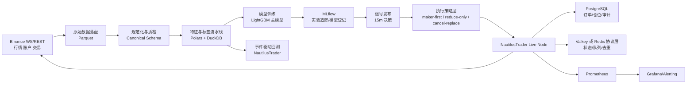

# BTC/ETH 永续合约量化项目技术路线细化报告

## 执行摘要

对这个项目，最优解不是“全部从零写”，也不是“把研究、回测、执行、风控全部押注在一个开源机器人框架里”，而是**混合路线**：把 **NautilusTrader** 作为执行与事件驱动底座，把 **Binance USDⓈ-M 接入、撮合语义、post-only/GTX、实盘对账、Demo 环境**等高复杂度基础能力交给成熟底层；把**数据标准化、特征库、标签定义、walk-forward 验证、组合约束、执行策略、风控规则、监控阈值**这些真正决定 alpha 与可持续性的部分坚持自研。NautilusTrader 的官方文档明确给出研究到实盘的统一事件驱动架构、L2/L3 队列与滑点模拟、延迟模型、Binance `post_only` 到期货 `GTX` 的映射、`commissionRate` 查询、以及 Demo 端点支持，这正好契合你希望以 Binance BTC/ETH 永续为标的、15 分钟做决策、LightGBM 为首选模型、并强调 maker 成交与实盘部署闭环的偏好。相比之下，Freqtrade 与 Hummingbot 更适合作为策略沙盒、运营化界面或参考实现；Backtrader 与 Zipline 更适合教学、传统 bar 回测或原型验证，不适合作为你这个项目的主干。citeturn32view3turn35view0turn35view1turn35view2turn14view0turn14view1turn14view2turn13view2turn16view0turn37view0turn37view2turn33view4turn33view2

就工程取舍而言，建议的最终组合是：**NautilusTrader + Binance adapter + Parquet/Polars/DuckDB 数据层 + LightGBM 主模型 + XGBoost 作为 challenger + MLflow + PostgreSQL + Redis 协议层但优先 Valkey 化部署 + Prometheus/Grafana + Docker Compose 起步，Kubernetes 后置**。这一组合的核心原因是：你的决策频率是 15 分钟，意味着项目的主要矛盾不在极低延迟撮合，而在**研究到实盘的一致性、maker-first 执行的真实性、费用/资金费/PnL 归因、以及长期迭代的工程纪律**。官方文档显示，Polars 擅长 lazy/streaming 处理，DuckDB 擅长直接查询 Parquet 并做投影与过滤下推，LightGBM 对缺失值原生支持且训练高效、支持 GPU，MLflow 提供实验追踪与模型注册，PostgreSQL 适合审计和事务性元数据，Prometheus/Grafana 适合指标与告警，而 Docker Compose 更适合单机高配研究机的早期阶段。citeturn13view8turn13view7turn6search0turn6search2turn6search15turn13view9turn13view10turn13view14turn8search2turn8search5turn13view11turn13view12turn13view13

## 背景与假设

本报告以你已给定的约束为主：交易所为 **Binance**，标的聚焦 **BTC/ETH 的 USDⓈ-M 永续合约**，并优先兼容 **USDC 结算的线性永续**；研究决策周期以 **15 分钟**为主；**LightGBM** 为首选模型；**NautilusTrader** 为执行底座的优先偏好。NautilusTrader 的 Binance 集成官方文档写明其支持 Spot、USDT Futures、Coin Futures 等产品类型，并在期货上把 `post_only` 映射到 `GTX` time-in-force，同时提供 Demo 环境与费率查询支持；文档也特别提到在 USDC 结算场景下需把 `bnfcr_currency` 设为 `USDC` 以完成账户余额与手续费对账。citeturn36view0turn36view2turn14view0turn14view2turn14view3turn14view1

以下事项在你的要求中**未指定**，因此会影响具体实现而不影响主路线判断：初始资金规模的具体数值、是否使用独立 VPS 或云主机、是否部署独立监控机、是否购买第三方高精度历史订单簿数据、是否计划做双向持仓或只做净持仓、以及是否对开源许可证兼容性有企业级要求。由于这些参数未指定，本文会优先给出**单机可执行、可逐步外迁到 VPS/云上**的路线，并把“需要额外预算时才启用”的组件后置。相应地，Kubernetes 不建议在第一阶段引入；单机阶段用 Docker Compose 就足够，等到你需要多节点调度、滚动发布、独立 stateful workload 管理再切换到 K8s 的 Deployment/StatefulSet 分工。citeturn13view11turn13view12turn13view13

从策略类型上讲，15 分钟决策频率意味着你做的是**中频方向性/统计性 alpha + 微结构执行优化**，而不是亚秒级做市。也因此，项目成功的关键不是堆更多 GPU 模型，而是让**bar 级信号、交易成本、资金费、maker/taker 路径、排队成交概率、实盘对账**形成一个闭环。NautilusTrader 官方文档之所以更匹配，是因为它在回测中提供了 L2/L3 订单簿、`prob_fill_on_limit`、`queue_position=True`、延迟模型和实盘 reconciliation；而 Freqtrade 官方文档明确写出其 bar 回测会假设“只要价格位于 candle high/low 内，订单就在请求价成交且无滑点”。对一个想认真研究 maker 优势是否能落地的人来说，这两种哲学差别非常大。citeturn35view0turn35view1turn35view2turn17view0turn17view1turn17view2

## 模块划分与自研边界

先给结论：**必须自研的是“研究逻辑”和“账户级约束”；应复用的是“通用引擎”和“通用基础设施”；连接这两者的地方用混合模式。** 下面这张表是项目的建议模块边界。

| 模块 | 建议方式 | 这样划分的原因 | 关键注意事项 | 依据 |
|---|---|---|---|---|
| 市场数据接入与归档 | 混合 | 交易所接入、WebSocket/REST、订单事件语义优先复用；原始数据归档、字段标准化、缺包修复、自定义数据质量规则应自研 | 不要只存 OHLCV；至少同步 funding、mark price、成交、深度快照/增量、账户成交回报 | citeturn32view3turn36view1turn15search4 |
| Canonical schema 与数据质检 | 自研 | 这是后续特征、回测、实盘对账的一致性基础；开源框架不会替你定义“你的研究真相表” | 建议统一成 instrument、event_ts、arrival_ts、source、sequence、side、px、qty、fee、funding 等字段 | citeturn13view2turn13view14 |
| 特征工程 | 自研 | Alpha 的可复制性来自特征与标签，而不是框架本身；FreqAI 也把 feature/label 交给用户定义 | 要显式区分 15m 决策特征与 1m/逐笔执行辅助特征 | citeturn37view3turn34search2 |
| 标签定义与训练样本构造 | 自研 | 方向标签、收益标签、路径依赖标签、资金费净收益标签必须与你的持仓和执行政策一致 | 一定做未来数据泄漏检查；标签要覆盖 fee、funding、滑点后的净收益 | citeturn37view3turn17view1 |
| 模型训练与 walk-forward 验证 | 混合 | 训练器、学习器、模型管理复用；切分逻辑、回放频率、再训练周期、评估口径自研 | LightGBM 做主模型，XGBoost 做 challenger；深度学习后置 | citeturn6search15turn6search1turn13view9turn13view10 |
| 事件驱动回测与撮合 | 混合 | 核心撮合引擎复用 NautilusTrader；你的 fees/funding/执行 policy/风控触发要自定义 | 必须启用更真实的 queue/slippage/latency 配置，而不是只看 bar 级回测 | citeturn32view3turn35view0turn35view1turn35view3 |
| 执行层与 OMS | 混合 | 订单生命周期、venue abstraction、对账可复用；下单节奏、maker-first、重试、撤单、分批挂单逻辑要自研 | Binance 期货 `post_only` 在底层是 `GTX`；费率最好拉 `commissionRate` 实测 | citeturn14view0turn14view1turn15search1turn13view2 |
| 风控引擎 | 自研 | 这是账户和策略绑定最强的模块，开源框架通常只给基础 primitives | 需至少覆盖 notional 上限、单标的风险、资金费暴露、连续亏损熔断、异常行情 Kill Switch | citeturn13view2turn36view2 |
| 监控与告警 | 开源 | Prometheus/Grafana/Alertmanager 已是成熟基础设施 | 交易类系统需把“行情缺失、订单失配、对账差异、风控触发”指标化，而不是只监控 CPU | citeturn8search1turn8search5turn8search6turn8search18 |
| 部署与运行环境 | 混合 | 容器化与基础编排复用；启动顺序、密钥注入、断线恢复、runbook 自研 | 单机阶段用 Compose，数据库与缓存分角色；K8s 后置 | citeturn13view11turn13view12turn13view13 |
| 实验管理与模型登记 | 开源 | MLflow 已提供 tracking 与 registry | 你要自定义 run schema、数据版本、回测版本、审批门禁 | citeturn13view9turn13view10turn21search14 |
| 审计、报表与 PnL 归因 | 混合 | 存储底座可复用；收益归因口径必须自研 | 建议拆分 alpha、执行、资金费、手续费、模型漂移、异常损失五类归因 | citeturn13view14turn15search1turn14view1 |

下面这张架构图对应的是上表的最终落地形态，适用于“高配单机研究机 + 小资金实盘”的起步方式。

## 关键开源库比较

### 交易底座与回测执行框架

| 库 | 功能匹配度 | 优点 | 缺点 | 已知风险 | 集成注意事项 | 替代方案 | 依据 |
|---|---|---|---|---|---|---|---|
| **NautilusTrader** | **非常高** | 官方强调研究、确定性模拟、实盘执行统一事件驱动架构；Binance 适配完善；支持期货 `post_only`→`GTX`、`commissionRate` 查询、Demo 环境；L2/L3、queue position、latency model 适合 maker 执行研究 | 学习曲线高；框架抽象重；你需要真正理解事件模型与 venue semantics | 版本发布长期带有 Beta 标识；开发版官方不建议用于真金白银生产环境 | 把它当“引擎”，不要把 alpha 逻辑也写成重耦合框架插件；优先先跑通 bar+L1，再引入 L2/L3 | 自研 OMS + CCXT；或只用 Binance SDK / websocket 自写执行层 | citeturn32view3turn32view1turn32view2turn14view0turn14view1turn14view2turn35view0turn35view1turn35view2turn35view3 |
| **Freqtrade** | 中等 | Python 生态轻便；官方带 backtesting、优化、WebUI/Telegram；FreqAI 能快速把 LightGBM 等模型接进实盘沙盒 | 官方 backtest 明确基于 candle 假设，订单只要落在 high/low 内就按请求价成交、无滑点；对 maker 排队成交研究偏弱 | 依赖 CCXT 语义，交易所细节会被抽象层抹平；杠杆/期货模式官方警告风险高 | 更适合做“策略 ideas sandbox / baseline / 参数探索”，不要作为你的主执行引擎 | NautilusTrader；研究层也可直接用 sklearn/lightgbm + 自研执行 | citeturn13view3turn16view1turn16view2turn17view1turn17view2turn37view3turn34search2 |
| **Hummingbot** | 中等偏低 | 对交易所连接、做市控制器、运营化界面友好；Binance perpetual connector 官方支持 `LIMIT_MAKER`；发布节奏活跃，文档说明通常每月发布版本 | 官方 Dashboard 回测按 candles 分辨率与 trade cost 运作，更适合控制器/做市参数检验，不是 L2/L3 队列研究框架 | Dashboard 文档已写明将被新浏览器版替换，界面层有演进风险；回测真实性不适合作为 alpha 主验证 | 如果以后做 inventory-based market making 或多交易所执行，Hummingbot 很有价值；当前不建议做研究主干 | NautilusTrader；或者仅把 Hummingbot 当 deployment/control panel 参考 | citeturn13view4turn37view0turn37view1turn37view2turn21search16 |
| **Backtrader** | 低 | 上手容易；有 commission / slippage / volume filling / futures-like instruments；教学与原型验证方便 | 官方主能力仍是 Python bar 级回测与少数传统 live broker；没有原生 Binance 永续一体化支持 | GPL-3.0 许可对后续二次分发更敏感；交易所接入大多靠社区 recipe | 可作为单策略教学框架或快速 sanity check，但不应进入主线 | vectorbt、Backtesting.py、NautilusTrader | citeturn13view5turn33view4turn33view5turn38search0 |
| **Zipline-reloaded** | 低 | 经典 event-driven backtester；支持 custom bundle、minute/daily 数据和自定义 24/7 calendar | 文档与 API 仍偏股票 Quantopian 体系；BarData 重点是 minutely/daily；不适合现代 crypto perpetual 执行语义 | 当前 fork 仍带 Beta 开发状态；无原生 Binance 永续执行与 maker 队列模拟框架 | 只适合作为“事件驱动设计思想”参考，不建议纳入项目主干 | NautilusTrader；研究表层使用 DuckDB/Polars + 自研事件回放 | citeturn33view0turn33view1turn33view2turn33view3turn38search1turn38search7 |

这一组对比的实质结论很明确：**交易底座选 NautilusTrader，Freqtrade 与 Hummingbot 只做参考与侧翼工具**。如果你的核心问题是“maker 优势是否真实可实现”，那么任何以 candles 为主、默认请求价成交的框架都不能成为最终裁判。citeturn35view0turn35view1turn17view1turn37view0

### 数据、特征与机器学习栈

| 库 | 功能匹配度 | 优点 | 缺点 | 已知风险 | 集成注意事项 | 替代方案 | 依据 |
|---|---|---|---|---|---|---|---|
| **pandas** | 中等 | 生态最全，notebook 与研究资料最多；和 Arrow 互操作性良好 | 以 eager/in-memory 使用为主，超长历史与多频特征管线会吃内存 | 不是性能瓶颈最优解；做主流水线容易拖慢回测迭代 | 保留给 notebook、报表、最终展示层即可 | Polars、DuckDB | citeturn5search2turn5search6turn27search3turn27search0 |
| **Polars** | **高** | Lazy execution、streaming、表达式系统强，适合大规模特征工程；官方强调 larger-than-RAM 处理 | 生态插件与教程少于 pandas；复杂时间序列 edge case 需要适应其表达式风格 | 团队若不熟悉 Rust 风格 dataframe，早期曲线较陡 | 作为**主特征流水线**最合适；统一 `scan_parquet` 而不是 `read_parquet().lazy()` | DuckDB、pandas | citeturn13view8turn5search8turn29search4turn29search0 |
| **DuckDB** | **高** | 可直接高效读写 Parquet，并做 filter/projection pushdown；SQL 友好；ACID/MVCC 适合本地分析库 | Python 研究团队若不喜欢 SQL，会出现“双语言心智切换” | 不是在线事务数据库替代品；更适合分析而非热路径持久化 | 用于**特征快照、回测切片、PnL 归因查询**最合适 | Polars、ClickHouse | citeturn13view7turn5search7turn5search19turn27search4 |
| **LightGBM** | **非常高** | 训练快、内存省、支持 GPU；原生处理缺失值；非常适合 tabular alpha 特征 | 需要小心时间序列 leakage 与类别/缺失编码约束 | 项目 2026 年迁移到新 GitHub 组织，依赖锁定要规范 | 作为**首发生产模型**最合适；先做二分类/回归两个版本并行 | XGBoost、CatBoost | citeturn6search15turn6search0turn6search2turn25search4turn25search1turn25search7 |
| **XGBoost** | 高 | 稳健、文档成熟、分布式与 GPU 生态强，是最好的 challenger 之一 | 在一些中小样本 tabular 场景未必优于 LightGBM 的迭代效率 | 生产中若与 LightGBM 并存，参数搜索成本会上升 | 建议作为 challenger 与鲁棒性校验模型，不作为首发主模型 | LightGBM、CatBoost | citeturn6search1turn25search5turn25search2 |
| **PyTorch** | 中等偏低 | 灵活、研究友好、GPU 强、分布式训练成熟；适合未来序列模型/多模态 | 对你当前 15m tabular alpha 项目而言，工程复杂度高于收益 | 深度模型容易把时间序列研究做成“算力问题”而不是“验证问题” | 后置到 challenger 阶段，只在 LightGBM 失效后引入 | TensorFlow、JAX | citeturn7search8turn7search0turn25search3turn25search16 |
| **TensorFlow** | 低到中等 | 分布式训练、Keras、部署生态成熟 | 当前社区量化研究与快速实验氛围通常不如 PyTorch 灵活 | 与当前项目的收益/复杂度比不优 | 不建议首年引入 | PyTorch | citeturn7search1turn7search3turn7search5turn26search0 |
| **MLflow** | **高** | tracking、model search、registry 都是现成能力；适合把数据版本/回测版本/模型版本串起来 | 默认不替你定义 quant 实验规范 | 若 run schema 设计差，后期可追溯性会很差 | 必须把“数据切分、特征版本、回测引擎版本、费用配置”写入 tags/artifacts | Weights & Biases、DVC + 自研 registry | citeturn13view9turn13view10turn21search14turn21search6 |

这一层最推荐的运行方式是：**Polars 负责流水线变换，DuckDB 负责查询与切片，pandas 退居展示层；LightGBM 做首发，XGBoost 做挑战者，PyTorch 只在后续确有必要时引入。** 你的硬件足以支撑深度模型，但从这个项目的当前边界看，**算力并不是第一约束，验证纪律才是。**citeturn13view8turn13view7turn6search15turn6search1turn7search8

### 实验管理、数据库、监控与部署栈

| 库 | 功能匹配度 | 优点 | 缺点 | 已知风险 | 集成注意事项 | 替代方案 | 依据 |
|---|---|---|---|---|---|---|---|
| **PostgreSQL** | **高** | 事务与 WAL 可靠；适合订单、持仓、审计、实验元数据 | 不适合作为批量特征主仓 | 高频写入若表设计差会膨胀 | 存“真相表”和审计表，不存海量原始逐笔主数据 | MySQL、SQLite | citeturn13view14turn22search5turn27search12 |
| **Redis** | 中等 | 状态缓存、去重、队列、限流方便；Streams 适合事件日志，Pub/Sub 简单 | Pub/Sub 是 at-most-once；持久化与许可证问题要格外注意 | Redis 主项目近年许可策略变化较大，法务敏感场景要谨慎；如果沿用 Redis，需明确版本与许可边界 | 若只需要缓存/队列，建议按 Redis 协议设计，但实践上优先考虑 **Valkey** 替代 | Valkey、NATS、Kafka | citeturn13view15turn13view16turn10search5turn30search5turn31search1turn31search2 |
| **Prometheus** | **高** | 指标采集与 Alertmanager 成熟；生态广 | 第三方 exporter 质量不一 | 不能把交易事件语义全部寄托在第三方 exporter 上 | 关键交易指标自己埋点；Alertmanager 做去重与路由 | VictoriaMetrics | citeturn8search1turn8search5turn22search8turn22search12 |
| **Grafana** | **高** | Dashboard 与 Alerting 成熟，适合统一观察交易/系统指标 | 许可从 Apache 迁到 AGPLv3，二次分发与嵌入需注意 | 对闭源衍生分发有许可敏感性 | 个人/自用通常问题不大，但仍要保留 license hygiene | Metabase、Superset | citeturn8search2turn8search6turn21search11turn21search15 |
| **Docker / Docker Compose** | **非常高** | 单机定义并运行多容器，最适合你的研究主机起步 | 不提供 K8s 级别自动恢复/调度能力 | 无显著技术阻碍；主要风险是把“容器化”误认为“生产化” | 第一阶段就应容器化；研究、回测、数据库、监控一套 Compose 文件管理 | Podman Compose | citeturn13view11turn9search6turn22search11 |
| **Kubernetes** | 中等 | 适合后期多服务、多节点、声明式发布；Deployment 管无状态，StatefulSet 管有状态 | 单机小资金阶段明显过度设计 | 维护复杂度高，容易把时间耗在平台而非策略 | 只有当你需要多节点、高可用、滚动升级、独立 stateful workload 时再上 | Nomad、Docker Swarm | citeturn13view12turn13view13turn23search2turn23search0 |

这里最值得强调的是 **Redis 的许可风险**。如果你只是个人自用，本质风险可控；但如果你将来考虑闭源二次分发、商业产品化、或对许可证确定性特别敏感，那么更稳妥的做法是**从第一天起就把缓存/队列接口按 Redis 协议层抽象出来，落地时优先用 Valkey**。Valkey 官方站点明确说明其继承了 BSD 3-Clause 代码基础，并提供从 Redis 迁移的官方文档。citeturn31search1turn31search2turn31search5

## 推荐的最终技术组合

推荐的最终组合不是简单罗列“最热门的库”，而是围绕你的研究闭环做出的最小充分组合：

| 组件层 | 最终建议 | 自研/开源/混合 | 选择理由 |
|---|---|---|---|
| 交易执行与 OMS | **NautilusTrader + 官方 Binance adapter** | 混合 | 你需要研究到实盘一致性、期货 `GTX` post-only、实盘对账、queue/latency 模拟；这正是 Nautilus 的强项。citeturn32view3turn14view0turn13view2turn35view1 |
| 数据归档 | **Parquet 文件湖** | 混合 | 便于本地 NVMe 落盘、版本化、回测重放、和 DuckDB/Polars 直接联动。citeturn13view7turn13view8 |
| 数据处理与特征计算 | **Polars 主，DuckDB 辅，pandas 次要** | 混合 | Polars 适合大规模 lazy/streaming 特征工程；DuckDB 擅长 SQL 切片与归因查询；pandas 留给 notebook 展示。citeturn13view8turn13view7turn27search3 |
| 模型 | **LightGBM 主模型，XGBoost challenger** | 混合 | 这是最契合 15 分钟 tabular alpha 的组合；训练快、解释性较强、易做 walk-forward。citeturn6search15turn6search1turn6search2 |
| 深度学习 | **PyTorch 后置，不首发** | 开源 | 未来可做序列模型与结构化+文本混合，但目前不是最经济的第一选择。citeturn7search8turn7search0 |
| 实验管理 | **MLflow** | 开源 | 把数据版本、特征版本、模型版本、回测结果串起来，形成可追溯链。citeturn13view9turn13view10 |
| 审计数据库 | **PostgreSQL** | 开源 | 订单、持仓、PnL、审计、实验元数据适合强事务数据库。citeturn13view14turn22search5 |
| 缓存与状态 | **Valkey 优先；如无许可顾虑可继续 Redis** | 开源 | 技术接口按 Redis 兼容层设计，降低未来许可证与迁移风险。citeturn31search0turn31search1turn31search5turn30search5 |
| 监控与告警 | **Prometheus + Grafana + Alertmanager** | 开源 | 适合交易系统 metrics/alerts 标准化。citeturn8search5turn8search18turn8search2 |
| 部署 | **Docker Compose 起步，Kubernetes 后置** | 混合 | 单机高配研究机最合适，避免早期平台复杂度；后期如需多节点再迁移。citeturn13view11turn13view12turn13view13 |

与此对应，下面这些东西**建议坚持自研**，不要被任何“all-in-one bot framework”诱导替代：

第一，**你的标签与评价体系**。比如“未来 3 根 15m bar 的净收益”“扣除手续费和资金费后的回报”“maker-first 执行下的到达价格偏离”“高波动期是否只允许减仓不允许开仓”等，这些都必须与你的账户约束和 Binance 实际交易语义一致。FreqAI 的设计本身也把 feature/label 交给用户，而不是替用户定义。citeturn37view3turn34search2

第二，**你的执行 policy**。底层订单提交、撤改、对账可以交给 NautilusTrader，但“何时先挂 maker、挂多久、何时转 taker、怎么分批挂单、何时只 `reduce_only`、何时取消剩余订单并切换到被动退出”这些规则本身就是策略的一部分，不能外包给通用框架。Binance 官方和 Nautilus 文档都表明期货上的 post-only 语义实际上落实到 `GTX` 与期货订单端点，因此执行 policy 必须理解 venue 真实约束，而不是只停留在“挂单优先”的口号上。citeturn14view0turn36view2turn15search1

第三，**你的风控与监控阈值**。任何个人量化项目后期出问题，绝大多数不是模型数学不够，而是异常行情、接口抖动、数据延迟、订单状态不一致、资金费暴露、日志没人看。Prometheus/Grafana/Alertmanager 负责通用基础设施，但你必须自己定义交易系统最关键的指标：包括数据 freshness、信号漂移、下单成功率、撤单成功率、订单与持仓对账偏差、手续费异常、资金费异常、连续亏损熔断与 Kill Switch。citeturn8search1turn8search5turn8search18turn13view2

## 分阶段实施里程碑

### 起步阶段

这一阶段的任务不是“尽快上实盘”，而是建立**可重放、可验证、可追责**的研究闭环。交付物应包括：一套可持续采集 Binance 行情与账户事件的原始数据流水线；Parquet 数据湖；Polars/DuckDB 特征管线；BTC/ETH 的 15 分钟决策样本集；首版 LightGBM baseline；NautilusTrader 回测环境；以及 MLflow 追踪与基础监控。验收标准不应仅看收益率，而应至少满足：同一数据版本下回测结果可重复；Research→Backtest→Paper 输出口径一致；fee/funding 进入净值计算；没有明显 look-ahead 与 label leakage；执行仿真已纳入 maker/taker 差异、基本 queue 设定与延迟模型。风险缓解措施是：把 Freqtrade 仅当作 baseline 对照，不要把它的 candle 假设当作最终真相；用 Nautilus 的 L1/L2 配置逐级增加仿真复杂度，而不是一开始就试图吃下所有微结构细节。citeturn17view1turn35view1turn35view2turn13view9turn13view10

### 扩展阶段

这一阶段的目标是把离线研究推进到**可控的 paper trading / demo trading / 小资金试实盘**。交付物应包括：Nautilus Live Node 接入 Binance Demo 或 Testnet；账户级风控规则；订单/持仓/成交三方对账；Prometheus/Grafana 仪表盘；异常告警；以及 maker-first 执行 policy 的首版实测报告。验收标准应包括：连续数周以上稳定运行；订单状态与账户状态能自动 reconciliation；异常断连后可恢复；执行层能区分 post-only 被拒、撤单失败、部分成交、仓位切换等情况；PnL 可拆分为 alpha、执行、手续费、资金费四部分。风险缓解重点在于：对于 Binance 费率，不依赖静态表，优先通过 `commissionRate` 或账户真实回报做实测；对于 USDC 结算合约，上线前确认适配参数与账户结算货币映射；对于 maker 优惠是否真实存在，不做静态假设，而做账户级实时确认。citeturn14view1turn15search1turn14view3turn13view2

### 生产阶段

这一阶段不是简单放大仓位，而是完成**生产纪律化**。交付物应包括：多版本模型并行评估、线上 challenger、回滚机制、完整 runbook、日终审计报表、PnL 归因面板，以及从 Docker Compose 到更稳健部署方式的迁移方案。若此时仍是单机或单 VPS，小资金规模下继续 Compose 完全可行；只有当你需要多节点高可用、长时间在线更新、或把 PostgreSQL/缓存/执行服务拆分到不同节点，才应考虑 Kubernetes，并明确把数据库这类 stateful 服务和无状态服务区别对待。验收标准应包括：连续多月无严重事故；系统能自动发现数据滞后、订单异常、风控超限并执行降级；模型切换有审计；任意一笔实盘交易都能追溯到对应数据版本、特征版本、模型版本与执行版本。风险缓解重点是：把平台复杂度视为成本，不在资金规模尚小且单机足够时过早上 K8s；并持续保留“停止新开仓、仅允许减仓、全部撤单、强制平仓”的四级降级开关。citeturn13view11turn13view12turn13view13turn8search5turn8search18

下面把三个阶段压缩成一张可执行路线图：

| 阶段 | 时间范围 | 核心交付物 | 验收标准 | 风险缓解 |
|---|---|---|---|---|
| 起步阶段 | 0–3 个月 | 数据湖、特征/标签管线、LightGBM baseline、Nautilus 回测、MLflow、基础监控 | 结果可重放；净收益口径已含 fee/funding；通过泄漏检查；具备 paper-ready 报告 | 用 Nautilus 做主验证；Freqtrade 只做 baseline；先 L1 后 L2/L3 |
| 扩展阶段 | 3–9 个月 | Demo/Paper 运行、风控、对账、maker-first 执行策略、PnL 归因、告警 | 连续稳定运行；对账闭合；执行路径真实；异常恢复可验证 | 用 `commissionRate`/真实账户回报确认费率；USDC 结算单独验算 |
| 生产阶段 | 9–18 个月 | 小资金实盘、版本化发布、线上 challenger、runbook、审计报表、可选平台迁移 | 多月无重大事故；版本可追溯；支持回滚；监控/告警闭环 | 不过早 K8s；先把交易纪律做扎实，再谈平台扩展 |

## 结论

综合官方文档、项目维护状态、Binance 适配能力、永续合约支持、maker 成交模拟能力与部署复杂度，**这个 BTC/ETH 永续量化项目最合理的技术路线是“混合方案”，不是从零全栈重造，也不是照搬某个开源 bot 框架跑到底。** 真正应该从零自研的，是你的数据标准、特征与标签体系、验证框架、执行 policy、风控系统和监控阈值；真正应该复用的，是事件驱动撮合/OMS、成熟的数据处理引擎、成熟的 GBDT 学习器、实验管理、数据库、指标与容器化基础设施。citeturn32view3turn13view8turn13view7turn6search15turn13view9turn13view10turn13view14turn8search1turn8search2turn13view11

如果只给一句最终建议，那就是：**以 NautilusTrader 作为执行与回测内核，以 LightGBM 作为首发模型，以 Polars/DuckDB/Parquet 作为研究数据主栈，以 PostgreSQL + Valkey 兼容层 + Prometheus/Grafana + Docker Compose 作为生产骨架；同时把全部 alpha、标签、执行 policy 与风控逻辑牢牢掌握在你自己的代码里。** 这条路线最适合个人、最契合你当前的设备条件，也最能在“小资金、单平台、少标的”的约束下，把研究做成真正可实盘迭代的系统。citeturn32view3turn35view1turn6search15turn13view8turn13view7turn13view14turn31search5turn8search5turn13view11