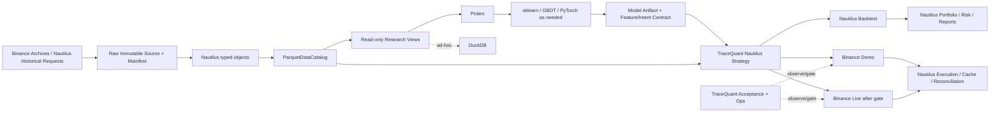

# TraceQuant — 基于 NautilusTrader v2 的技术栈、Ownership 与自研边界复审

> 复审对象：`TraceQuant 开源技术栈与自研边界深度研究.md` 中“推荐技术栈、Ownership 与自研边界”及“最终推荐”部分  
> NautilusTrader 基线：`v2.0.0rc4` / commit `a0400251110653b6d8ae6a9b5b89c4543fa85a2d`  
> 复审方式：对固定版本源码、类型声明、官方示例和仓库内文档作只读核验；不以未来版本或网页宣传替代当前代码事实  
> 项目阶段假设：现在进入开发和回测阶段，随后使用 Binance Demo 做观察；本文不把“采用基底”等同于“已批准实盘”

## 1. 结论

原报告选择 NautilusTrader 作为唯一 trading domain owner 的方向正确，研究工具与交易运行时分层也正确；但在进一步检查当前 v2 源码后，原报告有 **7 处边界需要收缩或改名**：

1. `Parquet` 只是文件格式，历史交易数据的组件 owner 应是 Nautilus `ParquetDataCatalog`，而不是 TraceQuant 自建 canonical lake 规范。
2. “Market-data schema & manifest”范围过大。交易域内的 Instrument、Bar、Trade、Quote、Mark、Index、Funding 语义已经由 Nautilus 定义；TraceQuant 只应拥有原始来源 manifest 和只读研究派生 schema。
3. “Binance historical ingestion/quality adapter”不应称为 adapter。Nautilus Binance client 已支持历史 bars、受限范围的 trades 和 funding rates；TraceQuant 只补全量 archive 下载、checksum、覆盖率和 Nautilus 未覆盖的历史字段。
4. “NautilusTrader Strategy Adapter / Runtime model adapter”不应成为独立中间件或仓库。模型加载与推理应直接位于一个薄的 Nautilus `Strategy`/`Actor` 实现中。
5. 常用技术指标和运行时 Bar 聚合不应归入自研 feature engine。Nautilus 已有指标库和多种 Bar aggregator；TraceQuant 拥有的是特征定义、参数、组合方式和因果性，而不是通用计算原语。
6. “Reconciliation guard”不能演变为第二套 REST 对账状态机。Nautilus 已实现启动和持续 reconciliation、缺失事件生成、外部订单归属、in-flight/open-order/position 检查；TraceQuant 只拥有黑盒验收、报警和 Live admission gate。
7. 风控“配置”不是一个自研组件。Nautilus 已提供订单校验、提交/改单限速、单笔 notional 限额和 `ACTIVE/REDUCING/HALTED` 状态；TraceQuant 只拥有阈值，以及 Nautilus 未内建的组合级/daily-loss/stale-data 政策扩展。

因此，应把原报告中的自研层从“薄集成 + 若干小子系统”进一步收缩为：

```text
TraceQuant research semantics
    + Nautilus-native Strategy/configuration
    + source-data provenance and missing-data acquisition
    + acceptance/operations
```

而不是：

```text
canonical trading-data layer
    + Binance historical adapter
    + model runtime adapter
    + reconciliation guard
    + risk-policy component
```

## 2. 源码事实：Nautilus 已经提供了什么

| 能力 | 固定版本证据 | 对边界的影响 |
|---|---|---|
| Typed Parquet catalog | `crates/persistence/src/backend/catalog.rs:132-158,384-498`；Rust 后端可写 Quote/Trade/Bar/OrderBook/Mark/Index/Funding 等；`2260-2266` 可查询 FundingRate | Nautilus 是交易历史数据 catalog owner；不要另定一套交易数据 schema。注意 rc4 的 Python binding 尚未直接暴露 Funding write/query |
| Catalog 数据完整性机制 | 同文件 `542-648` 检查时间升序和区间不重叠；`2546-2809` 提供首末时间与覆盖区间查询 | TraceQuant 仍检查源文件 checksum/gap，但不重复写 catalog 区间管理器 |
| Binance 历史请求 | `docs/integrations/binance.md:642-669`：历史/实时 kline、历史 trade 请求及其边界；`837-850`：历史 funding rate | 小规模补数可直接调用 Nautilus；大规模 archive backfill 仍由 TraceQuant 获取 |
| Binance 统一市场数据类型 | `docs/integrations/binance.md:671-679,833-850`：标准 Bar、MarkPriceUpdate、IndexPriceUpdate、FundingRateUpdate | 不自研 Binance mark/index/funding domain model 或运行时 joiner |
| 内建 Bar 聚合 | `crates/data/src/aggregation.rs` 中 `TickBarAggregator:490`、`VolumeBarAggregator:749`、`ValueBarAggregator:1099`、`RenkoBarAggregator:1566`、`TimeBarAggregator:1758` | 运行时 Bar 语义归 Nautilus；研究批处理重采样只能做等价派生并进行 parity test |
| 内建指标 | `crates/indicators/src` 已有 SMA、EMA、ATR、RSI、MACD、Bollinger Bands 等 | 不自研通用流式指标框架；自研的是策略特征语义 |
| Strategy/Actor 扩展面 | `python/nautilus_trader/trading/__init__.pyi:464-625`：生命周期、signal/custom data、指标注册、下单、状态保存、行情回调 | 模型推理直接放入 Strategy/Actor；不需要通用 model-to-runtime middleware |
| RiskEngine | `crates/risk/src/engine/config.rs:47-58`；`crates/risk/src/engine/mod.rs:435-478,1014-1036,1588-1633` | 订单限速/notional/交易状态/交易所边界校验直接配置或调用 Nautilus |
| 启动与持续对账 | `docs/concepts/reconciliation.md:68-128,128-189,297-378` | 不建第二套 reconciliation owner；只做外部验收和告警 |
| 状态持久化 | `docs/how_to/configure_live_trading.md:97-185`：Redis/Postgres cache backing、load/save state、order/position snapshots | 到 Demo restart 测试阶段使用 Nautilus 支持的 backing；不自建 ledger/database abstraction |
| 回测结果与分析 | `python/nautilus_trader/backtest/__init__.pyi:176-245`；`crates/analysis/src/python/mod.rs:31-81`；`python/nautilus_trader/analysis/tearsheet.py:366-474` | 回测订单/成交/持仓/账户报告、统计和 tearsheet 归 Nautilus；MLflow 不接管交易统计语义 |
| 官方数据/执行 tester | `examples/live/binance/data_tester.py`、`exec_tester.py`；Rust Futures 对应 `crates/adapters/binance/examples/futures/node_*_tester.rs` | 首轮 Demo 冒烟复用官方 tester；TraceQuant 只增加项目特有场景 |

这些结论还与前一轮仓库运行结果一致：固定版本的 Nautilus 选定测试为 **318 passed、6 skipped、0 failed**，官方合成数据回测示例也已跑通；这些结果证明当前构建和核心回测路径可执行，但不替代后续 Binance Demo 验收。

## 3. 对原报告逐项修订

### 3.1 推荐技术栈

| 原报告项 | 复审结论 | 修订后的定位 |
|---|---|---|
| NautilusTrader | 保留，且所有权扩大 | 唯一交易域 owner；同时拥有 typed catalog、运行时 Bar、指标原语、回测报告和 reconciliation |
| Apache Parquet → canonical historical storage | 表述不准确 | Parquet 是格式；`ParquetDataCatalog` 是交易历史数据 owner |
| Polars | 保留 | 研究批处理、特征表和派生数据；不能成为第二套交易数据/时间语义 owner |
| DuckDB | 降为按需 | ad-hoc SQL/跨表探索；不是第一阶段必需，也不管理 Nautilus catalog |
| Jupyter | 保留但非领域 owner | 研究界面与可复现 notebook 规范 |
| sklearn + LightGBM/XGBoost | 保留 | 推荐先做基线；与 Nautilus 无重叠 |
| PyTorch | 按策略启用 | GPU/DL 研究依赖，不应无条件进入 live runtime 环境 |
| SB3/NeuralForecast/FinGPT 等 | 继续可选 | 只有具体研究假设需要时才安装，不属于项目基底 |
| Optuna | 延后 | HPO 规模出现后启用；Nautilus 不替代它，但 MVP 不需要预装 |
| MLflow | 延后并缩小职责 | 只跟踪数据/代码/model artifact；交易运行结果和账务统计仍由 Nautilus 生成 |
| Prometheus + Grafana | 延后 | Nautilus 日志/事件先满足开发与 Demo；需要长期时序告警和 dashboard 时再接入 |
| Redis/Postgres | 原报告应补充条件化说明 | 仅在验证重启恢复/持久 cache 时，通过 Nautilus 官方 cache backing 接入；不是 TraceQuant 自研数据库 |
| cron/systemd | 保留 | 批任务和进程生命周期；Nautilus 的交易时钟不等于工作流调度器 |
| Prefect/Dagster/Kafka/ClickHouse | 继续不引入 | 只有数据规模或分布式需求形成实证后再评估 |

### 3.2 Capability Ownership

修订后的 ownership 以“谁定义领域语义和可变状态”为准，而不是以文件格式或调用库为准。

| Capability | Primary owner | Companion | TraceQuant 拥有 | 禁止重复 |
|---|---|---|---|---|
| Instrument/symbol/precision/filter | Nautilus model + Binance provider | — | universe allowlist、研究别名映射 | 第二套可交易 Instrument |
| Live market data | Nautilus Binance adapter + DataEngine | — | 订阅配置、质量门槛 | 自写 Binance WS/REST connector |
| Core market-data types | Nautilus | — | 只读派生字段 | 第二套 Bar/Trade/Quote/Mark/Index/Funding 类型 |
| Historical request | Nautilus Binance client | Binance public archives | 请求范围和补数策略 | 把完整 exchange adapter 包在“ingestion adapter”里 |
| Raw source archive | Binance/source | 下载工具按需 | URL/version/checksum/不可变留存 | 把 raw 文件当交易域事实 |
| Trading historical catalog | Nautilus `ParquetDataCatalog` | object storage 按需 | 路径、保留和版本 pin | 自研 catalog/schema registry |
| Research derived tables | TraceQuant | Polars/DuckDB | schema、lineage、point-in-time 规则 | 写回并污染 Nautilus canonical data |
| Bar aggregation | Nautilus DataEngine | Polars 仅离线等价计算 | BarType 选择和 parity tests | 自研运行时 aggregator |
| Common indicators | Nautilus indicators | Polars 仅批处理等价计算 | 参数、组合及策略含义 | 自研通用 indicator engine |
| Features/labels | TraceQuant | Polars/PyTorch | 定义、版本、因果性、防泄漏 | 让 runtime 框架决定研究标签 |
| Model training | TraceQuant | sklearn/GBDT/PyTorch | 训练、评估、资源和 artifact | 把训练耦合进 execution loop |
| Experiment/HPO | TraceQuant | MLflow/Optuna 按需 | 命名、lineage、search objective | 让 MLflow 成为交易账务 owner |
| Strategy lifecycle/runtime | Nautilus `Strategy`/`Actor` | — | alpha、配置、模型加载/推理 | 通用 Strategy Adapter 框架 |
| Orders/positions/account/portfolio | Nautilus | — | 策略意图和查询 | 影子状态或第二套 ledger |
| Core pre-trade risk | Nautilus RiskEngine | — | 阈值配置 | 第二套订单校验/RiskEngine |
| Strategy/portfolio risk policy | TraceQuant policy + Nautilus enforcement | 小型 Strategy/Actor 扩展 | daily loss、总敞口、stale-data 条件 | 在外部服务维护可交易状态 |
| Backtest/fill/fee/funding accounting | Nautilus | — | 场景、假设与验收 | 自研 simulator/accounting |
| Backtest reports/statistics | Nautilus | MLflow 仅存引用/摘要 | 选择指标、比较实验 | 独立重算账务事实 |
| Execution/Binance orders | Nautilus | — | venue config、allowlist、凭据 | 自写执行 adapter/FSM |
| State persistence | Nautilus cache + supported Redis/Postgres backing | Redis/Postgres | retention、备份、密钥 | 自研 cache/ledger adapter |
| Reconciliation/restart | Nautilus LiveExecutionEngine | — | 配置、验收、告警、Live gate | REST shadow reconciler 修正内部状态 |
| Demo/Live admission | TraceQuant | Nautilus official testers | 测试矩阵、soak 标准、审批 | 测试脚本成为第二交易引擎 |
| Monitoring | TraceQuant ops | Nautilus logs/events；Prom/Grafana 按需 | SLO、alert、runbook | 从监控端写回交易状态 |
| Deployment/secrets | TraceQuant ops | OS/container/system service | 环境隔离、回滚、最小权限 | 自研 secret manager |

### 3.3 自研清单：保留、改名、删除

| 原自研项 | 动作 | 新边界 |
|---|---|---|
| Canonical research artifact contract | **保留但限域** | 只描述 model artifact、feature version、signal/target intent；进入执行前立即翻译为 Nautilus Strategy 行为，不定义 Order/Position |
| Market-data schema & manifest | **拆分** | 保留 `raw source manifest` 与 `research derived schema`；删除 canonical trading-data schema |
| Feature definitions | **保留** | 复用 Nautilus 指标/aggregation 原语；自研组合、参数、时间语义和 lineage |
| Labels & leakage guards | **保留** | 完全属于 TraceQuant 研究 IP 与 QA |
| Strategy/model logic | **保留** | 生产实现必须是 Nautilus Strategy/Actor/plugin，而不是平行 runtime |
| Model bundle manifest | **保留** | 本地 manifest 即可；MLflow 只作为可选存储，不必自建 registry server |
| Binance historical ingestion/quality adapter | **改名并收缩** | 改为 `source acquisition & coverage QA`；优先 Nautilus 历史请求，archive 只负责长历史/缺口；不实现 exchange/domain adapter |
| Runtime model adapter | **删除为独立组件** | 合并进具体 Strategy 的 `ModelLoader/Predictor`，保持薄接口和依赖隔离 |
| Portfolio/risk policy configuration | **改为配置与少量扩展** | Nautilus 原生限额/状态直接配置；仅为 daily loss、组合总敞口、stale data 等确认缺失项写扩展 |
| Reconciliation guard / acceptance harness | **拆分** | 保留 black-box acceptance/soak/alert；删除会抓 REST 后自行重建或修正订单/持仓的 guard |
| Research/backtest/live parity tests | **保留并提升优先级** | 验证 timestamp、Bar、indicator、feature、sizing、fee/funding 一致性 |
| Deployment/secrets config | **保留** | 运维责任，不是交易基础设施重写 |

## 4. 修订后的推荐架构



关键约束：

- `Raw source`、`Research view`、`Trading catalog` 是三个不同区域；研究层只读 Nautilus catalog，再产生派生表。
- 一个生产 Strategy 可以加载模型，但模型输出不是订单事实；订单只能由 Nautilus `OrderFactory`/Strategy API 创建。
- acceptance/monitoring 可以从交易所做外部观察，但不得自行生成修正交易或覆盖 Nautilus cache。
- 若发现 Nautilus 缺陷，优先复现、固定版本、上游修复；不得长期维护影子 Order/Position/Reconciliation 系统。

## 5. 最小推荐技术栈

### P0：开发与回测必须

```text
Python 3.12
NautilusTrader v2.0.0rc4 pinned by exact version/commit
Nautilus ParquetDataCatalog
Nautilus Binance adapter
Polars
pytest
Jupyter（需要交互研究时）
scikit-learn + LightGBM/XGBoost（第一批数据驱动基线）
```

### P1：Demo 与恢复性观察

```text
Nautilus DataTester / ExecTester
Nautilus LiveExecutionEngine reconciliation
Redis 或 Postgres cache backing（二选一，通过 Nautilus 官方接口）
结构化日志 + 项目告警
systemd / container process lifecycle
```

### 按需求启用，不作为基底

```text
DuckDB          — 需要 SQL/跨表探索时
PyTorch/CUDA    — 具体 DL/AI 策略需要时
Optuna          — 手工/网格实验已成为瓶颈时
MLflow          — 多模型 lineage/artifact 管理成为问题时
Prometheus/Grafana — Demo 长时观察或生产 SLO 需要时
SB3/NeuralForecast/LLM tooling — 仅由具体研究课题触发
```

## 6. Nautilus 没有替代、仍应由 TraceQuant 拥有的能力

本次复审不是把所有工作都交给 Nautilus。以下责任仍然明确属于 TraceQuant：

- 数据来源选择、archive 下载、checksum、授权/再分发判断、覆盖率和修订记录。
- Nautilus 没有提供或交易所历史 API 无法完整返回的数据补齐。当前已确认 Binance 历史 trade 有时间/条数窗口限制，历史 funding 可请求；历史 mark/index 的全量归档不能假定已经由 adapter 解决。
- `rc4` 的 Rust catalog 后端已支持 FundingRate，但 Python `ParquetDataCatalog` 经源码与 wheel 反射核对仅直接暴露 Mark/Index 的 write/query；Funding 的 Python catalog 接入应优先做上游 binding/最小扩展或暂存为受控 custom data，不能因此另建数据平台。
- 研究派生 schema、feature/label 的金融语义、point-in-time correctness、purging/embargo 和 lineage。
- 策略、模型、目标仓位/信号语义，以及 artifact 与代码/数据版本的契约。
- 组合级风险阈值、daily loss、stale-data stop 等产品政策；先验证 Nautilus 扩展点，再补最小代码。
- Demo/Live 验收矩阵、持续观察、告警、发布、回滚、凭据与最小权限。
- 对 Nautilus v2 RC 的版本冻结、升级评审和 upstream issue 管理。

## 7. 对原报告最终推荐的替换文本

建议把原报告的最终边界压缩为下面这组表述：

```text
NautilusTrader owns:
    Trading-domain data types and Instrument semantics
    ParquetDataCatalog for trading history
    Runtime bar aggregation and common indicator primitives
    Strategy/Actor lifecycle
    Orders, positions, portfolio/accounting and core risk enforcement
    Backtest, fills, fees/funding accounting, reports and statistics
    Binance market data/execution adapter
    State cache, Demo/Live runtime and reconciliation

TraceQuant owns:
    Raw-source provenance and missing historical-data acquisition
    Read-only research schemas and derived datasets
    Feature/label definitions, causality and lineage
    Model/strategy logic and research artifact contract
    Risk policy values and only the missing policy extensions
    Acceptance, observation, Live gate, deployment, secrets and runbooks

Companion OSS is optional and non-authoritative:
    Polars/Jupyter/ML libraries for research
    DuckDB for ad-hoc SQL
    Optuna/MLflow for scaled experimentation
    Redis/Postgres only as Nautilus-supported cache backing
    Prometheus/Grafana for operational observability
```

## 8. 当前阶段决定

现在可以据此推进项目开发，但架构状态应明确写成：

```text
NAUTILUS_PRIMARY
VERSION_PINNED=v2.0.0rc4/a040025...
DEVELOPMENT_AND_BACKTEST_ALLOWED
BINANCE_DEMO_OBSERVATION_REQUIRED
LIVE_NOT_APPROVED
```

首个开发迭代不应创建 `binance_adapter`、`trading_schema`、`portfolio_service`、`risk_service`、`model_runtime_gateway` 或 `reconciliation_service` 这些仓库/子系统。推荐先建立：

```text
tracequant/
  data_sources/      # raw acquisition + manifest + QA
  research/          # read-only views, features, labels, training
  artifacts/         # model/feature/intent manifest
  strategies/        # Nautilus Strategy implementations
  policies/          # config and verified minimal extensions
  acceptance/        # backtest/Demo/restart/parity tests
  ops/               # deployment, secrets references, alerts, runbooks
```

这能最大限度利用 Nautilus 已具备的能力，同时把 TraceQuant 的开发投入集中在真正具有项目差异化价值的研究语义与安全门禁上。
