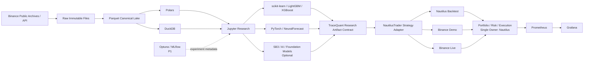
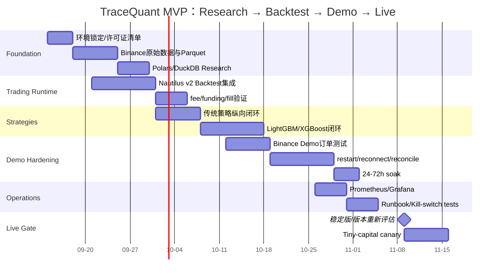

# TraceQuant 开源技术栈与自研边界深度研究

## 执行摘要

**结论：TraceQuant 最适合采用“一个权威 Trading Runtime + 多个互补 Research/Data/ML 工具”的组合，而不是一个项目包办一切，也不是多个交易框架并行。**

附件已经提供，并非“未提供”。附件给出的最高优先级原则是：

> “Prefer integration over reimplementation. Build the gaps, not the platform.”

并进一步把目标定义为：

> “成熟开源项目 + 少量整合代码 + 少量 TraceQuant 特有能力 = 完整 TraceQuant”

同时明确要求 Research、Backtest、Simulation/Demo、Live 构成同一完整闭环，首期聚焦 Binance USDⓈ-M 永续、BTCUSDT/ETHUSDT、15m–4h，并明确“不做 HFT”。fileciteturn0file0

本研究的综合判断如下。

**推荐方案 A，也是长期总体成本最低的目标架构：**

```text
Trading Runtime / Orders / Portfolio / Risk / Execution / Reconciliation
    → NautilusTrader

Historical Storage
    → Parquet

Research / ETL / Feature Computation
    → Polars + DuckDB + Jupyter

Classical ML
    → scikit-learn + LightGBM / XGBoost

Deep Learning / GPU
    → PyTorch

RL（按需，不进入核心运行时）
    → Stable-Baselines3

Experiment / HPO（第二阶段）
    → Optuna + MLflow

Monitoring（实盘前加入）
    → Prometheus + Grafana

TraceQuant 自研
    → 数据规范
    → features / labels
    → strategy / model logic
    → Research→Runtime contract
    → Binance 数据补齐与质量校验
    → 实盘验收与 reconciliation guard
    → 少量风险策略配置/胶水代码
```

NautilusTrader 与附件目标高度契合：Rust 核心、Python 控制面，同一事件驱动架构覆盖研究/模拟/实盘，策略及 execution algorithm 可以在 backtest/live 间复用；Binance adapter 已覆盖 USD-M Futures、one-way/hedge、leverage、cross/isolated margin、funding/mark/index 数据、订单/成交/持仓/余额 reconciliation，并支持 Live、Demo、Testnet。citeturn17search1turn18search3turn18search5

但这里存在一个**必须正视的当前时点风险**：截至 **2026 年 9 月 12 日**，NautilusTrader 的新 v2 路线最新公开版本是 **2.0.0rc4，发布于 2026 年 9 月 2 日**，官方明确说 release candidate 不建议用于控制真实资金的生产环境；旧 v1.231.0 又已被定位为最后一个 v1 主版本，之后只提供有限时间的关键安全回补。citeturn17search0turn17search1

因此，**“推荐 NautilusTrader”并不等于“今天直接拿 rc4 上真钱”**。正确路径是：

> **现在用 v2 做 Research → Backtest → Binance Demo 的完整纵向验证；真钱 Live 是 release gate，而不是开发阶段默认动作。**

尤其是 2026 年 8 月仍有 Binance futures Testnet endpoint mismatch、warm-restart reconciliation、execution-only reconciliation 等公开问题，因此 TraceQuant 必须把“冷启动、热重启、外部订单、partial fill、网络断连、position reconciliation”做成正式验收套件，而不能把 adapter 存在等同于 production readiness。citeturn19search2turn19search7turn19search11turn19search14

**若要求“今天就必须使用成熟稳定版本部署真钱”，推荐方案 B 是 QuantConnect LEAN。** LEAN 是 Apache-2.0 的成熟多资产交易引擎，拥有 Jupyter Research Environment、backtest、portfolio/reality models、live trading 和 Binance perpetual futures 支持。它是更好的“一体化框架”备选，但代价是更重的 LEAN/C# 领域模型和 CLI/container 工作流；本地 Research/Live 的官方 CLI 还要求 QuantConnect 组织的付费 tier。Binance brokerage 本身也不支持原地 order update，而是 cancel-and-replace。citeturn18search0turn18search1turn18search6turn18search11

**Freqtrade 是合理的方案 C，但不建议作为 TraceQuant 的长期主体。** 它对 crypto、dry-run、Binance futures、backtest 和 ML/FreqAI 上手很快，2026 年仍活跃，但 GPL-3.0 对计划公开且可能采用 Apache-2.0 的 TraceQuant 增加许可证设计成本，并且其 candle-oriented crypto bot 领域边界比 TraceQuant 的长期研究目标窄。citeturn20search1turn20search2turn20search8

最重要的“自研边界”结论是：

> **TraceQuant 不需要自研 Trading Engine、Order/Position/Portfolio Engine、通用 Event Bus、数据库、DataFrame Engine、ML/DL/RL Framework、通用实验平台、通用监控平台或 Workflow Engine。**

真正应该自己拥有的是**研究定义和业务语义**：数据 canonical schema、features/labels、策略与模型、Research→Live 的输出契约、实盘放行规则、少量 Binance 数据质量与状态一致性保护。这部分整体属于 **thin integration + small extension**，而不是 medium/large platform subsystem。这个结论与附件要求的“禁止重复 Ownership”以及“只对明确缺失的能力做小型自研”一致。fileciteturn0file0

| 主要路线 | 核心优势 | 核心弱点 | 剩余自研量 | 本研究结论 |
|---|---|---|---|---|
| **A：NautilusTrader + best-of-breed research** | Python/GPU 研究自由度高；backtest/live 领域模型统一；Binance futures adapter 深 | v2 截至本研究日仍为 RC；Binance adapter 需要实盘验收 | **LOW–MEDIUM** | **长期首选；Live 必须设版本与验收 gate** |
| **B：QuantConnect LEAN** | 一体化、多资产、Portfolio/Reality/Live 成熟；Apache-2.0 | 更重；Python 与 C# engine 结合；本地 CLI 有 QuantConnect tier 约束 | **LOW–MEDIUM** | **立即真钱/多资产优先时的合理替代** |
| **C：Freqtrade** | crypto MVP 非常快；dry-run、UI、优化工具现成 | GPL-3.0；crypto/candle-oriented；长期领域边界较窄 | **LOW（短期）/HIGH（未来迁移）** | **快速原型可选，不作为长期首选** |

## 需求约束与附件逐项回应

附件并不是一个已有 TraceQuant 软件 BOM，而是一份**架构研究验收规范**。因此，不能从附件推断“TraceQuant 目前已经有某个闭源交易引擎/某个专利算法”。对“现有自研/闭源组件”的事实结论只能是：**未提供现有实现清单、源代码、依赖锁文件或部署清单**。下文所谓“TraceQuant 自研组件”，均明确表示**建议未来由 TraceQuant 自己拥有的薄层**，不是声称这些组件当前已经存在。fileciteturn0file0

附件最关键的约束及本报告响应如下。

| 附件关注点 | 附件原意/片段 | 本研究如何落实 |
|---|---|---|
| 系统目标 | “Research + Backtest + Simulation / Demo + Live Trading” | Trading runtime 必须覆盖 backtest/demo/live；Research 可独立采用 Python 生态，但不能再建立第二个 live/order domain |
| 技术哲学 | “Build the gaps, not the platform.” | 所有通用基础设施默认 OSS；TraceQuant 只做 glue、strategy 与缺口 |
| 多策略 | “研究架构不应阻碍未来采用新的量化研究方法” | ML/DL/RL/AI 不嵌入 Trading Engine；统一在 signal/target/action 边界接入 |
| GPU | “NVIDIA RTX 5090” | PyTorch 为默认 GPU 层；GBDT GPU 按数据规模启用；Trading Runtime 不控制 CUDA 生命周期 |
| MVP | “Binance / USDⓈ-M Perpetual Futures / BTCUSDT / ETHUSDT” | 只优先验证 USD-M，避免第一版抽象多个 venue |
| 时间尺度 | “15 minutes 到 4 hours”及“不做 HFT” | 不为微秒延迟、colo、极端 queue model 自建基础设施 |
| 缺口处理顺序 | support → config → extension → adapter → patch → replace | Binance 差异首先由官方 adapter/config/plugin 解决 |
| 单框架与组合 | “Route A — Unified Framework”“Route B — Best-of-Breed Composition” | 本报告同时比较 LEAN unified 与 Nautilus + research composition |
| Research | history → dataframe → features → model → plots | Parquet/Polars/DuckDB/Jupyter 负责研究平面 |
| Research→Live | “是否需要大量重新实现” | 模型输出标准化为 signal/target；执行与持仓全部交给单一 runtime |
| Live | leverage/margin/funding/orders/reconnect/restart/reconciliation | Nautilus Binance adapter 深入核验，并查近期官方 issues，而非仅看首页 |
| Backtest | fee/funding/slippage/partial fill/futures | 用 runtime 的 fill/fee 模型；15m–4h 不要求 HFT queue fidelity |
| Ownership | “禁止重复 Ownership” | Qlib/FinRL 等如采用，只能做 isolated research，不能拥有 production Portfolio/Order |
| 剩余自研 | “特别计算‘剩余自研量’” | 明确 thin integration / small extension 表格 |
| 许可证 | “TraceQuant 计划公开” | LGPL/GPL/AGPL/Apache 与 model weights 单独分析 |
| MVP 验证 | “一种传统策略 + 一种现代数据驱动策略” | 推荐传统 momentum/mean-reversion + LightGBM/XGBoost baseline，不在 MVP 强塞 RL/LLM |
| 总体成本 | Integration + Missing Capability + Maintenance + Ops + Upgrade Risk | 不按 GitHub stars 或功能数量选框架 |

上述全部来自附件的同一研究规范。fileciteturn0file0

**对策略多样性的关键设计不是“让 Trading Framework 理解 Transformer/RL/LLM”，而是让它只理解可执行意图。** 建议 TraceQuant 的策略边界最终只有少数稳定语义：

```text
Research / Model
      │
      ├── Signal(score, confidence, horizon)
      ├── TargetPosition(quantity / notional)
      ├── TargetWeight(weight)
      └── Action(optional, RL)
                  │
                  ▼
          TraceQuant thin adapter
                  │
                  ▼
          Trading Runtime Strategy
                  │
       Order / Risk / Portfolio
                  │
                  ▼
            Binance USD-M
```

这让 LightGBM、PyTorch、未来 time-series foundation model 或 LLM agent 都处于**研究侧插件**，不会把交易系统变成 “ML platform”“RL platform” 或 “LLM trading system”。这正好对应附件对策略多样性的要求。fileciteturn0file0

对 15m–4h BTC/ETH 策略而言，数据规模意味着第一版没有必要引入 ClickHouse/Kafka/Spark 等服务型基础设施。Binance 官方公共数据仓库已经提供 USD-M Futures 的 klines、trades、aggTrades 等按日/月归档数据，并附校验和；Parquet + Polars + DuckDB 足够承担个人研究的历史存储、特征计算和 SQL 探索。citeturn13search0turn21search6turn22search10

## 开源生态、版本与候选架构

下表区分“**Core**”“**按需 Optional**”和“**不建议进入生产核心**”。版本是截至 2026-09-12 本研究能从官方 release/repository 信息核实的版本；个别项目官方页面存在 release 索引滞后，因此标为“已核实版本”，而不强称其一定是当天绝对最新。

| 组件/项目 | 本研究可核实版本 | TraceQuant 角色 | 许可 | 判断 | 官方来源 |
|---|---:|---|---|---|---|
| **NautilusTrader** | v2.0.0rc4；v1.231.0 为最后主要 v1 | Trading runtime、backtest、portfolio、risk、execution、Binance、reconciliation | LGPL-3.0-only | **Core 候选 A**；v2 实盘暂有 RC gate | [GitHub](https://github.com/nautechsystems/nautilus_trader) / [Binance docs](https://nautilustrader.io/docs/latest/integrations/binance/) citeturn17search0turn17search1turn18search5 |
| **QuantConnect LEAN** | 主干持续发布；本研究不强行给易误导的单一版本号 | Unified research/backtest/portfolio/live alternative | Apache-2.0 | **方案 B** | [Docs](https://www.quantconnect.com/docs/v2) / [GitHub](https://github.com/QuantConnect/Lean) citeturn18search7turn17search4 |
| **Freqtrade** | 2026.5.1 | Crypto bot、backtest、dry-run/live、FreqAI | GPL-3.0 | **方案 C/快速原型** | [GitHub](https://github.com/freqtrade/freqtrade) citeturn20search1turn20search8 |
| **VeighNa/vn.py** | 4.4.0（2026-05） | 中文生态 trading framework；alpha/AI research | MIT | Shortlist，但 Binance gateway 有边界 | [GitHub](https://github.com/vnpy/vnpy) citeturn2search7turn12search0 |
| **Hummingbot** | 2.14.0（2026-04） | 做市/套利/connector 强项 | Apache 风格开源项目；具体组件需逐仓核验 | 不做主体 | [GitHub](https://github.com/hummingbot/hummingbot) citeturn12search13turn12search1 |
| **Qlib** | 0.9.7（2025-08） | Feature/model/research workflow、AI quant | MIT | **Optional isolated research**；不拥有 production backtest/order | [GitHub](https://github.com/microsoft/qlib) citeturn9search0turn10search3 |
| **FinRL / FinRL-X** | FinRL 0.3.8；FinRL-X 为新一代项目 | RL research/reference | MIT / Apache-2.0（按项目） | Optional；不能做 runtime | [FinRL](https://github.com/AI4Finance-Foundation/FinRL) / [FinRL-X](https://github.com/AI4Finance-Foundation/FinRL-X) citeturn6search0turn7search1 |
| **Parquet / Arrow** | 文件格式；不绑定单一 runtime 版本 | Canonical historical files / interchange | Apache ecosystem | **Core** | [Apache Arrow](https://arrow.apache.org/) citeturn3search18 |
| **Polars** | 1.41.1 为本次核实 release | Feature engineering、lazy/streaming analytics | MIT | **Core** | [GitHub](https://github.com/pola-rs/polars) citeturn21search1turn21search6 |
| **DuckDB** | 1.5.5 已由官方 bindings 在 2026-07 核实 | Ad-hoc SQL、Parquet query | MIT | **Core** | [GitHub](https://github.com/duckdb/duckdb) citeturn22search10turn22search16 |
| **scikit-learn** | 1.9.0（2026-06） | Baseline ML、preprocessing/metrics | BSD-3-Clause | **Core research** | [Official](https://scikit-learn.org/) citeturn5search19 |
| **LightGBM** | 4.7.0（2026-07） | GBDT/ranking/classification；GPU optional | MIT | **Core ML 候选** | [GitHub](https://github.com/lightgbm-org/LightGBM) citeturn21search4turn21search5 |
| **XGBoost** | 3.1.3 为本次官方 release 页面可核实稳定线 | GBDT、GPU | Apache-2.0 | **Core ML 候选** | [GitHub](https://github.com/dmlc/xgboost) citeturn20search5 |
| **CatBoost** | 1.2.10（2026-02） | 类别特征友好的 GBDT | Apache-2.0 | Optional | [GitHub](https://github.com/catboost/catboost) citeturn5search16turn4search20 |
| **PyTorch** | **2.14**（2026-09-02） | DL/GPU/Transformer/LLM/RL 基础 | BSD-style | **Core GPU research** | [Release blog](https://pytorch.org/blog/pytorch-2-14-release-blog/) citeturn20search0 |
| **Stable-Baselines3** | 2.9.0（2026-06-15） | 单机 PyTorch RL experiments | MIT | **Optional research** | [GitHub](https://github.com/DLR-RM/stable-baselines3) citeturn21search2turn21search7 |
| **NeuralForecast** | 版本按安装时锁定 | NBEATS/NHITS/PatchTST/iTransformer 等 | Apache/MIT 类开源；按仓核验 | Optional time-series DL | [GitHub](https://github.com/Nixtla/neuralforecast) citeturn8search9turn8search10 |
| **TimesFM** | 3.0（2026-08） | Time-series foundation-model experiment | Code Apache-2.0；**3.0 weights 另有非商用/非生产许可** | **Research-only for 3.0 weights** | [GitHub](https://github.com/google-research/timesfm) citeturn21search8 |
| **FinGPT** | 1.0.0（2026-04） | Financial NLP/LLM research | MIT 代码；模型权重另验 | Optional AI research | [GitHub](https://github.com/AI4Finance-Foundation/FinGPT) citeturn7search2turn7search10 |
| **Optuna** | **5.0.0（2026-09-07）** | Hyperparameter optimization | MIT | P1；值得引入 | [GitHub](https://github.com/optuna/optuna) citeturn15search0 |
| **MLflow** | 官方 CHANGELOG 已记录 3.13.0（2026-05） | Experiment/model artifact tracking | Apache-2.0 | P1；本地部署即可 | [GitHub](https://github.com/mlflow/mlflow) citeturn15search2 |
| **Prometheus** | 3.11.3 为本次核实 release | Metrics/alert input | Apache-2.0 | **实盘 P0/P1** | [GitHub](https://github.com/prometheus/prometheus) citeturn15search1 |
| **Grafana** | **13.2.1（2026-09-02）** | Dashboard/alerts visualization | AGPL-3.0-only 为默认 | 外部独立服务使用 | [GitHub](https://github.com/grafana/grafana) citeturn16search6turn22search0 |
| **OpenTelemetry** | Python metrics/traces stable；logs 仍在稳定过程中 | 标准 telemetry API | Apache-2.0 | Optional，先不必全量引入 | [GitHub](https://github.com/open-telemetry/opentelemetry-python) citeturn16search5 |
| **Prefect / Dagster** | 活跃 | Training/data workflow orchestration | 各项目开源许可 | **MVP 不引入** | [Dagster releases](https://github.com/dagster-io/dagster/releases) citeturn16search7 |

**为什么没有推荐 Qlib 做 TraceQuant 的 Research Owner？** Qlib 本身值得研究：官方项目覆盖数据处理、ML/DL 模型、workflow 和 backtesting，并支持 LightGBM/XGBoost/CatBoost 以及多种 PyTorch 模型。问题不是“Qlib 不够好”，而是如果 Nautilus 已经拥有 production backtest、order、portfolio，Qlib 再进入正式策略流水线就很容易出现第二套交易领域模型。Qlib 0.9.7 是 2025 年 8 月的最新可核实 release，PyPI 仍标为 Alpha，而且其公开 issue 也显示 trading 参数/订单生成文档存在缺口。对 TraceQuant，最干净的使用方式是**isolated research sandbox → 输出 prediction/signal**，而不是让它成为第二个 Portfolio/Backtest owner。citeturn9search0turn10search2turn2search2

**为什么不把 FinRL、RLlib、TimesFM 变成基础依赖？** RL 与 foundation model 属于策略研究技术，不属于交易基础设施。Stable-Baselines3 已经提供成熟的 PyTorch RL 算法、custom environments 和 notebook 体验，足以作为个人单 GPU 默认试验库；RLlib 的核心价值更多在 distributed RL。FinRL-X 虽然在 2026 年展示了更模块化的“weight-centric”方向，但当前数据/broker 路径并不是 Binance-first。TimesFM 3.0 更进一步提醒我们：模型代码的开源许可证和**预训练权重许可证并非一回事**——其源代码是 Apache-2.0，而 3.0 默认预训练权重明确限制非商用、非生产。citeturn21search7turn7search1turn21search8

**RTX 5090 的正确使用方式**不是把 GPU 塞进 execution path，而是让研究环境自由使用当前 PyTorch/CUDA 生态。PyTorch 2.14 已在 2026 年 9 月发布，并进一步加强 NVIDIA kernel/compiler 路径；LightGBM/XGBoost/CatBoost 都有 GPU 能力。对于 BTC/ETH 15m–4h 这种相对小的数据集，GBDT 是否上 GPU 应由 benchmark 决定，而不是架构强制；真正容易发挥 RTX 5090 的通常是深度时序模型、Transformer、foundation-model fine-tuning/inference 和大量并行训练。citeturn20search0turn21search5turn20search5turn4search20

## 推荐技术栈、Ownership 与自研边界

**推荐 Option A 的原则是：多项目组合，但只有一个 trading domain owner。**



### Capability Ownership

| Capability | Owner | TraceQuant 责任 |
|---|---|---|
| Historical market data source | Binance official archives/API | 选择数据范围、记录 source/version/checksum |
| Data storage | Parquet | 目录布局、schema/version convention |
| Research query | Polars + DuckDB | query helpers，不自建 query engine |
| Notebook research | Jupyter/Python | notebooks、研究规范 |
| Feature engineering | Polars/Python/PyTorch | **拥有 feature 定义本身** |
| Label generation | Python/Polars | **拥有 label 定义与防泄漏规则** |
| Classical ML | sklearn + LightGBM/XGBoost | dataset/model config |
| Deep learning | PyTorch | model architecture/training code |
| Time-series DL | PyTorch/NeuralForecast optional | 研究按需加入 |
| RL | SB3 optional | environment/reward/action mapping |
| AI/text | FinGPT/HF/PyTorch 等按需 | 数据源、prompt/model policy |
| Strategy representation | **TraceQuant thin contract** | **核心自研边界** |
| Production strategy runtime | NautilusTrader | Strategy adapter/config |
| Backtest | **NautilusTrader** | fill/fee/funding assumptions 与 tests |
| Orders | **NautilusTrader** | 不定义第二套 Order |
| Portfolio | **NautilusTrader** | 不定义第二套 Portfolio |
| Core Risk | **NautilusTrader** | 配置限仓、杠杆、kill policy |
| Execution | **NautilusTrader** | 仅 venue-specific policy/config |
| Binance integration | Nautilus Binance adapter | acceptance tests / small extension only |
| Demo | Binance Demo + Nautilus | 自动化 smoke/soak tests |
| Live | Nautilus | deployment configuration |
| Reconciliation | Nautilus | **额外的健康断言/报警，而非第二套 reconciliation engine** |
| Experiment tracking | MLflow P1 | 实验命名/metadata convention |
| Hyperparameter search | Optuna P1 | objective/search-space |
| Monitoring | Prometheus + Grafana | 导出业务 metrics |
| Deployment | Docker/systemd/普通 Linux service | 极薄的 deployment manifest |
| Workflow scheduling | cron/systemd timer → Prefect/Dagster only if needed | 第一版不自建 scheduler |

Nautilus 的核心价值正是把 Orders、Portfolio、Execution、Risk、Reconciliation 这些最昂贵、最容易出错的基础设施集中到一个 domain owner；官方还明确把 UI dashboard、distributed orchestration、built-in AI/ML 排除在自身 scope 外，这反而非常符合 TraceQuant 的组合式架构：研究工具不必受 Trading Runtime 限制。citeturn17search1

### 建议的 TraceQuant 自研/闭源组件清单

**现有已实现的 TraceQuant 自研/闭源组件：未提供。** 附件只有目标与研究提示，没有代码、BOM、专利号或现有闭源模块描述。fileciteturn0file0

下表因此是“**推荐由 TraceQuant 拥有的自研层**”，不是现状盘点。

| TraceQuant 自研项 | 功能 | 为什么不直接交给通用开源项目 | 与开源替代差异 | IP/许可/合规风险 | 获取/替代策略 | 复杂度 |
|---|---|---|---|---|---|---|
| **Canonical research artifact contract** | 把模型输出规范成 signal/target position/weight/action + model/data version | 这是 TraceQuant 自己的 research→runtime 边界 | 开源框架各有自己的 signal/order 类型；直接共享会制造双 domain | **低**；接口设计通常无特殊许可负担 | 保持几十至数百行级 dataclass/schema；不做通用 framework | **THIN** |
| **Market-data schema & manifest** | symbol、venue、event time、ingest time、funding/mark/index、source/checksum | 数据源虽开源/公开，但“TraceQuant 认为什么是 canonical”是项目自身决策 | Parquet/DuckDB 只提供机制，不定义业务语义 | **低–中**；公开 Binance 原始数据再分发需另查数据条款 | 原始不可变 + normalized Parquet；保存来源/checksum | **SMALL** |
| **Feature definitions** | momentum、volatility、basis、funding 等 | 这是研究知识而不是基础设施 | Polars/PyTorch 负责计算，不知道正确金融语义 | **低**；注意第三方代码复制许可 | 自研 feature 函数；通用数学使用 OSS | **SMALL** |
| **Labels & leakage guards** | future return、ranking、regime label、purging/embargo | 数据泄漏规则是策略设计的重要组成 | 通用框架不能自动判断所有策略的 causal boundary | **低** | 自己定义，并用 unit tests 验证 timestamp causality | **SMALL** |
| **Strategy/model logic** | 传统策略与 ML/DL/RL policy | TraceQuant 的真正差异化知识 | ML 框架只提供算法 | 自己开发代码风险低；导入模型/论文实现需核许可证 | 尽可能调用 sklearn/PyTorch 等 | **SMALL–MEDIUM** |
| **Model bundle manifest** | model file + feature schema + data window + git SHA + dependencies | 避免 research/live artifact 不一致 | MLflow 可存 artifact，但不会替 TraceQuant 定义交易语义 | **低** | 可让 MLflow 保存，不自建 registry server | **THIN** |
| **Binance historical ingestion/quality adapter** | 下载、checksum、gap/duplicate/time alignment、funding/mark join | 官方 archive 能提供原数据，但不会替用户构建统一研究集 | 不需要重新写 Binance exchange connector | **中**：数据条款/历史数据修订 | 优先官方 archive；必要时补 REST；保存 manifest | **SMALL** |
| **Runtime model adapter** | 把 trained model/prediction 转成 Nautilus strategy input | Nautilus 不应该依赖具体 ML 框架 | 保持 ML dependency 与 trading runtime 解耦 | **低** | plugin/Strategy subclass，不 fork engine | **THIN** |
| **Portfolio/risk policy configuration** | 最大杠杆、notional、daily loss、stale-data stop、kill switch | 数值阈值属于 TraceQuant 策略，但执行机制应复用 runtime | **不是**重写 risk engine | **低** | 尽可能用 Nautilus config/components；只有缺口才小扩展 | **THIN–SMALL** |
| **Reconciliation guard / acceptance harness** | restart 后交叉检查 position/order/balance，异常禁止策略启动或报警 | 当前 Binance adapter 有近期 edge-case history；需要项目自己的 release gate | 不与 Nautilus 竞争 reconciliation ownership，只验证结果 | **低**，但实盘安全价值极高 | REST account assertion + runtime state assertion + fault injection | **SMALL** |
| **Research/backtest/live parity tests** | 同模型、同 feature、同 timestamps、同 sizing contract | 属于项目 QA | 不需自研 simulator | **低** | pytest/property-based tests/recorded scenarios | **SMALL** |
| **Deployment/secrets config** | Demo/Live 环境、API key、process restart | 环境相关不可完全由框架代替 | 不自研 secret manager | **高安全敏感度、低代码复杂度** | OS secrets/env/file permissions；API key 最小权限 | **THIN** |

其中最值得保留为 TraceQuant 自己的不是“引擎”，而是**语义**：

```text
TraceQuant owns:
    What data means
    What a feature means
    What a label means
    What a model predicts
    What position it wants
    What risk limits are acceptable
    What conditions allow Live

Open source owns:
    How to store/query data
    How to train generic models
    How to route events
    How to represent orders
    How to maintain portfolio/account state
    How to execute/reconcile
    How to collect/display metrics
```

### 按技术层划分开源与自研边界

| 技术层 | 开源 Owner | TraceQuant 边界 | 判定依据 | 主要不确定项 |
|---|---|---|---|---|
| **基础设施** | Linux、Python、Parquet、DuckDB、Polars、Docker | repo layout、config、data manifest | 通用能力成熟；个人 BTC/ETH 无需自建 data platform | L2/trades 扩张后是否需要 ClickHouse/object store |
| **中间件 / Trading Runtime** | **NautilusTrader** | adapters/config/tests only | 最应避免重复开发；同一 runtime 可 backtest/live | v2 stable 时间；Binance 边缘 bug |
| **算法/模型** | sklearn/LightGBM/XGBoost/PyTorch/SB3 | **features、labels、model、strategy 是 TraceQuant 核心** | 算法实现可复用，但研究假设不能外包 | 哪种模型长期有效无法预先决定 |
| **前端/SDK** | Jupyter；Grafana | 小型 CLI/config，暂不开发 Web UI | 个人系统没有 SaaS/UI 需求 | 后期是否需要策略控制台 |
| **运维/监控** | Prometheus/Grafana；OTel 按需 | trading-specific metric exporter | 通用 telemetry 不应重写 | 单机初期是否需要完整 OTel |
| **安全** | OS、Python package tooling、Nautilus supply-chain controls | key policy、permissions、dependency pinning、live gate | 自研密码学完全不合理 | Binance key type/API 改动、依赖 CVE |

Nautilus 本身的供应链工程也强于“随便 pip 装一个 GitHub 项目”的典型状态：官方仓库描述了 signed releases、dependency review/vulnerability controls 等发布措施；这并不能消除 adapter bug，但降低了核心 dependency 的供应链治理成本。citeturn17search1

### Binance USDⓈ-M 实盘能力核验

Nautilus 当前官方 Binance 文档明确支持 USDT/USDC-margined linear perpetuals，支持 one-way/hedge mode、动态 leverage、cross/isolated margin type、mark/index/funding、stop/trigger/trailing orders，以及 order/fill/position/balance reconciliation；Demo Trading 被明确建议为新 futures 测试路径，而 Testnet 已属于 legacy 路线。citeturn18search3turn18search5

但“功能表有勾”不等于“无需验证”。近期官方 issue 给出了几个值得直接写入 TraceQuant acceptance tests 的实例：

- 2026-08-12，Futures Testnet HTTP 与 private WebSocket host 出现不一致；这进一步支持**MVP 使用 Demo 而不是 legacy Testnet**。citeturn19search2
- 2026-08-16 的 issue 显示 execution-only 配置可能在 instrument unresolved 时丢弃 report，并使 reconciliation 看似成功；该 issue 已关闭，但它说明 **instrument universe 必须在 reconciliation 前完全可解析**。citeturn19search7
- 2026-08-12 仍有 warm-restart netting reconciliation 相关公开问题。citeturn19search14
- 2026 年早些时候也出现过 partial-fill / instrument-cache race、外部 LIMIT order reconciliation 等问题，后者已经关闭修复。citeturn19search15turn19search18
- Binance 自身在 2025–2026 又修改过 futures algo-order endpoints 和 CM/UM 架构，这意味着任何 adapter 都必须持续跟随交易所变化。citeturn19search17turn19search8

因此，**TraceQuant 的自研边界不是“自己写 Binance adapter”，而是“自己拥有 Binance adapter 的验收标准”**。这是一个很重要的工程区别。

推荐的 Live gate 至少包括：

```text
Demo startup with zero position
→ place/cancel LIMIT
→ MARKET partial/complete fill
→ reduce-only partial close
→ stop order
→ disconnect/reconnect
→ process kill + cold restart
→ process restart with open position
→ process restart with open order
→ compare venue orders / positions / balances
→ assert no unknown external/inferred state
→ 24–72h Demo soak
→ tiny-capital production canary
```

这属于 **small test/guard layer**，远比 fork 整个交易引擎便宜，也直接符合附件规定的 extension-before-reimplementation 原则。fileciteturn0file0

## 风险、许可证与合规评估

### 知识产权与许可证

最需要关注的并不是 MIT/BSD/Apache 项目，而是 **LGPL、GPL、AGPL 和 model-weight licenses**。

NautilusTrader 使用 LGPL-3.0-only。LGPLv3 明确区分 Library、Application 和 linked “Combined Work”，并对修改 Library、重新链接/替换 Library 等情况规定了义务；因此，一个计划以 Apache-2.0 公开的 TraceQuant 最保守的工程做法是：**把 Nautilus 保持为清晰的外部依赖，不把其 LGPL 代码复制进 TraceQuant Apache 模块；保留许可证与版权信息；如修改 Nautilus 本身，把修改作为 LGPL library patch/upstream PR 处理。** 这不是法律意见，但能显著减少许可证边界模糊。citeturn22search9

Apache-2.0 本身要求分发时保留相应 license/notice 条件；对 TraceQuant 自身采用 Apache-2.0 是合理的，但最终发布前应生成第三方依赖清单和 NOTICE/SBOM，而不是仅在 README 写一行“Apache-2.0”。citeturn22search2

Freqtrade 的 GPL-3.0 是它没有成为长期首选的重要原因之一：如果 TraceQuant 与其形成需要 GPL 覆盖的组合/衍生分发关系，项目整体许可证策略会比 Nautilus external-library 模式复杂得多。最简单的避免方式是**不让 Freqtrade 进入最终 architecture**；把它作为 benchmark/prototype 即可。Freqtrade 官方仓库明确标记 GPL-3.0。citeturn20search1

Grafana 当前 OSS 仓库默认是 AGPL-3.0-only，虽然部分子目录有 Apache-2.0 exception。对 TraceQuant 最简单的做法是把 Grafana 作为**独立、未修改的运维服务**部署，而不是把 Grafana 源码嵌入 TraceQuant 产品或 fork UI。citeturn22search0turn22search1

AI/foundation model 更应实行“**code license 与 weights license 双检**”。TimesFM 3.0 就是典型例子：仓库源码 Apache-2.0，但 v3.0 pretrained weights 当前明确限制在 non-commercial、non-production usage；2.5 及之前权重则有不同许可状态。因此 TraceQuant 不应建立“GitHub 代码 Apache-2.0 ⇒ checkpoint 也可生产”的错误假设。citeturn21search8

**专利风险方面，没有附件或公开资料证明本项目已有任何 TraceQuant 自有专利组件。** 对基础 glue/interface 没有理由人为构造“可能专利”；真正需要做 FTO/license review 的时点，是未来引入特定专有模型、交易数据、专利声明算法实现或闭源 SDK 时。另有一个非技术风险：公开网络上已经存在名为 **TraceQuant AI** 的 MT5 portfolio-monitoring 服务；它与附件描述的本项目并无证据上的关联，但在公开发布项目名称前，应做商标/名称冲突检索。citeturn14search0

### 数据隐私与数据授权

Binance 官方 `binance-public-data` 仓库为 public market data 提供日/月归档、Futures klines/trades/aggTrades 以及 CHECKSUM 文件。对私人量化研究，这是非常合适的 bootstrap 数据源。citeturn13search0

但不要把“GitHub repository 是 MIT”错误推导为“其中所有市场数据可无限制再分发”。2026 年 Binance 官方仓库仍有用户就商业 SaaS 和私人研究使用条件请求书面澄清的未决 issue，这说明数据使用/再分发条款应与代码 license 分开核对。TraceQuant 作为个人研究与交易系统的风险远低于数据转售 SaaS，但若以后公开打包大量原始 Binance 数据，应先确认当时的 Binance Data/API Terms。citeturn13search2turn13search9

隐私的主要对象不是 OHLCV，而是 **API credentials、账户余额、订单、PnL、模型 artifact 与个人交易历史**。这些数据不应默认上传公共 telemetry 或 hosted experiment tracker。第一版 MLflow 建议 local-only；Grafana/Prometheus 也优先 bind 到私有网络。

### 供应链安全

推荐至少采用如下 release discipline：

```text
pyproject + lock file
↓
pin exact runtime versions
↓
verify hashes / signed release where available
↓
SBOM / third-party-license inventory
↓
dependency vulnerability scan
↓
separate Research and Live environments
↓
immutable Live image
↓
explicit upgrade acceptance suite
```

这个要求不是理论性的。2026 年 Prometheus 3.11.3 就包含多个安全修复；Grafana 13.2.1 也包含 CVE 修复；MLflow 在 3.10.1 及以下曾有 artifact-download authorization bypass，之后修复。因此 production 依赖既不能“永不升级”，也不能“自动跟 latest”。citeturn15search1turn16search6turn15search11

正确策略是**固定版本 + 定期升级窗口 + 回归测试**，特别是 Nautilus/Binance adapter、PyTorch/CUDA 和 telemetry 服务。

### 长期维护与模型风险

最大的长期维护风险排序大致为：

| 风险 | 概率/影响 | 控制 |
|---|---|---|
| Binance API 行为变化 | 高 / 高 | 官方 adapter + Demo acceptance suite |
| Nautilus v2 API 稳定期 | 中高 / 中高 | 封装 TraceQuant adapter，不把 framework type 散落到 research code |
| Research/live feature drift | 高 / 高 | artifact manifest + parity tests |
| 数据 revisions/gaps | 中 / 高 | raw immutable files + checksum + provenance |
| GPU/CUDA dependency churn | 中 / 中 | 独立 research env；live runtime 不依赖 GPU |
| Qlib/FinRL 等 research framework churn | 中 / 低 | 不作为核心 domain owner |
| Foundation-model license change | 高 / 中 | weights 单独登记许可 |
| 过度优化/backtest leakage | 高 / 极高 | walk-forward/OOS、causal feature tests、realistic fees/funding |
| 单人系统 bus factor | 必然 / 中 | 极简架构、runbook、自动 restart/reconciliation tests |

尤其应避免把“模型训练环境”和“实盘交易环境”强制做成同一个巨大 Conda/Docker image。**RTX 5090、PyTorch、LLM 等最好只存在于 Research image；Live image 只加载必要的 inference/runtime dependency。** 这样 CUDA/PyTorch 的升级不会直接扩大交易执行面的供应链风险。

## 迁移、替代与实施时间线

### 推荐落地优先级

第一版的成功标准不应是“所有 AI 技术均已支持”，而应严格遵循附件要求：完整走通 Research → Backtest → Demo → Live，并验证**一种传统策略 + 一种现代数据驱动策略**。fileciteturn0file0

最合理的现代策略首选 **LightGBM/XGBoost**，而不是 RL 或 LLM。原因不是后两者没有研究价值，而是 GBDT 可以最小工程量验证最关键的“dataset → feature → train → artifact → inference → backtest → live”接口。只要这条链路没有把模型框死，PyTorch、RL 和 foundation models 以后都只是换 research producer。

建议优先级为：

| 优先级 | 工作 | 粗略人力 | 直接成本 | 结束条件 |
|---|---|---:|---:|---|
| **P0** | 固定架构、dependency/license manifest | 2–4 天 | ¥0 | 一套锁定环境 |
| **P0** | Binance raw → normalized Parquet | 3–5 天 | ¥0 | BTCUSDT/ETHUSDT 1m + funding/mark 可重复构建 |
| **P0** | Polars/DuckDB/Jupyter Research | 2–4 天 | ¥0 | notebook 可完成 history→features→plots |
| **P0** | Nautilus backtest runtime | 4–7 天 | ¥0 | fee/funding/slippage/order tests 通过 |
| **P0** | 传统策略 | 2–4 天 | ¥0 | OOS backtest + Demo |
| **P0** | LightGBM/XGBoost 策略 | 4–7 天 | ¥0 | train→artifact→same-runtime inference |
| **P0** | Binance Demo execution/restart/reconciliation tests | 5–10 天 | ¥0 | fault/restart suite 通过 |
| **P0 Live gate** | Tiny-capital canary | 3–7 天观察 | 交易手续费/资金成本 | 只有稳定 Nautilus v2 或明确批准版本才放行 |
| **P1** | Prometheus/Grafana | 2–4 天 | 本地近 ¥0 | metrics/alerts |
| **P1** | Optuna/MLflow | 2–4 天 | 本地近 ¥0 | reproducible experiment records |
| **P2** | DL/RL/foundation models | 按研究问题 | GPU 已有 | 不修改 Trading Runtime |

**整体工程量估算：约 7–11 个熟练 Python/量化工程师人周。** 对个人项目，更现实的日历时间可能是 8–12 周。这里是工程估算而非报价；如果把个人机会成本折算为约 ¥1–2 万/人周，则相当于约 **¥7 万–22 万** 的工程价值。实际现金支出则可以非常低，因为核心软件均可本地运行；不计 RTX 5090 已有成本、交易本金、交易手续费和第三方付费数据时，初期基础设施可以控制在 **¥0–3,000 一次性/杂项 + ¥0–1,000/月可选 VPS/备份** 的量级。

相比从零开发完整系统，上述成本主要**省掉**了：

> order state machine、portfolio/accounting、event runtime、fill/reconciliation engine、多交易所 connection lifecycle、generic backtester、generic risk engine、DataFrame/SQL engine、ML frameworks、HPO engine、experiment database、metrics TSDB、dashboard 系统。

这些恰好都是高维护、低差异化的部分。

### 时间线



这里的 **2026-11-09 不是对 Nautilus v2 stable 发布时间的预测**。它只是项目自己的重新评估 checkpoint；如果当时仍只有 RC 或 blocker 未解决，就继续 Demo，不应为了满足甘特日期强行真钱上线。官方截至 2026-09-12 仍明确把 v2 RC 视为 production 不推荐版本。citeturn17search0turn17search1

### 替代路径

**Option B：LEAN。** 当“近期真钱上线稳定性”和“未来传统多资产 breadth”优先级高于“最大 Python/GPU 研究自由度”时，可以整体换掉 Nautilus domain：

```text
LEAN owns:
Research integration
Backtest
Orders
Portfolio
Reality models
Risk
Execution
Binance brokerage
Live

TraceQuant owns:
features/models
custom data
strategy logic
model artifact glue
monitoring
```

LEAN 官方支持本地 Jupyter research，并明确建议在 Research Environment 训练模型后保存，再用于 backtest/live；Binance brokerage 支持 perpetual futures 的 margin/cash modeling 与 Real/Demo 环境。代价是 Lean CLI 本地 Research/Live 需要付费组织 tier，而且 Binance order update 语义是 cancel-and-replace。citeturn18search1turn18search6turn18search9turn18search11

**Option C：Freqtrade。** 如果唯一目标变成“最快上线 BTC/ETH crypto bot”，Freqtrade 可以把第一阶段缩到约 3–6 人周；但这相当于用未来迁移成本换取近期开发速度。考虑到附件明确要求未来其他 exchange、asset class、ML/DL/RL/AI 自由度和严格 ownership，本研究不把它放在 A/B 前面。Freqtrade 仍然非常适合作为功能 benchmark，特别是 dry-run UX 和 crypto-specific workflow。citeturn20search1turn20search2

## 待进一步验证事项与最终建议

### 上线前必须进一步验证的信息

| 待验证事项 | 为什么重要 | 推荐验证方式 | 优先级 |
|---|---|---|---|
| **NautilusTrader v2 stable 状态** | 当前 rc4 官方不建议真钱生产 | 每次 Live gate 检查官方 Releases/Migration docs | **最高** |
| Binance USD-M Demo 在所选 v2 build 的完整 regression | 近期 adapter issues 较多 | 自动化 Demo acceptance suite | **最高** |
| warm/cold restart reconciliation | 钱包状态错误可能比策略错误更危险 | 带 open position/order 的 kill/restart tests | **最高** |
| partial fill + reduce-only + stop algo orders | 是 futures 实盘常见状态 | Demo + tiny-capital canary | **最高** |
| 实际账户 one-way vs hedge mode | domain semantics 不同 | 项目明确只选一种作为 MVP | **最高** |
| cross vs isolated margin | 风险模型不同 | MVP 选一种，第二种以后再验证 | **高** |
| Funding 历史完整性和计入 backtest 的方式 | perpetual PnL 关键 | Binance archive/API 对账 | **高** |
| 手续费 VIP tier | backtest 误差来源 | 启动时获取实际 account commission | **高** |
| Binance historical-data redistribution terms | 项目未来公开可能涉及数据 | Binance 官方 Terms/书面澄清 | **高** |
| Nautilus LGPL 与 TraceQuant 最终许可证布局 | 计划公开 | 发布前 OSS legal checklist | **高** |
| TimesFM/FinGPT/其他模型 weights license | 模型代码 license 不等于 weights license | 每个 checkpoint 单独登记 | **高** |
| RTX 5090 的 PyTorch wheel/CUDA 组合 | GPU binary compatibility 易变 | 使用 PyTorch 官方 compatibility matrix，冻结 lock | 中 |
| Qlib 是否有真正无法替代的 research workflow | 否则增加第二 domain | 完成 MVP 后做 side-by-side prototype | 中 |
| 是否需要 MLflow | 一开始可能是过度建设 | 实验数/模型数达到痛点再引入 | 中 |
| 是否需要 workflow orchestrator | 个人 MVP 多半不需要 | retraining DAG 出现多个依赖步骤后再评估 | 低 |
| 是否需要 ClickHouse | 两标的 15m–4h 不需要 | L2/L3、多 venue 数据达到本地文件瓶颈时 benchmark | 低 |
| “TraceQuant”名称冲突/商标 | 已有公开 TraceQuant AI 服务 | 正式公开项目前做名称/商标检索 | 中 |

### 推荐的信息源优先级

**最高优先级应始终是“具体运行组件的官方 docs + release notes + 源代码 + adapter-specific issues”。** 对交易系统而言，一个半年前的博客评测远不如当前 adapter issue 有价值。Nautilus Binance 的 2026 年 issue 就很好地说明了为什么不能仅根据项目首页选型。citeturn18search5turn19search2turn19search7

建议按如下顺序持续验证：

| 层级 | 来源 | 用途 |
|---|---|---|
| **S** | Binance 官方 API/Change Log、Nautilus/LEAN/Freqtrade 官方 docs/repo/releases/security/issues | 实盘语义、breaking changes、版本与安全 |
| **A** | PyTorch、LightGBM、XGBoost、scikit-learn、SB3、Polars、DuckDB 官方文档/repo | Research stack |
| **A** | 原始论文与模型作者官方仓库 | Qlib、FinRL、TimesFM、Chronos、现代 time-series model 能力判断 |
| **A，中文优先** | VeighNa/vn.py 官方中文资料、项目官方中文文档 | 中文生态交叉验证 |
| **B** | 官方 GitHub discussions/issues | operational edge cases；必须区分 open/closed/fixed/version |
| **C** | 高质量社区 benchmark/实战帖 | 仅补充实际体验，不覆盖官方事实 |
| **D** | 聚合榜单、营销文章、“十大量化框架”类资料 | 不作为核心架构证据 |

### 最终推荐

**Recommended Open-Source Stack**

```text
NautilusTrader
    → sole owner:
      Trading Runtime
      Event-driven Backtest
      Orders
      Portfolio / Accounting
      Risk Engine
      Execution
      Binance USD-M Adapter
      Demo / Live
      Reconciliation

Apache Parquet
    → canonical historical storage

Polars
    → feature engineering / dataframe analytics

DuckDB
    → ad-hoc SQL / research query

Jupyter
    → notebook research

scikit-learn
    → baseline models / preprocessing / evaluation

LightGBM + XGBoost
    → first modern data-driven strategy class

PyTorch
    → primary GPU / DL / future AI framework

Stable-Baselines3
    → optional RL research library only

Optuna
    → P1 hyperparameter optimization

MLflow
    → P1 local experiment/model artifact tracking

Prometheus
    → live metrics

Grafana
    → independent monitoring/dashboard service
```

**TraceQuant Custom Layer**

```text
1. Canonical crypto-perpetual data schema + manifest
2. Data quality/gap/checksum pipeline
3. Feature definitions
4. Label definitions + leakage guards
5. Strategy/model implementations
6. Research artifact / signal / target-position contract
7. Model-to-Nautilus thin adapter
8. Strategy-specific risk limits and execution policy
9. Binance Demo/Live acceptance suite
10. Reconciliation health assertions
11. Deployment/config/runbook
```

整体应控制在：

```text
Thin integration
    +
Small extensions
    +
Strategy/research code
```

而不是：

```text
Medium/Large infrastructure subsystem
```

**明确不应该由 TraceQuant 自研：**

```text
Trading engine
Order state machine
Portfolio/accounting engine
Generic event bus
Generic backtester
Exchange WebSocket/REST framework
Generic database
Generic dataframe engine
Generic ML/DL/RL framework
Generic experiment platform
Generic monitoring platform
Generic workflow orchestrator
Custom cryptography
```

这也是本研究对附件核心问题的最终回答：TraceQuant 不应选择“一个项目包办研究、AI、数据、交易和监控”，也不应将多个量化框架拼成两个相互竞争的 Order/Portfolio 世界；最佳形态是**一个交易领域 owner + 多个无领域冲突的研究工具**。附件明确要求“避免双交易引擎 / 双领域模型 / 双 Portfolio”，这应该成为项目 architecture test，而不是文档口号。fileciteturn0file0

从长期适配度看，NautilusTrader 最符合这一核心位置：它专注单机/小团队 research/backtest/live 核心，同时把 dashboard、distributed orchestration、built-in AI/ML 留给外部生态，这和个人 TraceQuant 的需求高度一致。citeturn17search1

从**当前日期的工程现实**看，唯一重大保留意见是 Nautilus v2.0 尚处 release-candidate 阶段。因此最终决策不是“放弃 Nautilus”，而是：

> **采用 Nautilus v2 作为目标 Trading Runtime，立即完成 Research → Backtest → Binance Demo；把 v2 stable/经验证版本 + reconciliation acceptance suite 作为真钱 Live 的硬性 release gate。** citeturn17search0turn19search2turn19search7

若业务约束变成“必须立即使用当前成熟路径上真钱，而不能等待这个 gate”，则切换到 **LEAN 方案 B**，而不是自己补写一个交易引擎。LEAN 已有 Research、backtest、portfolio、reality modeling、Binance perpetual Live/Demo 等完整能力，代价只是总体研究自由度和开发体验更受其生态约束。citeturn18search0turn18search6turn18search8

因此，在附件所定义的目标函数

> `Total Cost = Integration Cost + Missing Capability Development + Maintenance + Operational Complexity + Upgrade Risk`

之下，fileciteturn0file0

本研究最终排序为：

**长期综合最优：NautilusTrader + Parquet/Polars/DuckDB + sklearn/GBDT/PyTorch 的严格单-owner组合。**

**需要当前立即真钱稳定路径时：QuantConnect LEAN。**

**只追求最快 crypto MVP 时：Freqtrade，但接受 GPL 与未来迁移成本。**

**Qlib、FinRL、RLlib、TimesFM、FinGPT、NeuralForecast 等，应是可插拔的 Research Libraries，而不是 TraceQuant 的系统骨架。**

这使 TraceQuant 最终真正维护的，不是又一个量化平台，而是最有价值、也最不可外包的少量内容：**自己的数据语义、研究假设、特征标签、模型策略、风险政策，以及从研究结果安全地走到真实交易的验证边界。**