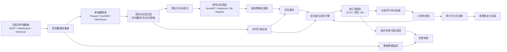
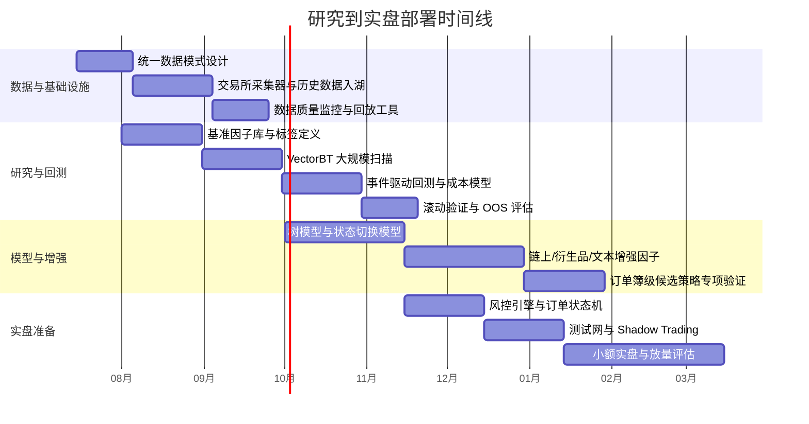

# 数字货币量化交易从研究到实盘部署分析报告

## 执行摘要

基于你给出的条件——单机高端算力、熟悉大模型尝试与机器学习、希望从量化研究一路走到实盘——**最可行、风险收益比最高的路径，不是超低延迟高频或跨所抢跑**，而是以 **BTC/ETH 及少数高流动性永续合约为核心的中频与日内策略**，辅以 **资金费率/基差/持仓结构** 和 **有限可解释链上因子** 的组合研究。原因很直接：主流交易所官方都提供了较完整的 REST/WebSocket、历史成交、K 线、衍生品和测试环境，而真正高频做市/抢跑要想在回测与实盘中逼真复现，必须处理队列位置、撮合延迟、订单簿重建与断流修复，这一门槛远高于“有一台强电脑”本身。HftBacktest 明确把**队列位置、订单延迟、全量订单簿重建**作为高频回测核心；Tardis 也把**tick 级订单簿、成交、资金费率、爆仓、期权链**作为高频研究的必要原料。与此同时，Coinbase 公开说明其 WebSocket 有 level2/level2 batch/full 等不同档位，OKX 提供官方历史成交、资金费率和高分辨率 L2 订单簿下载，Binance 也有公开历史数据仓库。综合这些条件，个人研究者最优的“护城河”往往来自 **研究设计、特征工程、稳健验证和执行风控**，而不是本地网络环境下的延迟竞速。 citeturn5search1turn10search0turn21view0turn21view2turn21view4

如果只给出一句优先建议，我会给出如下排序：**第一优先做 BTC/ETH 永续或现货-永续的中频/日内趋势-反转混合、资金费率/基差、低杠杆市场中性；第二优先做链上+衍生品的状态切换模型；第三优先做文本/社交情绪因子作为辅助过滤器；最后才考虑订单簿级高频做市或跨所延迟套利**。这一路线能最大化利用你本地 CPU/GPU 的优势：本地可以高强度做特征计算、参数扫描、树模型与中等规模时序深度模型训练，也能运行本地 LLM 做新闻/推文摘要与标签生成；同时，稳定运行的实盘层则应尽量瘦身，重点做好数据完整性、风控和恢复机制。VectorBT、Freqtrade、NautilusTrader、CCXT 这类工具恰好覆盖了从大规模参数搜索到加密实盘接入、再到研究/回测/实盘一体化的不同层面。 citeturn3search1turn3search2turn23search10turn23search7

在合规层面，这份报告必须给出明确提示：**如果你的实际主体位于中国大陆，风险不是“高”，而是“原则上不应开展”**。中国官方 2026 年 2 月的答记者问和通知延续并重申了禁止性政策立场，明确指出虚拟货币不具有与法定货币等同的法律地位，在境内开展相关业务活动属于非法金融活动，境外单位和个人不得以任何形式非法向境内主体提供相关服务。与此同时，主流交易所都已把 KYC、地域限制和产品限制写入规则：Bybit 明确列出包括**美国、中国大陆、香港、新加坡、加拿大**等在内的排除司法辖区；Coinbase 明确要求身份验证；OKX 也披露了若干辖区及产品层面的限制。因此，实盘前的第一件事不是选模型，而是先确认**你本人所在司法辖区、账户主体、税务与交易所准入**是否允许你做相应产品。 citeturn14search1turn14search2turn13search2turn13search3turn13search1

从执行角度看，建议把项目拆成三层：**研究层本地化、执行层云端常驻、监控层双活冗余**。研究层依赖你的高端 PC；执行层使用一个稳定的低成本云 VPS 或专用主机负责 24/7 运行；本地机器作为热备与回放环境。交易所接入优先采用官方 API 文档与测试环境，统一适配层可用 CCXT，但凡涉及订单簿深度、风控字段或交易所特有参数时，应尽量直接落到交易所原生 API。 citeturn15search4turn15search5turn15search3turn15search16turn23search3

## 研究目标与可行性评估

对个人研究者而言，数字货币市场的“可行策略”不应该先按想象分类，而应该先按**信息优势来源**分类：你能否拿到别人拿不到的数据，你能否用别人不用的验证流程减少过拟合，你能否在他人弃守的中低频区间把执行损耗做薄。主流交易所官方文档已经把市场数据、交易、历史下载、测试环境开放到相当高的程度，这意味着**“接得到数据”不再是优势**；真正的优势在于如何把**衍生品结构、微观结构、链上、文本与状态切换模型**拼成一个可验证、可扩展、可实盘的研究体系。另一方面，官方与第三方高频数据文档都在提示同一件事：越往高频走，越依赖延迟、订单簿完整性和撮合细节，因此个人研究者应把资源集中在**非共址环境下仍可成立的 alpha** 上。 citeturn6search20turn6search1turn12search6turn21view0turn5search1turn10search0

| 策略类型 | 对个人研究者可行性 | 数据与基础设施要求 | 资金容量 | 推荐优先级 | 核心理由 | 主要参考 |
|---|---|---:|---:|---|---|---|
| 超低延迟高频做市 / 延迟套利 | 低 | 需要高质量 L2/L3、队列模型、延迟测量、极稳定网络 | 中到高 | 不推荐作为起点 | HFT 回测必须考虑队列位置、订单与行情延迟；单机强算力不能替代共址与网络优势 | HftBacktest、Tardis citeturn5search1turn10search0 |
| 日内中频趋势 / 反转 | 高 | K 线、逐笔成交、基础订单簿、资金费率 | 低到高 | 最高 | 实现门槛适中，可用官方数据先做；对硬件友好；执行难度可控 | Binance/OKX/Bybit/ Coinbase 数据与 API citeturn21view4turn21view2turn6search2turn21view0 |
| 资金费率 / 基差 / 现货-永续套保 | 高 | 资金费率、标记价格、指数价格、借贷与费率 | 中到高 | 最高 | 成本可建模，逻辑可解释，适合 BTC/ETH 等高流动性标的 | Binance 资金费率 FAQ、Bybit Funding、OKX 历史资金费率 citeturn2search6turn12search18turn21view2 |
| 市场中性多空篮子 | 中高 | 多币种行情、成交量、资金费率、OI、相关性矩阵 | 中 | 高 | 个人不必拼方向判断，可把重点放在因子排序、风险平衡与容量控制 | CoinGlass、交易所数据、Dune/Glassnode/CryptoQuant citeturn9search12turn21view2turn7search4turn7search7turn8search14 |
| 波段 / 状态切换 | 中高 | K 线、链上、衍生品结构、宏观/新闻 | 低到中 | 高 | 能利用你的 ML/LLM 能力，但交易频率更低，样本更稀 | Glassnode、CryptoQuant、Dune、GDELT、X API citeturn7search4turn7search7turn8search14turn11search1turn11search4 |
| 跨所搬砖 / 提现转账套利 | 低 | 跨所资产路由、提现、到账、费率、地域/KYC | 低到中 | 低 | 提现与链上确认是天然瓶颈，KYC/地域限制显著影响可执行性 | 各所 KYC/限制条款 citeturn13search1turn13search2turn13search3turn13search0 |
| 纯新闻 / 纯社交情绪事件交易 | 中 | 文本流、低延迟新闻源、情绪标注、去重 | 低到中 | 低到中 | 可作为过滤器很有价值，但单独作为主策略通常噪声过大、成本偏高 | X API、GDELT、NewsAPI citeturn11search4turn11search1turn11search22 |

在“资金规模未指定”的前提下，建议不要把策略设计成与规模强绑定，而是采用**随规模变化切换策略密度**的思路。小资金阶段更适合做 **单品种或双品种（BTC/ETH）中频与日内**，以最小化滑点和工程复杂性；中等资金可以引入 **多空配对、BTC/ETH + 若干高流动性山寨币篮子**；更大资金再去考虑更完整的**市场中性+分账户/分交易所执行**。对个人研究者来说，最致命的不是“赚得慢”，而是太早引入多策略、多交易所、多账户、多资产、杠杆与借贷，从而让研究误差、运维风险与合规风险一起放大。这个结论与主流交易所对费率层级、风险限额、保证金和地域限制的制度化设计是一致的：规模一上来，制度成本会迅速高于建模红利。 citeturn18view3turn19view1turn24search2turn24search9turn24search19

| 资金规模情景 | 建议主策略 | 杠杆建议 | 研究重点 | 实盘重点 |
|---|---|---:|---|---|
| 小于 2 万 USDT | BTC/ETH 日内中频、低频波段 | 0–1.5x | 先验证因子与成本模型是否稳定 | 少交易、严控手续费 |
| 2–10 万 USDT | 资金费率/基差、BTC/ETH + 少量 alpha 篮子 | 0–2x | 做跨时段、跨市场状态切换 | 开始做分账户与风险预算 |
| 10–50 万 USDT | 市场中性、多因子多空、按成交量过滤 | 0–2.5x | 容量与冲击成本建模 | 引入执行算法与限价优先 |
| 大于 50 万 USDT | 分层组合、分交易所执行、低冲击化 | 0–3x 但按风险限额动态收缩 | 订单簿冲击、分笔算法、风控自动化 | 监控、容灾、审计优先 |

上表不是市场常数，而是**工程优先级建议**。若你后续补充账户主体、可用交易所、资金区间和司法辖区，优先级还应再细化。

## 数据体系与来源优先级

你的数据体系应遵循一个非常实用的原则：**官方交易所原始数据优先，第三方“整理型”数据用于补充，第三方“衍生指标”数据用于加速，不要一开始就把研究建立在黑盒聚合商上**。Binance 提供公开历史市场数据仓库，支持日度/月度打包，覆盖现货与期货的 aggTrades、trades、klines 等；OKX 官方直接提供历史成交、K 线、资金费率、高分辨率 L2 订单簿下载；Bybit 提供历史市场数据下载页面；Coinbase 提供公开与直连接口并区分普通 Market Data 与 Direct Market Data。对个人研究者而言，这意味着**日内与中频策略完全可以先用官方源起步**，只有在你明确要做订单簿微结构或跨所统一重放时，才需要上 Tardis 之类的付费高频数据层。 citeturn21view4turn21view2turn6search2turn21view0

| 数据类别 | 研究用途 | 获取难度 | 延迟与频率 | 典型成本 | 清洗要点 | 数据源优先级 | 主要参考 |
|---|---|---|---|---|---|---|---|
| K 线 / OHLCV | 中低频趋势、反转、波动率、 regime 分类 | 低 | 秒到日 | 低/免费 | 时区统一、缺口填补、合约与现货分开、复权逻辑不适用但需处理上下线交易对 | **官方交易所优先** | Binance Public Data、OKX 历史数据、Bybit 历史下载 citeturn21view4turn21view2turn6search2 |
| 逐笔成交 / Trades | 日内 alpha、成交驱动、VPIN 类特征、交易者主动性 | 中 | 毫秒到秒 | 低到中 | 去重、买卖方向统一、时间戳精度统一、撮合批量消息拆解 | 官方优先；需要统一格式时上 Tardis | Binance Public Data、Coinbase WS、Tardis citeturn21view4turn21view1turn10search0 |
| 订单簿 / L2/L3 | 微结构、做市、冲击成本、队列压力 | 中到高 | 毫秒级 | 中到高 | 快照+增量重建、断流补齐、序列号校验、不同所深度档位差异 | 先官方 WS；研究级统一重放用 Tardis | Coinbase level2/full、OKX L2 历史、Tardis、HftBacktest citeturn21view1turn21view2turn10search0turn5search1 |
| 资金费率 / 标记价 / 指数价 | 套保、基差、拥挤度、成本建模 | 低 | 1 分钟到 8 小时结算 | 低/免费 | 对齐结算时点、区分预测值与已结算值、与 OI/基差联动 | 交易所原生 API 优先；聚合看板次之 | Binance FAQ、Bybit Funding API、OKX 历史数据、CoinGlass citeturn2search6turn12search18turn21view2turn9search12 |
| OI / 多空比 / 爆仓 | 拥挤度、杠杆挤压、状态切换 | 中 | 分钟级 | 低到中 | 不同交易所口径不一，必须按交易所保留原始字段 | 交易所原生 + CoinGlass 聚合 | Bybit OI API、CoinGlass API citeturn12search2turn9search12 |
| 借贷利率 / 保证金利率 | 现货杠杆、套保与 carry 收益核算 | 中 | 小时到日 | 低 | 币种、方向、VIP 档位、借贷期错配 | 官方优先 | OKX borrowing rates、Coinbase/各所保证金文档 citeturn21view2turn24search15 |
| 链上原始数据 | 充值提现、地址行为、活跃地址、Gas、桥接流向 | 中到高 | 区块级 | 低到中 | 地址归属、链重组、时间对齐、代币精度、合约升级 | Etherscan / Dune / 节点 API | Etherscan API、Dune Docs citeturn7search6turn8search14 |
| 链上衍生指标 | 交易所净流入、持有成本、MVRV、储备变动等 | 低到中 | 分钟到日 | 中到高 | 注意“点时可得性”，避免用修订后指标做回测 | Glassnode / CryptoQuant 优先 | Glassnode API、CryptoQuant API citeturn7search4turn7search7 |
| 新闻 / 社交 / 情绪 | 事件过滤、 regime gating、风险提示 | 中 | 秒到分钟 | 低到高 | 去重、延迟测量、语言识别、垃圾内容过滤、相同事件聚类 | GDELT 开源新闻优先；X API 和商业新闻作补充 | GDELT、X API、NewsAPI citeturn11search1turn11search4turn11search22 |

如果你的第一阶段目标是**快速从研究走到可验证策略**，建议按下面顺序搭数据，而不是一次拉满：

| 阶段 | 必需数据 | 可选增强 | 不建议过早投入 |
|---|---|---|---|
| 起步阶段 | 1m/5m K 线、逐笔成交、资金费率、标记价、OI | CoinGlass 聚合、少量 Glassnode/CryptoQuant 指标 | 全市场 L2 或 L3 |
| 进阶阶段 | 高流动性币对的深度档订单簿、爆仓、借贷利率 | Dune 自建 SQL、Tardis 小范围订阅 | 全市场跨所 tick 订阅 |
| 微结构阶段 | Tardis 或自建录制、订单簿重建、消息序列校验 | HftBacktest / NautilusTrader 精细回放 | 未验证前就上全部交易所 |

从成本角度看，这一顺序也最合理。Tardis 的 Solo/Professional/Business 方案已经覆盖了从个人到团队的完整梯度，但**其价值主要体现在订单簿回放与跨所统一重放**，不适合在策略尚未成型时就成为月度固定成本；CoinGlass 则更像一个性价比较高的衍生品聚合层；Glassnode 和 CryptoQuant 更适合你已经验证“链上信息确实能改善择时或风险过滤”之后再买。Dune 则适合你愿意自己写 SQL、自己定义口径的阶段。 citeturn22search2turn22search0turn9search0turn7search0turn7search3turn8search7

在关键建议上，优先参考这些官方/原始入口即可：**Binance Public Data 与 Binance Developer Docs**、**OKX 中文 API 文档与官方历史数据页**、**Bybit API 文档与历史下载页**、**Coinbase Exchange WebSocket / Sandbox 文档**、**Glassnode API / Pricing**、**CryptoQuant API / Pricing**、**Dune Docs / Pricing**、**Etherscan API**、**CoinGlass API**。 citeturn21view4turn0search1turn21view2turn12search6turn6search2turn21view0turn15search3turn7search4turn7search0turn7search7turn7search3turn8search14turn8search1turn7search6turn9search13

## 因子特征与模型路线

你的研究路线不应从“最强模型”开始，而应从**解释性最强、泄漏风险最小、可反复验证**的因子层开始。数字货币里，很多看起来“高级”的模型最终只是在放大不同口径的数据对齐错误。最稳的做法是先建立一个**事件时间或 bar 时间对齐的特征仓**，并严格区分：在时点 *t* 可获得的特征、在 *t+h* 才结算的标签、以及会被后验修订的链上衍生指标。特别是链上与新闻类数据，一定要按**点时可得性**回放，否则回测会天然乐观。Glassnode、CryptoQuant、Dune、GDELT 和 X API 都很有价值，但真正的价值来自**口径清晰地与价格、衍生品和微结构拼接**，而不是把它们“喂给模型”。 citeturn7search4turn7search7turn8search14turn11search1turn11search4

| 可解释因子 | 数据来源 | 适用周期 | 实现要点 | 个人研究价值 |
|---|---|---|---|---|
| 短周期收益反转 | K 线 / 成交 | 5m–4h | 用多窗口收益率，分时段建模，避免在高趋势期硬做均值回归 | 高 |
| 波动率状态 | K 线 / 成交 | 5m–1d | 用 realized vol、range、jump proxy；分状态而非单一阈值 | 高 |
| 成交量惊奇度 | K 线 / 成交 | 5m–4h | 用当前量相对季节性均值与分位数归一 | 高 |
| 现货-永续基差 | 标记价 / 指数价 / 现货价 | 1m–1d | 分币种、分状态看基差均值回归或趋势外推 | 很高 |
| 资金费率偏离 | 资金费率 | 1h–3d | 区分预测资金费率与已结算费率；与 OI 联动 | 很高 |
| OI 变化率 | OI | 5m–1d | 与价格同向/反向组合成“增仓上涨/挤空”等状态 | 很高 |
| 爆仓不平衡 | 爆仓/清算数据 | 1m–4h | 更适合做风险过滤与极端行情开关，而非单独方向因子 | 中高 |
| 盘口不平衡 | L2 / L3 | 秒到分钟 | 需要快照+增量重建；不同档位深度要标准化 | 中高 |
| 点差与队列压力 | 订单簿 | 秒到分钟 | 更适合执行优化与做市，不必强行做主 alpha | 中 |
| 交易所净流入/净流出 | 链上衍生指标 | 1h–1d | 注意地址标签变更与点时口径 | 中高 |
| 稳定币净铸造/流入交易所 | 链上 / 交易所钱包 | 4h–1d | 更适合做 regime 过滤 | 中 |
| 活跃地址 / 手续费 / Gas / 桥接流量 | 链上原始或 SQL 聚合 | 4h–1d | 必须币种特异化；不要跨币种直接比较原值 | 中 |
| 新闻/社交情绪分数 | GDELT / X / News 流 | 分钟到天 | 先做实体识别、去重、事件聚类，再做情绪 | 中 |
| 跨模态一致性因子 | 价格+衍生品+文本 | 1h–1d | 例如“价格走强 + OI 扩张 + 情绪温和偏正” | 高 |

上表里最适合个人研究起步的，不是最复杂的，而是**基差、资金费率偏离、OI 变化率、波动率状态、短周期反转/突破、交易所净流入/净流出**。这些因子要么成本低、要么解释性强、要么在 BTC/ETH 等深度更好、噪声更低的品种上能比较清楚地做验证。真正适合你的“机器学习能力”发挥的地方，是让模型去学习**多因子非线性交互、状态切换和条件触发**，而不是直接取代因子。 citeturn2search6turn12search18turn12search2turn7search4turn7search7turn8search14

模型选择方面，我建议遵循 **线性基线 → 树模型 → 轻量时序深度学习 → 图模型/强化学习/LLM 辅助** 的路线，而不是反过来。LightGBM 明确支持 GPU，训练速度快、内存效率高，XGBoost 也强调面向大规模样本的高效树提升；Temporal Fusion Transformer 虽然有解释性优势，但官方文档也明确提醒它总体是较大的模型，更适合更大样本；PyG 提供了标准化 GNN 开发栈；Stable-Baselines3 与 FinRL 则适合在仿真环境成熟后再做策略控制与执行研究。换句话说，你的 GPU 更应该先花在**树模型大规模扫描、轻量时序模型、文本嵌入/情绪分类和 LLM 推理辅助标注**，而不是一开始就上 RL 或 GNN 主策略。 citeturn16search0turn16search5turn16search2turn16search6turn23search0turn16search3turn23search5

| 模型路线 | 最适合的任务 | 优点 | 主要风险 | 你的硬件适配度 | 训练时间估计 |
|---|---|---|---|---|---|
| 线性 / Ridge / Lasso / Logistic | 基线方向预测、风格暴露、风险模型 | 可解释、稳健、快 | 容易欠拟合 | 极高 | 分钟级 |
| LightGBM / XGBoost | 多因子分类/回归、排序、状态切换 | 对表格数据强、GPU 可用、样本效率高 | 特征泄漏与参数过搜 | 极高 | 分钟到数小时 |
| TCN / LSTM / TFT | 多步时序预测、跨窗口依赖 | 能学非线性时序结构 | 需要更多样本与更严验证 | 高 | 数小时到 1–2 天 |
| GNN / 图时序 | 多币种关系、资金轮动网络、链上图结构 | 能表达关联网络 | 设计复杂、收益不一定超过树模型 | 中 | 数小时到多天 |
| RL / DRL | 仓位控制、执行策略、连续动作 | 适合处理“做多少”和“何时减仓” | 样本效率低、回测伪优严重 | 中 | 多天起 |
| LLM 微调 / 检索增强 | 文本事件抽取、情绪标注、研究助手 | 对非结构化信息很强 | 直接输出交易信号的稳定性通常不足 | 高 | LoRA/分类头可行；全量微调不建议 |

上表中的训练时间是工程经验估计，不是官方性能承诺；但方向上是稳的：**树模型先跑满，时序模型只在树模型确实打不过时再上，RL 与 GNN 限制在明确问题定义后的专项研究**。

避免过拟合方面，不建议再用“简单 train/test 切一刀”的旧模式。针对金融时序，至少应使用**滚动/扩展窗口回测、带 embargo 的时间切分、按月份或周度的模型重训、以及策略库层面的多重检验控制**。Bailey 与 López de Prado 关于 **PBO** 与 **Deflated Sharpe Ratio** 的工作就是为了解决“你试了太多策略，最终挑中了样本内最好但样本外不成立”的问题；更近期的研究也明确指出，金融机器学习里专门的交叉验证与稳健验证方法对减少回测过拟合是必要的。对你这样的个人研究者而言，这一点比“模型是 TFT 还是 LSTM”更重要。 citeturn17search8turn17search1turn17search4turn17search15

实操上，我建议你把验证流程固定成以下模板：**先做特征冻结，再做标签冻结，再做滚动 OOS，再做成本敏感性，再做参数稳定性，再做真实延迟模拟**。任何一个策略，只要在**手续费+滑点上调 50%** 后就从可盈利变成不可盈利，就不应该进入下一阶段。

## 回测框架与交易成本建模

真正能落地的回测体系，最好不是单一框架，而是三层。第一层是**向量化研究层**，用来做特征、标签、参数和资产池的大规模扫描；第二层是**事件驱动组合层**，用来做真实资金曲线、换仓、杠杆、净敞口与风控逻辑；第三层是**tick / order-book 回放层**，只对极少数候选策略做精细执行验证。VectorBT 的优势就在第一层，Backtrader/Freqtrade/Zipline Reloaded 更偏第二层，NautilusTrader 与 HftBacktest 更适合第三层或研究-实盘一体化。Catalyst 虽然是加密回测历史项目，但 PyPI 上最新发布停留在 2018 年，生态显著陈旧，不适合新项目作为主框架。 citeturn3search1turn3search0turn3search2turn3search7turn23search10turn5search1turn4search6

| 框架 | 风格 | 优势 | 局限 | 加密适配度 | 我的建议 | 主要参考 |
|---|---|---|---|---|---|---|
| VectorBT | 向量化研究 | 基于 pandas/NumPy，Numba/Rust 加速，适合大规模参数搜索 | 事件驱动和微结构细节不如专门引擎 | 高 | **研究层首选** | citeturn3search1turn3search17 |
| Backtrader | 事件驱动 | 成熟、易上手、策略与指标生态丰富 | 对高频和复杂多交易所微结构不够强 | 中 | 适合做中频组合与教学原型 | citeturn3search0turn3search4 |
| Freqtrade | 加密实盘导向 | 原生加密交易机器人，含回测、资金管理、ML/FreqAI、WebUI/Telegram | 回测真实性依赖你的数据与成本建模；复杂投资组合不如专门平台 | 高 | **中频到实盘很实用** | citeturn3search2turn3search18 |
| Zipline Reloaded | 事件驱动 | Quantopian 风格，研究范式清晰 | 更偏传统资产框架；加密支持不如专门项目 | 低到中 | 可学习，不建议做主生产框架 | citeturn3search7turn3search3 |
| Catalyst | 早期加密回测 | 曾面向加密 | 发布与生态老旧 | 低 | **不建议新项目采用** | citeturn4search1turn4search6 |
| NautilusTrader | 生产级事件引擎 | Rust 原生核心、研究/回测/实盘一体、可配纳秒时间戳与事件语义 | 学习成本较高 | 很高 | **若你想长期做生产系统，值得优先评估** | citeturn23search10turn23search6 |
| HftBacktest | 高频回放 | 队列位置、延迟、全量订单簿重建、面向做市/HFT | 更偏高频专项，不适合做全部研究层 | 很高 | 只在候选 HFT/做市策略阶段采用 | citeturn5search1turn5search0 |

对你而言，最合理的组合通常是：**VectorBT 做因子挖掘与参数搜索 → Freqtrade 或 NautilusTrader 做事件驱动回测与实盘 → HftBacktest 只验证少数订单簿策略**。这套组合既不浪费本地 CPU/GPU，又不会过早陷入复杂的微结构仿真。

交易成本建模必须比股票更细。建议把每笔交易成本分解为：

```text
总成本
= 显性手续费
+ 点差成本
+ 滑点
+ 市场冲击
+ 借贷/融币利率
+ 资金费率
+ 提现/转账/链上费用
+ 执行失败与重试成本
```

其中，**手续费** 必须按 maker/taker、币对、VIP 层级、活动费率和账户所在地区分别建模。Binance 现货普通用户基础费率为 0.1%/0.1%，用 BNB 支付可降到 0.075%/0.075%；Bybit VIP 0 现货 0.1%/0.1%，永续与期货 taker/maker 分别为 0.055%/0.02%；Coinbase Exchange 的基础层级远高于前三者，0–10K 美元 30 日成交量档的 taker/maker 为 60bps/40bps。OKX 的精确费率需要按司法辖区与产品组查看官方费率页，但其官方帮助/学习页示例显示，现货常见入门费率可在 0.08%/0.10% 左右，而合约示例常见 maker/taker 为 0.02%/0.05%。因此，若你的策略交易频率较高，**交易所选择本身就是 alpha 的一部分**。 citeturn18view3turn19view1turn18view2turn20search5turn20search0

**滑点与冲击** 则不能用固定常数。建议至少做三档敏感性测试：**基准、+50%、+100%**。日内中频策略可以用“半点差 + 函数型冲击”起步，订单簿策略则应直接读取 L2 深度估算吃单冲击。若使用 Coinbase 的公共 market data，还要把其文档明确提示的“消息可能丢失，需要 heartbeat + REST 修复”纳入回测或模拟层，否则回放会过于理想。 citeturn21view1turn21view0

一个可执行的回测流程，建议固定为：

1. **数据冻结**：保存原始快照版本与清洗版本，避免“数据随时间变了，结果却无法复现”。  
2. **标签冻结**：先定义 horizon 和执行假设，再允许模型搜索。  
3. **滚动训练-滚动验证**：按月/周滚动，不做随机切分。  
4. **成本回测**：引入 maker/taker、点差、滑点、资金费率、借贷利率。  
5. **鲁棒性测试**：参数扰动、样本扰动、资产池扰动、成本上调。  
6. **执行回放**：只对入围策略做 tick/L2 级别模拟。  
7. **Shadow Trading**：先只发信号不下单。  
8. **小资金实盘**：用严格风控验证“回测-实盘偏差”而非追求一开始就赚钱。  

## 风险管理、交易所选择与实盘架构

数字货币实盘系统的风险，不是“行情波动”一个词可以概括的。它至少包含 **市场风险、执行风险、模型风险、数据风险、交易所风险、地域/KYC 风险、系统与恢复风险** 七类。你的系统要先定义“**什么时候不交易**”，再定义“怎么交易”。经验上，以下规则非常有效：对单策略设定**日亏损上限、周回撤上限、单币种风险预算、单交易所敞口上限、最大杠杆上限、数据完整性闸门、订单拒绝率闸门**，任何一项超阈值都进入减仓、只平不开、或人工审核模式。这个思想与交易所对风险限额、仓位分层和保证金政策的做法是一致的：Bybit 明确提供 Risk Limit API；OKX 提供 Position Tiers；Coinbase 的衍生品帮助页也强调初始保证金与维持保证金决定何时触发清算。 citeturn24search2turn24search9turn24search3turn24search15

合规与准入层面，建议把以下几点视为**硬约束**而非“注意事项”：

- **若主体位于中国大陆，不应开展以境内主体为对象的虚拟货币相关交易业务活动**；2026 年官方口径再次重申，相关业务活动属于非法金融活动，境外单位和个人不得非法向境内主体提供相关服务。 citeturn14search1turn14search2
- **不要尝试绕过 KYC、地理限制或产品限制**。Bybit 已明确列出排除司法辖区，包括美国、中国大陆、香港、新加坡、加拿大等；Coinbase 要求身份验证；OKX 也披露一些国家和产品受限。 citeturn13search2turn13search3turn13search1
- **实盘前先核对你的账户主体能否合法交易现货、永续、期货、保证金、期权**，因为不同账户、不同区域、不同子站，产品清单并不一致。 citeturn13search0turn13search1turn24search7

在交易所选择上，我更建议你把标准从“谁最火”改成“谁最适合我的策略与合规边界”。下面这张表更适合研究者视角，而不是营销视角。

| 交易所 | 现货基础费率 | 衍生品与公开数据 | 测试环境 / Demo | 杠杆与保证金规则 | KYC / 地域限制 | 适合的角色 | 主要参考 |
|---|---|---|---|---|---|---|---|
| Binance | 普通用户现货 maker/taker 0.1%/0.1%，BNB 支付可为 0.075%/0.075% | 有官方开发者文档与公开历史数据仓库；现货/期货 API 丰富 | 有 API 测试环境与 spot testnet 文档 | 产品多，规则复杂，需按账户与合约查看；有 position mode 等接口 | 受地区合规影响明显 | **研究起步、现货与期货数据获取很强** | citeturn18view3turn21view4turn15search4turn15search18turn24search4 |
| OKX | 官方学习/帮助页示例常见现货入门费率约 0.08%/0.10%，实际按司法辖区与费率组 | 官方历史成交、K 线、资金费率、L2 订单簿下载很强 | 有 Demo Trading API | 有 Position Tiers 与保证金/借贷相关 API | 披露若干国家与产品限制 | **衍生品研究、历史数据、Demo 与生产衔接较好** | citeturn20search5turn21view2turn15search5turn24search9turn13search1 |
| Bybit | 现货 VIP0 0.1%/0.1%；永续/期货 VIP0 taker/maker 0.055%/0.02% | API 文档成熟，历史市场数据下载可用 | 有 Testnet 与 API 指南 | 提供 Risk Limit API；保证金按合约与风控档位变化 | 明确列出排除司法辖区，包括美国、中国大陆、香港、新加坡等 | **衍生品交易与中高频研究都较友好，但合规边界必须先核对** | citeturn19view1turn6search2turn15search16turn24search2turn13search2 |
| Coinbase | Exchange 低档位 taker/maker 60bps/40bps，费用显著高于前三者 | WebSocket 提供 Market Data 与 Direct Market Data；兼具 sandbox | 有 Exchange Sandbox 与 Advanced Trade Sandbox | 保证金和杠杆规则更偏合规化、产品区域差异大 | KYC 要求明确，产品按地区区分 | **合规优先、数据质量与直连行情工具强，但高频成本较高** | citeturn18view2turn21view0turn15search3turn15search17turn13search3turn24search19 |

如果你是以**研究+实盘**为目标，而不是只写一个 bot，我会给出非常具体的组合建议：  
**首选研究交易所**：OKX + Binance。前者在官方历史数据与 demo 方面表现很强，后者在公开历史文件与 API 生态上非常友好。  
**首选衍生品备选**：Bybit。若你的司法辖区允许，Bybit 的费率与 API 也很适合做永续策略。  
**首选合规参考与直连接口研究对象**：Coinbase。尤其适合做市场数据工程与高合规环境下的执行研究。  
这一建议建立在官方文档可得性、历史数据可获得性、测试环境可用性与费用公开度之上，而不是纯主观偏好。 citeturn0search1turn21view2turn21view4turn12search6turn21view0

下面给出一个适合个人研究者的系统组件图。建议把**研究系统**与**实盘执行系统**分离，但共享同一套数据模式、特征定义、风控字段与订单状态机。



部署上，我不建议“全本地”或“全上云”走极端。**最佳实践通常是混合部署**：  
研究与模型训练在本地高端 PC 完成；  
实时执行与监控在云端常驻；  
本地保留热备执行器、回放器与数据库快照。  
这样做的原因并不复杂：研究更吃算力与交互性，执行更吃常驻与稳定性。官方文档已经提供了 पर्याप्त 的测试环境——Binance 的 API 测试环境、OKX 的 Demo Trading、Bybit Testnet、Coinbase Sandbox——完全足够把这套混合流程先演练通。 citeturn15search4turn15search5turn15search16turn15search3

## 监控验收、放量规则与成本时间表

从回测到实盘，最重要的不是收益曲线本身，而是**偏差控制**。你需要同时监控两组指标：一组是研究常用指标，如净收益、Sharpe、最大回撤、Calmar、胜率、盈亏比、换手、持仓时间分布；另一组是实盘工程指标，如下单 RTT、ACK 延迟、WebSocket 断流率、订单拒绝率、成交偏差、滑点相对模型误差、风控触发次数、数据缺口率。对于策略是否“过关”，我建议采用更严格的、偏工程化的验收标准：**样本外 Sharpe 为正且稳定；成本上调后仍为正；最大回撤与周度回撤受控；实盘 shadow 阶段的信号-成交偏差可解释；至少一个月没有严重数据缺口或恢复失败**。而在策略选择上，建议引入 **Deflated Sharpe Ratio** 与 **PBO** 的思路，避免把“试出来的最好者”当作真实最优。 citeturn17search1turn17search8

| 指标类别 | 建议核心指标 | 验收思路 |
|---|---|---|
| 收益质量 | 年化收益、净收益、Sharpe、Calmar | 不看单一高收益，看成本后稳定性 |
| 下行风险 | 最大回撤、周回撤、极端日损失 | 优先约束可承受回撤，再谈放量 |
| 交易效率 | 胜率、盈亏比、平均持仓时长、换手 | 判断利润来自少数大单还是可重复优势 |
| 成本鲁棒性 | 手续费敏感性、滑点敏感性、资金费率敏感性 | 成本上调后仍为正才有实盘意义 |
| 执行质量 | maker 占比、成交率、撤单率、拒单率 | 决定策略是否能复现回测 |
| 基础设施 | WS gap 率、订单延迟 P50/P95/P99、服务恢复时间 | 决定系统能否长期无人值守 |
| 研究稳健性 | 滚动 OOS、DSR、PBO、参数稳定性 | 防止“回测冠军”进入实盘 |

在资金规模“未指定”的前提下，建议采用非常克制的放量节奏。下面的表不是收益最大化方案，而是**生存优先、验证优先**方案。

| 阶段 | 资金规模 | 单策略仓位上限 | 杠杆上限 | 放量触发条件 | 回滚触发条件 |
|---|---:|---:|---:|---|---|
| Paper / Shadow | 0 | 0 | 0 | 研究回测满足验收标准，连续 2–4 周信号与模拟成交一致 | 数据缺口、状态机错误、风控误触发 |
| 小额实盘 | 1,000–5,000 USDT | 10%–20% | 1x | 2–4 周内净滑点接近预估，拒单率与断流率低 | 单周回撤超阈值、连续异常成交 |
| 初步放量 | 5,000–20,000 USDT | 20%–30% | 1.5x | 成本后样本外 Sharpe 维持为正，回撤可控 | 连续两周偏离回测分布 |
| 稳定期 | 20,000–100,000 USDT | 30%–50% | 2x | 三个月以上稳定运行，关键监控无红线 | 风险指标恶化、交易所规则变化 |
| 组合扩张 | 100,000 USDT+ | 按风险预算分配 | 2x–3x 但动态收缩 | 增加新策略时必须重新走小额验证 | 新策略拖累组合、容量与冲击恶化 |

数据与系统成本方面，你的高端本地机器能显著降低云开销，因此真正需要花钱的主要是**高频历史数据、链上衍生指标、常驻执行节点和交易成本**。一个比较合理的区间可以这样估：

| 成本项 | 低成本起步 | 中等配置 | 强研究配置 | 主要参考 |
|---|---:|---:|---:|---|
| 官方交易所历史数据 | 0–低 | 低 | 低 | Binance/OKX/Bybit/Coinbase 多数基础数据可直接获取 citeturn21view4turn21view2turn6search2turn21view0 |
| Tardis 高频数据 | 0 | 约 900 美元/月级别（Derivatives Solo） | 约 2,200 美元/月级别（All Exchanges Professional） | 官方价格页 citeturn22search2 |
| CoinGlass | 29–79 美元/月 | 79–299 美元/月 | 699 美元/月+ | 官方定价页 citeturn9search0 |
| CryptoQuant | 免费–29 美元/月 | 99 美元/月 | 799 美元/年档以上 | 官方定价页 citeturn7search3 |
| Glassnode | 需 Professional + API add-on，公开页未给出 add-on 细价 | 同左 | 同左 | Pricing + API docs citeturn7search0turn7search4 |
| Dune | 信用计费，可低起步 | 信用消耗随导出/API 增长 | 企业级可显著增 | 官方 pricing / docs citeturn8search1turn8search7turn8search11 |
| Etherscan | 免费 | 41.65–169.15 美元/月左右 | 更高阶或专属 | 官方 API plans citeturn7search2 |
| X API / 新闻 | 按使用量或开发档起步 | 中 | 取决于抓取量与商业授权 | X API pricing、NewsAPI pricing citeturn11search0turn11search2 |
| 云执行与监控 | 20–100 美元/月 | 100–300 美元/月 | 300 美元/月以上 | 工程估算 |
| 手续费与资金费率 | 与策略频率强相关 | 与频率/做市比例强相关 | 与频率/容量强相关 | 交易所费率页与资金费率文档 citeturn18view3turn19view1turn18view2turn2search6turn12search18 |

对你这种硬件条件较好的个人研究者，我更推荐的月度预算分层是：

- **低预算**：只用官方交易所数据 + 少量 CoinGlass 或 Dune，月固定成本尽量压在 **100 美元以内**。  
- **中预算**：加入 CoinGlass / CryptoQuant / 少量 Dune 导出，月成本 **100–500 美元**。  
- **高研究预算**：只有当你确定要做订单簿微结构或跨所执行时，才上 Tardis，月成本进入 **900–2200 美元+** 区间。  

如果目标是“在 3–12 个月内做出稳定实盘”，我建议先走中预算，而不是直接冲高预算。

下面给出一个更贴近实施的时间线。假设你从零开始，但已有较强的 Python/ML/LLM 使用能力。



将时间线换成明确的可交付物，更便于管理：

| 时段 | 主要可交付成果 | 通过标准 |
|---|---|---|
| 短期 | 完整数据管线、统一 schema、基础因子库、VectorBT 扫描框架、单一交易所回测 | 可复现回测；至少 2–3 个样本外为正的候选 |
| 中期 | 滚动验证、树模型与状态切换、成本模型、事件驱动回测、测试网执行器、监控与告警 | 候选策略通过成本敏感性与 shadow 交易 |
| 长期 | 多策略组合、市场中性扩展、链上/文本增强、双活部署、逐步放量与审计 | 至少一条策略完成稳定小额实盘并可重复扩容 |

综合全报告，若要把建议压缩成一套“开工清单”，顺序应当是：**先确认合规与账户主体 → 选 1–2 个交易所 → 先做 BTC/ETH 中频与资金费率/基差 → 用官方数据走通研究、回测、shadow、实盘 → 只有在主策略稳定后，才把订单簿高频、GNN、RL、LLM 直接出信号这些高复杂度方向逐步引入**。这条路线最符合你当前的硬件条件、技能背景和个人研究者的真实约束。